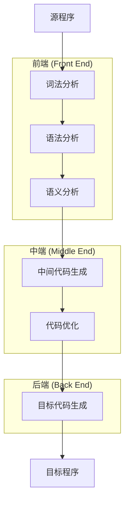
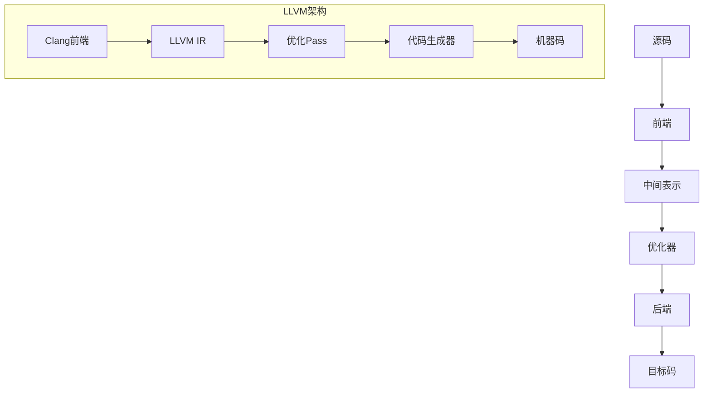

# 编译原理实战：通过Python对象解析器理解编译器设计

> **目标读者**：具备Java基础，希望深入理解编译原理的开发者  
> **学习时间**：约120分钟  
> **实践项目**：Python对象到JSON的转换器

---

## 1. 编译原理全景图

### 1.1 什么是编译器？

#### 编译器的本质定义

编译器是一个**语言翻译系统**，它将用一种语言（源语言）编写的程序转换为另一种语言（目标语言）的等价程序。这个定义包含三个关键要素：

1. **输入语言**：源程序使用的编程语言
2. **输出语言**：目标程序使用的语言
3. **语义等价性**：转换前后程序的含义必须保持一致

```
源程序 (Source Language) ──[编译器]──> 目标程序 (Target Language)
     ↓                                        ↓
 人类可理解的高级抽象              机器可执行的具体实现
```

#### 编译器的分类体系

根据源语言和目标语言的不同，编译器可以分为以下几类：

| 编译器类型 | 源语言 | 目标语言 | 典型例子 |
|-----------|--------|----------|----------|
| **传统编译器** | 高级语言 | 机器语言 | GCC (C→x86汇编) |
| **转换器** | 高级语言 | 高级语言 | TypeScript→JavaScript |
| **解释器** | 高级语言 | 虚拟机指令 | Python解释器 |
| **交叉编译器** | 高级语言 | 其他平台机器语言 | ARM-GCC |

#### 我们的项目定位

我们的Python对象解析器属于**转换器**类别：

- **源语言**：Python对象字面量语法
- **目标语言**：JSON格式
- **应用场景**：跨语言数据交换、配置文件转换

```python
# 源语言：Python对象语法
{'name': 'Alice', 'scores': [85, 92, 78], 'active': True}

# 目标语言：JSON格式  
{"name":"Alice","scores":[85,92,78],"active":true}
```

### 1.2 编译器的整体架构

#### 编译过程的逻辑分层

现代编译器采用**多阶段流水线**架构，将复杂的翻译过程分解为若干个相对独立的阶段。这种设计遵循了**关注点分离**的软件工程原则：



#### 各阶段的职责划分

**前端阶段**（与源语言相关）：
1. **词法分析**：字符流 → 记号流
2. **语法分析**：记号流 → 抽象语法树
3. **语义分析**：语义检查 + 类型分析

**中端阶段**（语言无关优化）：
4. **中间代码生成**：AST → 中间表示
5. **代码优化**：提高执行效率

**后端阶段**（与目标语言相关）：
6. **目标代码生成**：中间代码 → 目标代码

#### 符号表：贯穿全流程的数据结构

**符号表（Symbol Table）** 是编译器的核心数据结构，记录程序中标识符的信息：

```java
// 符号表条目的典型结构
public class SymbolTableEntry {
    private String name;        // 标识符名称
    private Type type;          // 数据类型
    private Scope scope;        // 作用域
    private int address;        // 内存地址
    private List<Attribute> attributes; // 其他属性
}
```

### 1.3 我们的项目架构分析

#### 项目的编译阶段映射

我们的Python对象解析器实现了编译器的前端和部分中端功能：

| 编译阶段 | 我们的实现 | 输入 | 输出 |
|----------|------------|------|------|
| **词法分析** | `Lexer.java` | 字符串 | `List<Token>` |
| **语法分析** | `Parser.java` | `List<Token>` | `PythonValue` |
| **语义分析** | `PythonValue.toJavaObject()` | `PythonValue` | Java对象 |
| **代码生成** | `convertToJsonNode()` | Java对象 | JSON字符串 |

#### 系统架构的设计原则

```java
public class PythonObjectParser {
    // 门面模式：封装复杂的编译流程
    public String parseToJson(String pythonString) {
        // 阶段1：词法分析
        List<Token> tokens = new Lexer(pythonString).tokenize();
        
        // 阶段2：语法分析  
        PythonValue ast = new Parser(tokens).parse();
        
        // 阶段3：语义分析 + 代码生成
        JsonNode jsonNode = convertToJsonNode(ast);
        return objectMapper.writeValueAsString(jsonNode);
    }
}
```

这种设计体现了编译器设计的核心原则：
- **模块化**：每个阶段职责单一明确
- **可扩展性**：易于添加新的语法特性
- **可测试性**：每个阶段都可以独立测试

---

## 2. 词法分析：从字符到记号

### 2.1 词法分析的作用和原理

#### 词法分析的根本目的

词法分析是编译过程的**第一道关口**，其核心使命是将无结构的字符流转换为有意义的记号流。这个过程解决了两个根本问题：

1. **字符分组**：如何将连续的字符流切分成有意义的单元
2. **语义识别**：如何为每个单元赋予语法意义

```
输入字符流: {'name': 'John', 'age': 30}
           ↓ 词法分析
输出记号流: [LBRACE, STRING, COLON, STRING, COMMA, STRING, COLON, NUMBER, RBRACE]
```

#### 词法分析的核心概念体系

**1. 记号（Token）**
记号是语法分析的基本单位，包含两个关键信息：
- **记号类型**：语法角色（如关键字、标识符、运算符）
- **记号值**：具体内容（如字符串的内容、数字的值）

```java
public class Token {
    private final TokenType type;      // 语法分类
    private final Object value;        // 语义内容
    private final int position;        // 源码位置（用于错误报告）
}
```

**2. 词素（Lexeme）**
词素是源程序中构成记号的字符序列，是记号在源码中的**字面表示**：

```
记号类型     词素示例        记号值
--------    -----------    ---------
STRING      'hello'        "hello"
NUMBER      42             42
BOOLEAN     True           true
```

**3. 模式（Pattern）**
模式是描述词素形式的规则，通常用正则表达式表示：

```regex
IDENTIFIER: [a-zA-Z][a-zA-Z0-9_]*     # 标识符模式
INTEGER:    [0-9]+                     # 整数模式  
FLOAT:      [0-9]+\.[0-9]+            # 浮点数模式
STRING:     '[^']*'|"[^"]*"           # 字符串模式
```

#### 有限状态自动机理论基础

词法分析器的核心算法基于**有限状态自动机（Finite Automaton）**理论。对于每种记号类型，我们都可以构造一个状态转换图：

以识别数字为例：
```
状态转换图：
    数字         数字
[开始] ──→ [整数] ──→ [整数]
    ↓         │
  其他      小数点
    ↓         ↓      数字
  [错误]   [小数] ──→ [小数]
             ↓
           其他
             ↓
          [接受]
```

### 2.2 设计词法分析器

#### Python对象词汇表分析

我们需要识别的Python对象包含以下词汇类别：

**基本类型词汇**：
- **数字**：整数(42)、浮点数(3.14)、负数(-10)
- **字符串**：单引号('hello')、双引号("world")
- **布尔值**：True、False
- **空值**：None

**结构化词汇**：
- **容器起始符**：[ { (
- **容器结束符**：] } )
- **分隔符**：, :

#### TokenType枚举的设计逻辑

```java
public enum TokenType {
    // ========== 字面量类型 ==========
    NUMBER,    // 数字：42, 3.14, -10
    STRING,    // 字符串：'hello', "world"  
    BOOLEAN,   // 布尔：True, False
    NULL,      // 空值：None
    
    // ========== 标识符类型 ==========
    IDENTIFIER, // 变量名（预留扩展用）
    
    // ========== 分隔符类型 ==========
    LEFT_BRACKET,  RIGHT_BRACKET,   // [ ]
    LEFT_BRACE,    RIGHT_BRACE,     // { }
    LEFT_PAREN,    RIGHT_PAREN,     // ( )
    COMMA,                          // ,
    COLON,                          // :
    
    // ========== 特殊类型 ==========
    EOF        // 文件结束标记
}
```

这种设计遵循了以下原则：
- **完备性**：覆盖所有可能的Python对象语法元素
- **互斥性**：每个字符序列只能属于一种记号类型
- **可扩展性**：预留IDENTIFIER类型支持未来扩展

### 2.3 实现深入解析

#### Lexer.java整体架构

```java
public class Lexer {
    // ========== 核心状态 ==========
    private final String input;        // 输入字符串（不可变）
    private int position;               // 当前字符位置
    private char currentChar;           // 当前字符缓存
    
    // ========== 主要方法 ==========
    public List<Token> tokenize()      // 主入口：执行词法分析
    private void advance()              // 状态转换：移动到下一字符
    private void skipWhitespace()       // 辅助方法：跳过空白字符
    private String readNumber()         // 识别方法：读取数字
    private String readString(char quote) // 识别方法：读取字符串
    private String readIdentifier()     // 识别方法：读取标识符
}
```

#### 核心算法：tokenize()方法深度解析

```java
public List<Token> tokenize() {
    List<Token> tokens = new ArrayList<>();
    
    // 主循环：处理每个字符直到结束
    while (currentChar != '\0') {
        skipWhitespace();  // 预处理：跳过无意义字符
        
        if (currentChar == '\0') break; // 边界检查
        
        int tokenPos = position; // 记录记号起始位置
        
        // 状态转换决策树
        if (Character.isDigit(currentChar) || currentChar == '-') {
            tokens.add(createNumberToken(tokenPos));
        } else if (currentChar == '\'' || currentChar == '"') {
            tokens.add(createStringToken(tokenPos));
        } else if (Character.isLetter(currentChar) || currentChar == '_') {
            tokens.add(createIdentifierToken(tokenPos));
        } else {
            tokens.add(createDelimiterToken(tokenPos));
        }
    }
    
    tokens.add(new Token(TokenType.EOF, null, position));
    return tokens;
}
```

**算法设计要点**：

1. **状态机驱动**：使用currentChar作为状态转换的驱动条件
2. **位置跟踪**：每个Token都记录其在源码中的位置，便于错误报告
3. **边界安全**：使用'\0'作为输入结束标记，避免数组越界
4. **分治策略**：将复杂的识别逻辑分解到专门的方法中

#### 难点突破1：数字识别算法

数字识别需要处理多种格式：整数、浮点数、负数。其状态转换逻辑为：

```java
private String readNumber() {
    StringBuilder result = new StringBuilder();
    
    // 状态1：处理可选的负号
    if (currentChar == '-') {
        result.append(currentChar);
        advance();
    }
    
    // 状态2：读取整数部分
    while (currentChar != '\0' && Character.isDigit(currentChar)) {
        result.append(currentChar);
        advance();
    }
    
    // 状态3：处理可选的小数部分
    if (currentChar == '.') {
        result.append(currentChar);
        advance();
        
        // 读取小数位
        while (currentChar != '\0' && Character.isDigit(currentChar)) {
            result.append(currentChar);
            advance();
        }
    }
    
    return result.toString();
}
```

**关键设计决策**：
- **贪婪匹配**：尽可能长地匹配数字字符
- **容错处理**：不在词法阶段验证数字格式的合法性
- **延迟解析**：返回字符串，由调用者负责数值转换

#### 难点突破2：字符串转义处理

字符串识别的挑战在于正确处理转义字符：

```java
private String readString(char quote) {
    StringBuilder result = new StringBuilder();
    advance(); // 跳过开始引号
    
    while (currentChar != '\0' && currentChar != quote) {
        if (currentChar == '\\') {
            // 转义序列处理
            advance(); // 跳过反斜杠
            switch (currentChar) {
                case 'n':  result.append('\n'); break;
                case 't':  result.append('\t'); break;
                case 'r':  result.append('\r'); break;
                case '\\': result.append('\\'); break;
                case '\'': result.append('\''); break;
                case '"':  result.append('"'); break;
                default:   result.append(currentChar); // 保持原字符
            }
        } else {
            result.append(currentChar);
        }
        advance();
    }
    
    // 处理结束引号
    if (currentChar == quote) {
        advance();
    }
    // 注意：这里选择容错处理，不抛异常
    
    return result.toString();
}
```

**设计考虑**：
- **完整性**：支持标准的C风格转义序列
- **健壮性**：对未知转义序列采用原样保留策略
- **容错性**：即使缺少结束引号也不崩溃，交由语法分析器处理

#### 难点突破3：关键字识别与分派

Python的关键字识别采用**先识别后分派**的策略：

```java
private Token createIdentifierToken(int position) {
    String identifier = readIdentifier();
    TokenType type;
    Object value;
    
    // 关键字检查与分派
    switch (identifier) {
        case "True":
            type = TokenType.BOOLEAN;
            value = Boolean.TRUE;
            break;
        case "False": 
            type = TokenType.BOOLEAN;
            value = Boolean.FALSE;
            break;
        case "None":
            type = TokenType.NULL;
            value = null;
            break;
        default:
            type = TokenType.IDENTIFIER;
            value = identifier;
    }
    
    return new Token(type, value, position);
}
```

**算法优势**：
- **统一处理**：标识符和关键字使用相同的字符读取逻辑
- **精确分类**：在识别完成后进行精确的类型分派
- **易于扩展**：添加新关键字只需修改switch语句

### 2.4 词法分析的局限性

#### 上下文无关的本质特征

词法分析器是**上下文无关的**，这意味着它只能根据当前字符及其邻近字符做决策，无法考虑更广泛的语法上下文。

**无法解决的问题示例**：

1. **歧义消解**：无法区分 `-` 是负号还是减法运算符
```python
a = -5      # 负号
b = a - 5   # 减法运算符
```

2. **作用域相关**：无法判断标识符是否已声明
```python
print(x)    # x是否已定义？词法分析器无法判断
```

3. **类型相关**：无法进行类型检查
```python
"hello" + 42  # 类型不匹配，但词法分析器认为语法正确
```

这些问题需要在后续的语法分析和语义分析阶段解决。

---

## 3. 语法分析：从记号到结构

### 3.1 语法分析的使命

#### 从线性到树形：结构化的本质

语法分析器接过词法分析器的成果，将**线性的记号序列**转换为**层次化的语法结构**。这个转换过程体现了人类理解语言的基本方式：我们不是逐字阅读，而是理解句子的语法结构。

```
线性记号流: [LBRACE, STRING("name"), COLON, STRING("John"), RBRACE]
              ↓ 结构化分析
层次语法树:
    DictValue
    └── entries
        └── "name" → "John"
```

#### 上下文无关文法（Context-Free Grammar）基础

语法分析的理论基础是**上下文无关文法**，它用一组产生式规则定义了语言的语法结构。

**文法的四元组定义**：G = (V, T, P, S)
- **V**：非终结符集合（语法变量）
- **T**：终结符集合（记号类型）
- **P**：产生式规则集合
- **S**：开始符号

#### 推导与语法树的关系

**推导（Derivation）** 是从开始符号出发，逐步应用产生式规则，最终得到目标句子的过程：

```
推导过程:
Value → Dict                    # 应用产生式1
Dict  → '{' Entry '}'          # 应用产生式2  
Entry → STRING ':' Value       # 应用产生式3
...
最终: '{' 'name' ':' 'John' '}'
```

每次推导都对应语法树中的一次节点展开，因此语法树就是推导过程的图形化表示。

### 3.2 Python对象的文法设计

#### 我们的文法规则定义

使用**EBNF（Extended Backus-Naur Form）**表示法：

```ebnf
Value     := Primitive | Container
Primitive := NUMBER | STRING | BOOLEAN | NULL
Container := List | Dict | Tuple | Set

List  := '[' (Value (',' Value)*)? ']'
Dict  := '{' (Entry (',' Entry)*)? '}'
Entry := Value ':' Value  
Tuple := '(' (Value (',' Value)*)? ')'
Set   := '{' (Value (',' Value)*)? '}'
```

#### 文法设计的关键决策

**1. 左递归消除**
传统的表达式文法往往包含左递归：
```ebnf
List := List ',' Value | Value  # 左递归形式
```

我们采用EBNF的重复结构来消除左递归：
```ebnf  
List := '[' (Value (',' Value)*)? ']'  # 消除左递归后
```

**2. 歧义消解策略**
字典和集合都使用花括号，存在语法歧义：
- `{1, 2, 3}` → 集合
- `{1: 2, 3: 4}` → 字典

我们采用**向前看**技术，在解析第一个元素后检查下一个记号：
- 如果是 `:`，则解析为字典
- 否则解析为集合

**3. 可选元素处理**
使用 `?` 表示可选，`*` 表示重复，使文法更加简洁和易懂。

### 3.3 递归下降分析法

#### 自顶向下分析策略

**递归下降分析**是一种自顶向下的语法分析方法，其核心思想是：
- **每个非终结符对应一个递归函数**
- **每个函数负责识别对应的语法结构**
- **通过函数调用的递归实现语法的递归**

```java
// 文法规则与函数的对应关系
Value     → parseValue()
List      → parseList()  
Dict      → parseDict()
Primitive → parsePrimitive()
```

#### LL(1)分析的理论基础

我们的分析器属于**LL(1)类别**：
- **第一个L**：Left-to-right，从左到右扫描输入
- **第二个L**：Leftmost derivation，最左推导
- **1**：向前看1个记号做决策

**LL(1)的核心要求**：对于任何非终结符A，根据当前记号能唯一确定使用哪个产生式。

#### 向前看（Lookahead）技术

向前看是LL(1)分析器的核心技术，通过检查当前记号的类型来决定采用哪个产生式：

```java
private PythonValue parseValue() {
    switch (currentToken.getType()) {
        case LEFT_BRACKET:  return parseList();     // [...]
        case LEFT_BRACE:    return parseDictOrSet(); // {...}
        case LEFT_PAREN:    return parseTuple();     // (...)
        case NUMBER:        
        case STRING:
        case BOOLEAN:
        case NULL:          return parsePrimitive(); // 基本类型
        default:
            throw new ParseException("Unexpected token");
    }
}
```

### 3.4 实现深入解析

#### Parser.java整体架构

```java
public class Parser {
    // ========== 解析器状态 ==========
    private final List<Token> tokens;   // 输入记号序列
    private int position;                // 当前记号位置
    private Token currentToken;          // 当前记号缓存
    
    // ========== 基础操作方法 ==========
    private void advance()               // 移动到下一记号
    private void expect(TokenType type)  // 期望并消费特定记号
    
    // ========== 语法规则方法 ==========
    public PythonValue parse()           // 主入口
    private PythonValue parseValue()     // 解析任意值
    private PythonValue parseList()      // 解析列表
    private PythonValue parseDictOrSet() // 解析字典或集合
    private PythonValue parseDict(PythonValue firstKey)   // 解析字典
    private PythonValue parseSet(PythonValue firstElement) // 解析集合
    private PythonValue parseTuple()     // 解析元组
    private PythonValue parsePrimitive() // 解析基本类型
}
```

#### 核心调度：parseValue()方法分析

```java
private PythonValue parseValue() {
    switch (currentToken.getType()) {
        case NUMBER:
        case STRING:  
        case BOOLEAN:
        case NULL:
            return parsePrimitive();
        case LEFT_BRACKET:
            return parseList();
        case LEFT_BRACE:
            return parseDictOrSet();
        case LEFT_PAREN:
            return parseTuple();
        default:
            throw new IllegalArgumentException(
                "语法错误：在位置 " + currentToken.getPosition() + 
                " 处遇到意外的记号 " + currentToken.getType()
            );
    }
}
```

**设计要点**：
1. **完备性**：覆盖所有可能的记号类型
2. **互斥性**：每种记号类型只对应一种处理方式
3. **错误处理**：对意外记号给出明确的错误信息

#### 难点突破1：字典vs集合的智能区分

这是我们语法分析器的最大技术挑战。两种结构都以 `{` 开始，需要通过**延迟决策**来区分：

```java
private PythonValue parseDictOrSet() {
    expect(TokenType.LEFT_BRACE);  // 消费 '{'
    
    // 特殊情况：空结构 {} 默认为空字典
    if (currentToken.getType() == TokenType.RIGHT_BRACE) {
        advance();
        return new PythonValue.DictValue(new HashMap<>());
    }
    
    // 解析第一个元素
    PythonValue firstElement = parseValue();
    
    // 关键决策点：检查下一个记号
    if (currentToken.getType() == TokenType.COLON) {
        // 发现冒号 → 这是字典结构
        return parseDict(firstElement);
    } else {
        // 没有冒号 → 这是集合结构  
        return parseSet(firstElement);
    }
}
```

**算法创新点**：
- **延迟决策**：直到确定结构类型才开始专门化解析
- **上下文传递**：将已解析的第一个元素传递给后续处理函数
- **默认策略**：空结构默认为字典，符合JSON语义

#### 难点突破2：递归嵌套结构处理

```java
private PythonValue parseList() {
    expect(TokenType.LEFT_BRACKET);  // 消费 '['
    List<PythonValue> elements = new ArrayList<>();
    
    // 处理非空列表
    if (currentToken.getType() != TokenType.RIGHT_BRACKET) {
        elements.add(parseValue());  // 递归调用！
        
        // 处理后续元素
        while (currentToken.getType() == TokenType.COMMA) {
            advance();  // 消费逗号
            // 处理尾随逗号：[1, 2, 3,]
            if (currentToken.getType() != TokenType.RIGHT_BRACKET) {
                elements.add(parseValue());  // 再次递归调用！
            }
        }
    }
    
    expect(TokenType.RIGHT_BRACKET);  // 消费 ']'
    return new PythonValue.ListValue(elements);
}
```

**递归处理的优势**：
1. **自然表达**：递归代码直接对应递归的语法结构
2. **无限嵌套**：可以处理任意深度的嵌套结构
3. **代码简洁**：避免了复杂的栈操作

#### 难点突破3：错误恢复机制

```java
private void expect(TokenType expectedType) {
    if (currentToken.getType() != expectedType) {
        throw new IllegalArgumentException(
            String.format("语法错误：期望 %s，但在位置 %d 处得到 %s", 
                expectedType, 
                currentToken.getPosition(), 
                currentToken.getType())
        );
    }
    advance();
}
```

**错误处理策略**：
- **精确定位**：提供详细的位置信息
- **期望说明**：明确告知期望的记号类型
- **早期失败**：一旦发现错误立即停止，避免错误传播

### 3.5 抽象语法树（AST）设计

#### AST设计的核心原则

**抽象语法树**是语法分析的核心输出，它具有以下特征：
- **抽象性**：去除语法糖，保留语义本质
- **层次性**：反映语言的递归结构
- **类型化**：每个节点都有明确的类型信息

#### PythonValue类层次结构

```java
// 抽象基类：定义统一接口
public abstract class PythonValue {
    public abstract Object toJavaObject();  // 访问者接口
}

// 具体节点类型
public static class PrimitiveValue extends PythonValue {
    private final Object value;  // 基本类型值
}

public static class ListValue extends PythonValue {
    private final List<PythonValue> elements;  // 子节点列表
}

public static class DictValue extends PythonValue {
    private final Map<PythonValue, PythonValue> entries; // 键值对映射
}

public static class TupleValue extends PythonValue {
    private final List<PythonValue> elements;  // 元组元素
}

public static class SetValue extends PythonValue {
    private final List<PythonValue> elements;  // 集合元素
}
```

#### 访问者模式的应用

访问者模式允许我们在不修改AST节点类的情况下，添加新的操作：

```java
// 访问者接口
public interface ASTVisitor<T> {
    T visit(PrimitiveValue node);
    T visit(ListValue node);
    T visit(DictValue node);
    T visit(TupleValue node);
    T visit(SetValue node);
}

// 具体访问者：JSON转换器
public class JsonConverter implements ASTVisitor<JsonNode> {
    @Override
    public JsonNode visit(ListValue node) {
        ArrayNode arrayNode = objectMapper.createArrayNode();
        for (PythonValue element : node.getElements()) {
            arrayNode.add(element.accept(this));  // 递归访问
        }
        return arrayNode;
    }
}
```

**访问者模式的优势**：
- **开放-封闭原则**：对扩展开放，对修改封闭
- **关注点分离**：将数据结构与算法分离
- **类型安全**：编译时保证访问的正确性

---

## 4. 语义分析与代码生成：从结构到目标

### 4.1 语义分析的职责

#### 语义分析的本质使命

语义分析是编译器前端的最后一个阶段，其核心职责是**验证程序的语义正确性**并**收集代码生成所需的信息**。在我们的项目中，语义分析主要解决以下问题：

1. **类型一致性检查**：确保Python类型能正确映射到JSON类型
2. **结构完整性验证**：验证嵌套结构的正确性
3. **语义转换准备**：为后续的JSON生成做准备

#### 我们的语义处理特点

与传统编译器不同，我们的语义分析相对简化，主要原因：
- **目标简单**：只需转换为JSON，不涉及复杂的类型系统
- **语法限制**：只处理数据字面量，没有变量、函数等复杂结构
- **容错设计**：采用"最大努力转换"策略

### 4.2 Python到JSON的类型映射系统

#### 类型映射的理论基础

Python和JSON虽然都是动态类型系统，但在数据表示上存在差异：

| Python类型 | JSON类型 | 转换策略 | 注意事项 |
|------------|----------|----------|----------|
| `int/float` | `number` | 直接映射 | 保持数值精度 |
| `str` | `string` | 直接映射 | Unicode兼容 |
| `bool` | `boolean` | 直接映射 | True→true, False→false |
| `None` | `null` | 直接映射 | 空值语义一致 |
| `list` | `array` | 递归转换 | 保持元素顺序 |
| `tuple` | `array` | 递归转换 | **语义丢失**：不可变性丢失 |
| `set` | `array` | 递归转换 | **语义丢失**：唯一性和无序性丢失 |
| `dict` | `object` | 递归转换 | 键必须转换为字符串 |

#### 类型转换的实现策略

```java
private JsonNode convertToJsonNode(PythonValue pythonValue) {
    // 使用instanceof进行类型分派（访问者模式的简化版本）
    if (pythonValue instanceof PythonValue.PrimitiveValue) {
        return convertPrimitive((PythonValue.PrimitiveValue) pythonValue);
    } else if (pythonValue instanceof PythonValue.ListValue) {
        return convertList((PythonValue.ListValue) pythonValue);
    } else if (pythonValue instanceof PythonValue.DictValue) {
        return convertDict((PythonValue.DictValue) pythonValue);
    } // ... 其他类型
    
    throw new IllegalArgumentException("Unsupported Python value type");
}
```

#### 基本类型转换的精细处理

```java
private JsonNode convertPrimitive(PythonValue.PrimitiveValue primitive) {
    Object value = primitive.toJavaObject();
    
    // 空值处理
    if (value == null) {
        return NullNode.getInstance();
    }
    
    // 类型特定处理
    if (value instanceof Boolean) {
        return BooleanNode.valueOf((Boolean) value);
    } else if (value instanceof Integer) {
        return IntNode.valueOf((Integer) value);
    } else if (value instanceof Long) {
        return LongNode.valueOf((Long) value);
    } else if (value instanceof Double) {
        return DoubleNode.valueOf((Double) value);
    } else if (value instanceof String) {
        return TextNode.valueOf((String) value);
    }
    
    throw new IllegalArgumentException("Unknown primitive type: " + value.getClass());
}
```

**设计考虑**：
- **类型安全**：对每种Java类型都有明确的处理逻辑
- **性能优化**：使用Jackson的专门节点类型，避免通用对象包装
- **错误处理**：对未知类型给出明确的错误信息

### 4.3 递归转换策略详解

#### 容器类型的递归处理模式

所有容器类型（List、Dict、Tuple、Set）都遵循相同的递归转换模式：

```java
// 列表转换示例
private JsonNode convertList(PythonValue.ListValue listValue) {
    ArrayNode arrayNode = objectMapper.createArrayNode();
    
    // 递归转换每个元素
    for (PythonValue element : listValue.getElements()) {
        JsonNode jsonElement = convertToJsonNode(element);  // 递归调用
        arrayNode.add(jsonElement);
    }
    
    return arrayNode;
}
```

**递归转换的核心特征**：
1. **结构保持**：容器的嵌套结构在转换后保持不变
2. **类型递归**：容器内元素的类型转换递归进行
3. **深度优先**：按深度优先顺序处理嵌套结构

#### 字典转换的特殊处理

字典转换面临一个重要问题：**键类型转换**。JSON要求所有键都是字符串，但Python允许任意不可变类型作为键：

```java
private JsonNode convertDict(PythonValue.DictValue dictValue) {
    ObjectNode objectNode = objectMapper.createObjectNode();
    
    for (Map.Entry<PythonValue, PythonValue> entry : dictValue.getEntries().entrySet()) {
        // 关键步骤：将键转换为字符串
        String key = String.valueOf(entry.getKey().toJavaObject());
        
        // 递归转换值
        JsonNode value = convertToJsonNode(entry.getValue());
        
        objectNode.set(key, value);
    }
    
    return objectNode;
}
```

**键转换策略分析**：
- **统一转换**：使用`String.valueOf()`确保所有键都转换为字符串
- **潜在问题**：不同键可能转换为相同字符串（如数字1和字符串"1"）
- **设计权衡**：优先保证JSON兼容性，接受可能的信息丢失

### 4.4 端到端的转换流程

#### PythonObjectParser门面设计

```java
public class PythonObjectParser {
    private final ObjectMapper objectMapper;
    
    public String parseToJson(String pythonString) {
        try {
            // 阶段1：词法分析 - 字符流 → 记号流
            Lexer lexer = new Lexer(pythonString);
            List<Token> tokens = lexer.tokenize();
            
            // 阶段2：语法分析 - 记号流 → AST
            Parser parser = new Parser(tokens);
            PythonValue pythonValue = parser.parse();
            
            // 阶段3：语义分析 - AST → JsonNode树
            JsonNode jsonNode = convertToJsonNode(pythonValue);
            
            // 阶段4：代码生成 - JsonNode → JSON字符串
            return objectMapper.writeValueAsString(jsonNode);
            
        } catch (Exception e) {
            throw new RuntimeException("Python对象解析失败: " + e.getMessage(), e);
        }
    }
}
```

#### 管道式处理的设计优势

这种管道式设计体现了以下软件工程原则：

1. **关注点分离**：每个阶段专注于一个特定任务
2. **模块化设计**：各阶段相对独立，易于测试和维护
3. **数据流驱动**：数据在各阶段间有序流转
4. **错误隔离**：错误可以定位到具体阶段

#### 错误处理的统一化

```java
// 统一的错误处理策略
catch (Exception e) {
    // 包装所有异常为RuntimeException
    throw new RuntimeException("Python对象解析失败: " + e.getMessage(), e);
}
```

**错误处理设计考虑**：
- **统一接口**：对外提供一致的异常类型
- **错误链追踪**：保留原始异常信息，便于调试
- **用户友好**：提供有意义的错误描述

---

## 5. 编译器设计模式与工程实践

### 5.1 经典设计模式应用

#### 门面模式：简化复杂编译流程

**问题背景**：编译过程涉及多个复杂的子系统（词法分析器、语法分析器、语义分析器），客户端需要一个简单的接口。

**解决方案**：`PythonObjectParser`类作为门面，封装了整个编译流水线：

```java
public class PythonObjectParser {
    // 门面模式的核心：隐藏子系统复杂性
    public String parseToJson(String pythonString) {
        // 内部协调多个子系统
        Lexer lexer = new Lexer(pythonString);
        Parser parser = new Parser(lexer.tokenize());
        return generateJson(parser.parse());
    }
    
    // 为不同需求提供多个门面方法
    public Object parseToObject(String pythonString) { /* ... */ }
}
```

**模式优势**：
- **简化接口**：客户端只需调用一个方法
- **降低耦合**：客户端不依赖具体的子系统实现
- **易于维护**：子系统变化不影响客户端代码

#### 访问者模式：AST遍历与操作

**问题背景**：需要对AST执行多种不同的操作（类型转换、代码生成、优化等），但不想在每个AST节点类中添加大量方法。

**解决方案**：在`PythonValue`中使用简化的访问者模式：

```java
public abstract class PythonValue {
    // 每个子类实现自己的转换逻辑
    public abstract Object toJavaObject();
}

// 不同的访问者实现不同的操作
public class JsonNodeConverter {
    public JsonNode convert(PythonValue value) {
        // 根据具体类型分派到不同的处理逻辑
        if (value instanceof ListValue) {
            return convertList((ListValue) value);
        } // ...
    }
}
```

**模式优势**：
- **开放封闭原则**：易于添加新操作，无需修改现有代码
- **类型安全**：编译时保证操作的正确性
- **性能优化**：避免运行时类型检查的开销

#### 组合模式：处理树形结构

**问题背景**：Python对象可以任意嵌套，需要统一处理叶子节点（基本类型）和复合节点（容器类型）。

**解决方案**：`PythonValue`体系使用组合模式：

```java
// 组件抽象
public abstract class PythonValue {
    public abstract Object toJavaObject();
}

// 叶子组件
public static class PrimitiveValue extends PythonValue {
    private final Object value;
    
    public Object toJavaObject() {
        return value;  // 直接返回
    }
}

// 复合组件
public static class ListValue extends PythonValue {
    private final List<PythonValue> elements;
    
    public Object toJavaObject() {
        return elements.stream()
                .map(PythonValue::toJavaObject)  // 递归处理子组件
                .toArray();
    }
}
```

**模式优势**：
- **统一接口**：客户端无需区分叶子节点和复合节点
- **递归结构**：自然支持任意深度的嵌套
- **易于扩展**：添加新的节点类型非常简单

#### 策略模式：支持多种输出格式

**问题背景**：需要支持多种输出格式（JSON字符串、Java对象），但核心解析逻辑相同。

**解决方案**：使用不同的转换策略：

```java
public class PythonObjectParser {
    // 策略1：转换为JSON字符串
    public String parseToJson(String input) {
        PythonValue ast = parseToAST(input);
        return jsonStrategy.convert(ast);
    }
    
    // 策略2：转换为Java对象
    public Object parseToObject(String input) {
        PythonValue ast = parseToAST(input);
        return javaObjectStrategy.convert(ast);
    }
    
    // 公共的解析逻辑
    private PythonValue parseToAST(String input) { /* ... */ }
}
```

### 5.2 错误处理设计

#### 错误分类体系

根据错误发生的阶段，我们建立了完整的错误分类体系：

```java
// 错误类型层次结构
public class CompileException extends RuntimeException {
    protected final int position;
    protected final String input;
}

public class LexicalException extends CompileException {
    // 词法错误：非法字符、未闭合字符串等
}

public class SyntaxException extends CompileException {
    // 语法错误：括号不匹配、缺少分隔符等
}

public class SemanticException extends CompileException {
    // 语义错误：类型不匹配、上下文不符合等
}
```

#### 精确的错误定位

每个错误都包含详细的位置信息和上下文：

```java
// 词法错误示例
throw new LexicalException(
    String.format("意外字符 '%c' (ASCII: %d) 在位置 %d", 
        currentChar, (int)currentChar, position),
    position, input
);

// 语法错误示例  
throw new SyntaxException(
    String.format("语法错误：期望 %s，但在位置 %d 处得到 %s", 
        expectedType, currentToken.getPosition(), currentToken.getType()),
    currentToken.getPosition(), input
);
```

#### 错误恢复策略

对于不同类型的错误，采用不同的恢复策略：

**1. 词法错误 - 立即失败**
```java
// 遇到非法字符立即抛异常，因为无法确定用户意图
if (!isValidChar(currentChar)) {
    throw new LexicalException("非法字符: " + currentChar);
}
```

**2. 语法错误 - 恐慌模式恢复**
```java
private void recover() {
    // 跳过记号直到找到同步点
    while (currentToken.getType() != TokenType.COMMA &&
           currentToken.getType() != TokenType.RIGHT_BRACE &&
           currentToken.getType() != TokenType.EOF) {
        advance();
    }
}
```

**3. 语义错误 - 最佳努力转换**
```java
// 对于类型转换错误，尝试提供默认值
private JsonNode handleConversionError(PythonValue value) {
    logger.warn("类型转换失败，使用默认值: " + value);
    return TextNode.valueOf(value.toString());
}
```

### 5.3 测试驱动开发实践

#### 测试金字塔的应用

我们的测试策略遵循测试金字塔原则：

```
        /\
       /  \        集成测试 (少量)
      /____\       ├─ 端到端功能测试
     /      \      ├─ 组件集成测试  
    /________\     
   /          \    单元测试 (大量)
  /__________\     ├─ 词法分析器测试
                   ├─ 语法分析器测试
                   ├─ AST节点测试
                   └─ 错误处理测试
```

#### 单元测试设计原则

**1. 按功能模块组织测试**
```java
public class LexerTest {
    @Test public void testNumberRecognition() { /* */ }
    @Test public void testStringEscaping() { /* */ }
    @Test public void testKeywordIdentification() { /* */ }
}

public class ParserTest {
    @Test public void testListParsing() { /* */ }
    @Test public void testDictSetDisambiguation() { /* */ }
    @Test public void testNestedStructures() { /* */ }
}
```

**2. 边界条件全覆盖**
```java
@Test
public void testEdgeCases() {
    // 空容器
    assertEquals("[]", parser.parseToJson("[]"));
    assertEquals("{}", parser.parseToJson("{}"));
    
    // 尾随逗号
    assertEquals("[1,2,3]", parser.parseToJson("[1,2,3,]"));
    
    // 深层嵌套
    assertEquals("[[[[1]]]]", parser.parseToJson("[[[[1]]]]"));
}
```

**3. 错误场景测试**
```java
@Test(expected = LexicalException.class)
public void testInvalidCharacter() {
    parser.parseToJson("@invalid");
}

@Test(expected = SyntaxException.class)
public void testUnmatchedBracket() {
    parser.parseToJson("[1, 2, 3");
}
```

#### 集成测试策略

```java
@Test
public void testComplexRealWorldScenario() {
    String input = """
        {
            'user': {'name': 'Alice', 'age': 30},
            'scores': [95, 87, 92],
            'metadata': {'active': True, 'tags': None}
        }
        """;
    
    String expected = """
        {"user":{"name":"Alice","age":30},"scores":[95,87,92],"metadata":{"active":true,"tags":null}}
        """;
    
    assertEquals(expected, parser.parseToJson(input));
}
```

### 5.4 性能考虑与优化

#### 算法复杂度分析

**时间复杂度**：
- **词法分析**：O(n)，其中n为输入字符串长度
- **语法分析**：O(n)，每个记号只访问一次
- **语义分析**：O(m)，其中m为AST节点数量
- **整体复杂度**：O(n + m)，通常m ≤ n

**空间复杂度**：
- **记号存储**：O(n)，存储所有记号
- **AST存储**：O(m)，存储所有AST节点
- **递归栈**：O(d)，其中d为最大嵌套深度
- **整体复杂度**：O(n + m + d)

#### 内存优化策略

**1. 对象重用**
```java
// 重用常见的Token实例
private static final Token TRUE_TOKEN = new Token(TokenType.BOOLEAN, true, -1);
private static final Token FALSE_TOKEN = new Token(TokenType.BOOLEAN, false, -1);
private static final Token NULL_TOKEN = new Token(TokenType.NULL, null, -1);
```

**2. 延迟创建**
```java
public class PythonValue {
    // 延迟转换，只有在需要时才执行
    private Object javaObject = null;
    
    public Object toJavaObject() {
        if (javaObject == null) {
            javaObject = computeJavaObject();
        }
        return javaObject;
    }
}
```

**3. 字符串优化**
```java
// 使用StringBuilder避免字符串拼接开销
private String readString(char quote) {
    StringBuilder result = new StringBuilder(32); // 预分配容量
    // ...
    return result.toString();
}
```

#### 性能监控与调优

```java
public class PerformanceMonitor {
    public static void benchmark(String name, Runnable task) {
        long start = System.nanoTime();
        task.run();
        long end = System.nanoTime();
        
        double ms = (end - start) / 1_000_000.0;
        System.out.printf("%s: %.2f ms%n", name, ms);
    }
}

// 使用示例
PerformanceMonitor.benchmark("Large JSON parsing", () -> {
    parser.parseToJson(largeJsonString);
});
```

---

## 6. 扩展与深入学习

### 6.1 项目扩展方向

#### 扩展1：支持Python表达式

**当前限制**：只支持字面量，不支持表达式计算

**扩展目标**：支持简单的Python表达式
```python
# 当前支持
[1, 2, 3]

# 扩展后支持  
[1 + 2, 3 * 4, len([1, 2, 3])]
```

**实现步骤**：
1. **扩展词法分析器**：添加运算符记号
```java
public enum TokenType {
    // 新增运算符
    PLUS, MINUS, MULTIPLY, DIVIDE, MODULO,
    // 新增比较运算符  
    EQUAL, NOT_EQUAL, LESS_THAN, GREATER_THAN
}
```

2. **扩展语法分析器**：添加表达式文法
```ebnf
Expression := Term (('+' | '-') Term)*
Term       := Factor (('*' | '/' | '%') Factor)*
Factor     := '(' Expression ')' | FunctionCall | Literal
```

3. **添加表达式求值器**：
```java
public class ExpressionEvaluator implements ASTVisitor<Object> {
    @Override
    public Object visit(BinaryOpNode node) {
        Object left = node.getLeft().accept(this);
        Object right = node.getRight().accept(this);
        
        switch (node.getOperator()) {
            case PLUS: return add(left, right);
            case MULTIPLY: return multiply(left, right);
            // ...
        }
    }
}
```

#### 扩展2：添加变量支持

**扩展目标**：支持变量引用和简单的赋值
```python
x = 10
y = [x, x + 5]  # 引用变量x
```

**实现步骤**：
1. **添加符号表管理**：
```java
public class SymbolTable {
    private final Map<String, Object> variables = new HashMap<>();
    
    public void define(String name, Object value) {
        variables.put(name, value);
    }
    
    public Object lookup(String name) {
        if (!variables.containsKey(name)) {
            throw new RuntimeException("Undefined variable: " + name);
        }
        return variables.get(name);
    }
}
```

2. **扩展AST节点**：
```java
public static class VariableNode extends PythonValue {
    private final String name;
    private final SymbolTable symbolTable;
    
    @Override
    public Object toJavaObject() {
        return symbolTable.lookup(name);
    }
}
```

#### 扩展3：支持函数调用

**扩展目标**：支持内置函数调用
```python
len([1, 2, 3])      # 长度函数
max([1, 5, 3])      # 最大值函数
sum([1, 2, 3])      # 求和函数
```

**实现步骤**：
1. **定义内置函数**：
```java
public class BuiltinFunctions {
    private static final Map<String, Function<List<Object>, Object>> FUNCTIONS;
    
    static {
        FUNCTIONS = Map.of(
            "len", args -> {
                if (args.size() != 1) throw new RuntimeException("len() takes 1 argument");
                Object arg = args.get(0);
                if (arg instanceof Object[]) return ((Object[]) arg).length;
                return 0;
            },
            "max", args -> {
                if (args.isEmpty()) throw new RuntimeException("max() requires at least 1 argument");
                return args.stream().max(Comparator.comparing(Object::toString)).orElse(null);
            }
        );
    }
}
```

2. **添加函数调用节点**：
```java
public static class FunctionCallNode extends PythonValue {
    private final String functionName;
    private final List<PythonValue> arguments;
    
    @Override
    public Object toJavaObject() {
        List<Object> argValues = arguments.stream()
            .map(PythonValue::toJavaObject)
            .collect(Collectors.toList());
        
        return BuiltinFunctions.call(functionName, argValues);
    }
}
```

### 6.2 编译原理进阶主题

#### 中间代码生成技术

**三地址码**：编译器中间表示的经典形式
```
源码: a = b + c * d
中间码:
  t1 = c * d
  t2 = b + t1  
  a = t2
```

**现代中间表示**：
- **LLVM IR**：工业级编译器使用的中间表示
- **SSA Form**：静态单赋值形式，便于优化分析
- **字节码**：面向虚拟机的中间代码

#### 代码优化技术概览

**局部优化**：
- **常数折叠**：编译时计算常数表达式
- **死代码消除**：移除不可达代码
- **公共子表达式消除**：避免重复计算

**全局优化**：
- **循环优化**：循环不变代码外提、循环展开
- **数据流分析**：活跃变量分析、可用表达式分析
- **控制流优化**：跳转优化、条件化简

**过程间优化**：
- **函数内联**：消除函数调用开销
- **过程间常数传播**：跨函数的常数优化
- **全程序分析**：整个程序的全局优化

#### 现代编译器架构



### 6.3 现代编译器技术

#### LLVM基础设施

**LLVM的核心价值**：
- **模块化设计**：前端、优化器、后端完全分离
- **中间表示**：类型化的、SSA形式的IR
- **可重用性**：一次编写，多处使用

**LLVM IR示例**：
```llvm
define i32 @add(i32 %a, i32 %b) {
entry:
  %c = add i32 %a, %b
  ret i32 %c
}
```

#### JIT编译技术

**即时编译**的优势：
- **运行时优化**：基于实际执行情况优化
- **适应性**：动态适应输入数据特征
- **热点检测**：重点优化频繁执行的代码

**JIT实现策略**：
```java
public class SimpleJIT {
    private final Map<String, CompiledFunction> cache = new HashMap<>();
    
    public Object execute(ASTNode code, Object... args) {
        String signature = generateSignature(code, args);
        
        CompiledFunction compiled = cache.get(signature);
        if (compiled == null) {
            compiled = compile(code);  // 编译热点代码
            cache.put(signature, compiled);
        }
        
        return compiled.execute(args);
    }
}
```

#### DSL设计实践

**领域特定语言**的应用场景：
- **配置文件**：如Nginx配置、Docker Compose
- **查询语言**：如SQL、GraphQL  
- **构建脚本**：如Gradle、Makefile
- **模板语言**：如Jinja2、Handlebars

**DSL设计原则**：
1. **领域专属**：语法贴近问题域
2. **简洁表达**：减少样板代码
3. **可验证性**：提供静态检查能力
4. **可扩展性**：支持未来需求变化

### 6.4 学习资源与发展路径

#### 经典教材推荐

**理论基础**：
1. **《编译原理》（龙书）**
   - 作者：Aho, Lam, Sethi, Ullman
   - 特点：理论完备，数学基础扎实
   - 适合：深入理解编译原理理论

2. **《现代编译原理》（虎书）**
   - 作者：Andrew W. Appel
   - 特点：实践导向，包含完整实现
   - 适合：想要动手实践的读者

3. **《高级编译器设计与实现》（鲸书）**
   - 作者：Steven S. Muchnick
   - 特点：优化技术详尽，工程实践丰富
   - 适合：从事编译器开发的专业人员

#### 在线资源导航

**课程资源**：
- **Stanford CS143**：编译器设计课程，理论与实践并重
- **MIT 6.035**：计算机语言工程，现代编译技术
- **Coursera编译器课程**：适合自学的在线课程

**开源项目**：
- **LLVM**：现代编译器基础设施
- **GCC**：GNU编译器集合
- **TinyCC**：小巧的C编译器，代码简洁
- **Lua**：高质量的解释器实现

**技术社区**：
- **LLVM开发者列表**：讨论编译器前沿技术
- **Reddit r/Compilers**：编译器相关讨论
- **Stack Overflow**：编译器开发问题解答

#### 实践项目建议

**初级项目**：
```
表达式计算器 → JSON解析器 → 配置文件解析器 → 简单脚本语言
     ↓              ↓              ↓              ↓
   理解词法        掌握语法        学会扩展        完整实现
```

**中级项目**：
- **C子集编译器**：实现变量、函数、控制结构
- **虚拟机+字节码**：设计指令集和执行引擎
- **SQL解析器**：处理复杂的查询语法

**高级项目**：
- **完整编程语言**：包含类型系统、模块系统
- **JIT编译器**：实现运行时优化
- **分析工具**：代码质量分析、漏洞检测

#### 职业发展路径

**编译器工程师**：
- **基础要求**：扎实的CS理论基础、算法功底
- **技能树**：LLVM、程序分析、代码优化
- **就业方向**：编译器公司、芯片公司、互联网公司

**语言设计师**：
- **基础要求**：对编程语言有深刻理解
- **技能树**：类型理论、语言设计、用户体验
- **就业方向**：语言设计团队、研究机构

**工具开发者**：
- **基础要求**：工程实践能力强
- **技能树**：IDE开发、静态分析、开发工具
- **就业方向**：IDE厂商、代码分析公司

---

## 总结与展望

### 核心收获回顾

通过这个Python对象解析器项目，我们深入理解了编译原理的核心概念：

**理论层面**：
- **编译器架构**：理解了多阶段流水线设计的优势
- **自动机理论**：掌握了有限状态自动机在词法分析中的应用
- **文法理论**：学会了使用上下文无关文法描述语法规则
- **递归下降**：实现了LL(1)分析器，理解了自顶向下分析

**实践层面**：
- **工程设计**：应用了门面模式、访问者模式等设计模式
- **错误处理**：建立了完整的错误分类和处理体系
- **测试驱动**：实践了全面的单元测试和集成测试
- **性能优化**：分析了算法复杂度，实施了内存优化策略

### 编译原理的现实价值

编译原理不仅仅是构建编译器的技术，它的思想和方法广泛应用于：

**软件开发领域**：
- **IDE和编辑器**：语法高亮、代码补全、重构工具
- **静态分析工具**：代码质量检查、安全漏洞检测
- **配置处理**：各种DSL的设计和实现
- **数据处理**：日志分析、数据转换、格式化工具

**新兴技术领域**：
- **人工智能**：代码生成、程序合成、自动重构
- **低代码平台**：可视化编程、模型驱动开发
- **区块链**：智能合约编译、虚拟机设计
- **边缘计算**：轻量级编译器、即时优化

### 学习方法论总结

**从整体到局部**：
- 先理解编译器的整体架构和数据流
- 再深入每个阶段的具体实现细节
- 最后关注跨阶段的协调和优化

**理论与实践结合**：
- 每个理论概念都要有对应的代码实现
- 通过实际项目来验证理论的正确性
- 在实践中发现理论的局限性和扩展点

**循序渐进**：
- 从简单的例子开始，逐步增加复杂性
- 每个阶段都要确保充分理解再进入下一阶段
- 建立完整的知识体系，而不是孤立的知识点

### 未来发展趋势

**编译技术的发展方向**：

1. **智能化编译**：
   - 机器学习指导的代码优化
   - 自适应的编译策略选择
   - 基于历史数据的性能预测

2. **并行编译**：
   - 多核处理器的充分利用
   - 分布式编译系统
   - 增量编译技术

3. **安全编译**：
   - 内存安全的强制保证
   - 密码学编译器技术
   - 可信执行环境支持

4. **领域特定优化**：
   - 面向特定硬件的编译器
   - 特定应用场景的优化策略
   - 跨语言的优化技术

**对个人发展的建议**：

1. **建立扎实基础**：深入理解计算机科学的核心理论
2. **保持实践敏感**：关注工业界的实际需求和技术发展
3. **培养系统思维**：从系统的角度思考问题和解决方案
4. **持续学习更新**：技术发展迅速，需要不断学习新知识

编译原理作为计算机科学的基础学科，不仅提供了构建编译器的技术手段，更重要的是培养了**系统性思维**、**抽象建模能力**和**工程实践能力**。这些能力将在软件开发的各个领域发挥重要作用，是每个优秀程序员必备的核心素养。

通过深入理解和实践编译原理，我们不仅能更好地理解现有的编程语言和工具，还能为未来的技术创新和工具开发奠定坚实的基础。在人工智能、低代码开发、领域特定语言等新兴技术领域，编译原理的知识和思维方式将发挥越来越重要的作用。