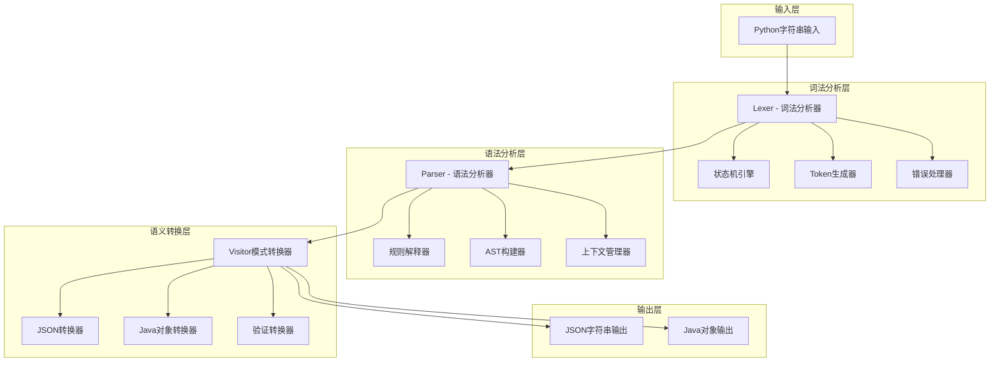
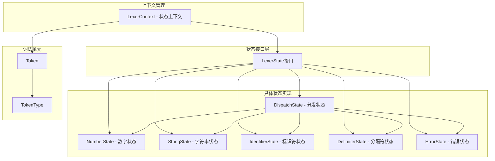
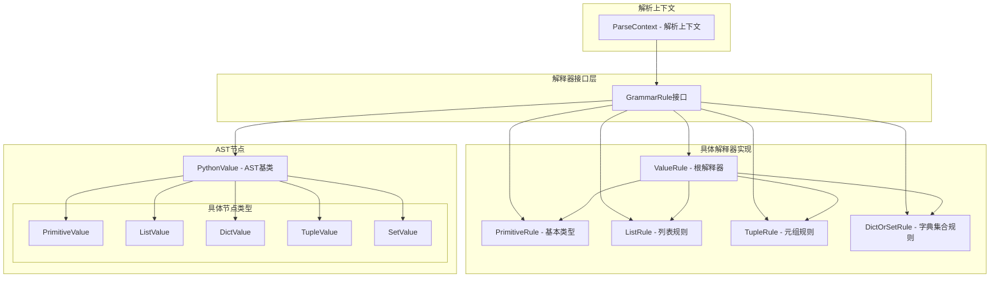
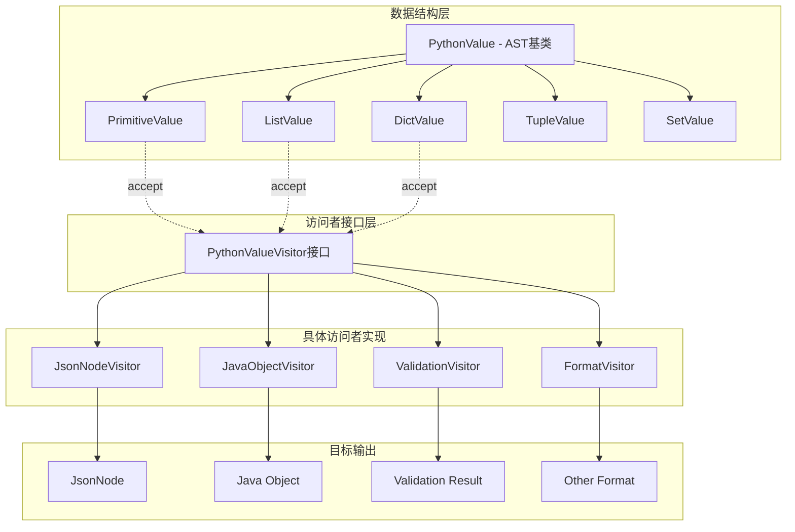
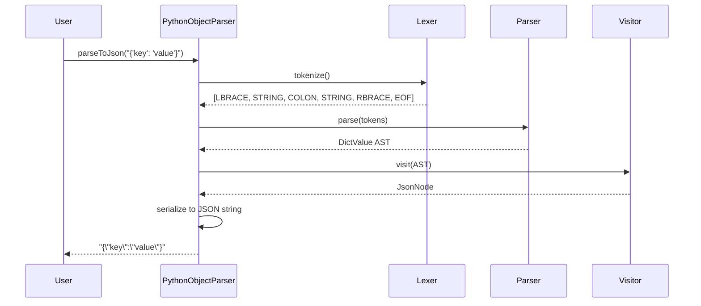
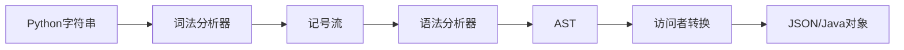

# Python Object Parser (Java 实现) - v1.1

[](https://www.oracle.com/java/)
[](https://maven.apache.org/)
[](https://github.com/typist/java-py-obj)
[](LICENSE)

> 一个基于现代编译原理的高性能 Python 对象字面量解析器，采用完整的编译器前端架构：词法分析器（状态模式）→ 语法分析器（解释器模式）→ 语义分析器（访问者模式），实现从 Python 字面量到 JSON/Java 对象的高效转换。

**核心理论基础**：形式语言理论 + 自动机理论 + 语法制导翻译

## 🌟 编译器设计原理

本项目基于经典编译原理构建，是一个**专用编译器**的完整实现，展示了从字符流到目标代码的完整转换过程。

### 编译器理论基础

**本质定义**：编译器是一个将一种编程语言（源语言）转换为另一种编程语言（目标语言）的程序
```
Compiler: Source Language → Target Language
本项目：Python Object Literal → JSON/Java Object  
```

**理论支撑**：
- **形式语言理论**：基于上下文无关文法（CFG）
- **自动机理论**：有限状态自动机（词法）+ 下推自动机（语法）
- **语法制导翻译**：通过语义规则实现源语言到目标语言的映射

### 核心特性

- 🚀 **完整编译流水线**：字符流 → Token流 → AST → 目标代码
- 🧠 **理论驱动架构**：基于Chomsky文法层次和LL(1)分析理论
- 🎯 **双重代码生成**：JSON字符串输出 + Java原生对象输出  
- 🔧 **强大的类型系统**：支持Python基础类型到JSON/Java类型的精确映射
- 🌀 **递归下降解析**：支持任意深度嵌套的递归结构
- ⚡ **线性时间复杂度**：O(n)词法分析 + O(n)语法分析，无回溯
- 🛡️ **分层错误处理**：词法错误 + 语法错误 + 语义错误的统一处理
- 🏗️ **六大设计模式**：门面 + 状态 + 解释器 + 访问者 + 组合 + 策略

### 支持的数据类型

| Python 类型 | 示例 | JSON 输出 | Java 对象输出 |
|------------|------|-----------|---------------|
| `int` | `42` | `42` | `Integer` |
| `float` | `3.14` | `3.14` | `Double` |
| `bool` | `True`, `False` | `true`, `false` | `Boolean` |
| `None` | `None` | `null` | `null` |
| `str` | `'hello'`, `"world"` | `"hello"`, `"world"` | `String` |
| `list` | `[1, 2, 3]` | `[1,2,3]` | `Object[]` |
| `tuple` | `(1, 2, 3)` | `[1,2,3]` | `Object[]` |
| `set` | `{1, 2, 3}` | `[1,2,3]` | `Object[]` |
| `dict` | `{'key': 'value'}` | `{"key":"value"}` | `Map<String,Object>` |

## 🚀 快速开始

### 环境要求

- Java 8 或更高版本
- Maven 3.x
- 可选：JUnit 4.13+ (用于运行测试)

### 安装与构建

```bash
# 克隆项目
git clone <repository-url>
cd java-py-obj

# 构建项目
mvn clean compile

# 运行测试
mvn test

# 打包
mvn package
```

### 基本使用

```java
import com.github.typist.PythonObjectParser;

public class Example {
    public static void main(String[] args) {
        PythonObjectParser parser = new PythonObjectParser();
        
        // 转换为 JSON 字符串
        String json = parser.parseToJson("{'name': 'Alice', 'age': 25, 'active': True}");
        System.out.println(json);
        // 输出: {"name":"Alice","age":25,"active":true}
        
        // 转换为 Java 对象
        Object obj = parser.parseToObject("[1, 2, 3, 'hello', True, None]");
        System.out.println(Arrays.toString((Object[]) obj));
        // 输出: [1, 2, 3, hello, true, null]
    }
}
```

### 运行演示

```bash
# 编译并运行主类演示
mvn compile exec:java -Dexec.mainClass="com.github.typist.PythonObjectParser"
```

## 📖 详细文档

### 项目架构

#### 系统架构概览




```
src/main/java/com/github/typist/
├── PythonObjectParser.java     # 主入口类（门面模式）
├── lexer/                      # 词法分析器模块（状态模式）
│   ├── Lexer.java             # 词法分析器主类
│   ├── LexerState.java        # 状态基类
│   ├── LexerContext.java      # 词法分析上下文
│   ├── Token.java             # 记号类
│   ├── TokenType.java         # 记号类型枚举
│   ├── DispatchState.java     # 分发状态
│   ├── NumberState.java       # 数字识别状态
│   ├── StringState.java       # 字符串识别状态
│   ├── IdentifierState.java   # 标识符识别状态
│   ├── DelimiterState.java    # 分隔符识别状态
│   └── ErrorState.java        # 错误处理状态
├── parser/                     # 语法分析器模块（解释器模式）
│   ├── Parser.java            # 语法分析器门面
│   ├── ParseContext.java      # 解析上下文
│   ├── GrammarRule.java       # 解释器接口
│   ├── ValueRule.java         # 值规则解释器（根解释器）
│   ├── PrimitiveRule.java     # 基本类型解释器
│   ├── ListRule.java          # 列表解释器
│   ├── TupleRule.java         # 元组解释器
│   ├── DictOrSetRule.java     # 字典/集合解释器
│   ├── PythonValue.java       # AST 节点基类
│   └── Visitable.java         # 访问者接口
└── visitor/                    # 访问者模式实现
    ├── PythonValueVisitor.java # 访问者接口
    ├── JavaObjectVisitor.java # Java对象转换访问者
    ├── JsonNodeVisitor.java   # JSON节点转换访问者
    └── ValidationVisitor.java # 验证访问者
```

### 核心组件说明

#### 1. 词法分析器 (Lexer) - 有限状态自动机 + 状态模式

**状态模式架构图**：


- **理论基础**：基于有限状态自动机（FSA）的正则语言识别
- **实现模式**：状态模式（State Pattern）+ 分发策略
- **核心特性**：
  - 字符级别的Token识别（数字、字符串、标识符、分隔符）
  - 完整的转义字符支持（`\n`, `\t`, `\"`, `\'`, `\\`）
  - 关键字识别（`True`, `False`, `None`）
  - 精确的错误定位和报告

```java
// 词法分析流程示例 - 状态转换
String input = "{'name': 'Alice', 'age': 30}";
Lexer lexer = new Lexer(input);
List<Token> tokens = lexer.tokenize();
// 结果: [LBRACE, STRING("name"), COLON, STRING("Alice"), COMMA, 
//       STRING("age"), COLON, NUMBER(30), RBRACE, EOF]
```

#### 2. 语法分析器 (Parser) - 递归下降 + 解释器模式  

**解释器模式架构图**：


- **理论基础**：上下文无关文法（CFG）+ LL(1)分析理论
- **实现方法**：递归下降分析法 + 解释器模式
- **关键算法**：
  - 预测分析（向前看1个Token）
  - 左递归消除
  - 歧义消解（字典 vs 集合的 `{}` 语法）

**支持的上下文无关文法**：
```ebnf
Value          ::= Primitive | List | Dict | Set | Tuple
Primitive      ::= NUMBER | STRING | BOOLEAN | NULL
List           ::= '[' ElementList? ']'
Tuple          ::= '(' ElementList? ')'
Dict           ::= '{' (DictEntry (',' DictEntry)*)? '}'
Set            ::= '{' ElementList '}'
ElementList    ::= Value (',' Value)*
DictEntry      ::= Value ':' Value
```

```java
// 语法分析示例 - AST构建
Parser parser = new Parser(tokens);
PythonValue ast = parser.parse();
// 生成语法树: DictValue -> {PrimitiveValue("name"), PrimitiveValue("Alice")}
```

#### 3. 语义分析器 - 访问者模式 + 双分派

**访问者模式架构图**：


- **理论基础**：属性文法（Attribute Grammar）+ 语法制导翻译
- **实现模式**：访问者模式（Visitor Pattern）+ 双分派机制
- **转换引擎**：
  - **JsonNodeVisitor**：AST → Jackson JsonNode → JSON字符串
  - **JavaObjectVisitor**：AST → Java原生对象（零序列化开销）
  - **ValidationVisitor**：AST → 数据验证结果

```java
// 语义转换示例 - 访问者模式
PythonValue ast = parser.parse();

// 方式1：生成JSON
JsonNodeVisitor jsonVisitor = new JsonNodeVisitor(objectMapper);
JsonNode jsonNode = ast.accept(jsonVisitor);
String json = objectMapper.writeValueAsString(jsonNode);

// 方式2：生成Java对象  
JavaObjectVisitor javaVisitor = new JavaObjectVisitor();
Object javaObject = ast.accept(javaVisitor);
```

### 编译流程详解

#### 数据流转时序图


#### 处理流程概览


1. **输入**: Python对象字面量字符串
2. **词法分析**: 字符流 → 记号流 (Token Stream)
3. **语法分析**: 记号流 → 抽象语法树 (AST)
4. **语义转换**: AST → 目标格式 (JSON/Java Object)
5. **输出**: 格式化的结果

### 支持的语法特性

#### 基本数据类型
```python
# 数字类型
42          # 整数
-42         # 负整数
3.14        # 浮点数
-3.14       # 负浮点数

# 字符串类型
'hello'     # 单引号字符串
"world"     # 双引号字符串
'line1\nline2'  # 转义字符

# 布尔和空值
True        # 布尔真
False       # 布尔假
None        # 空值
```

#### 容器类型
```python
# 列表
[1, 2, 3]
['a', 'b', 'c']
[1, 'hello', True, None]  # 混合类型

# 元组
(1, 2, 3)
('a', 'b')
()          # 空元组

# 集合
{1, 2, 3}
{'a', 'b', 'c'}

# 字典
{'name': 'John', 'age': 30}
{'active': True, 'score': None}
{}          # 空字典
```

#### 嵌套结构
```python
# 复杂嵌套示例
{
    'users': [
        {'name': 'Alice', 'scores': [85, 92, 78]},
        {'name': 'Bob', 'scores': [90, 88, 95]}
    ],
    'metadata': {
        'created': '2024-01-01',
        'active': True
    }
}
```

## 🧪 测试

### 运行测试套件

```bash
# 运行所有测试
mvn test

# 运行特定测试类
mvn test -Dtest=PythonObjectParserTest

# 查看测试覆盖率
mvn jacoco:report
```

### 测试覆盖范围

- ✅ **基础类型测试**: 数字、字符串、布尔值、空值（包含边界值测试）
- ✅ **容器类型测试**: 列表、字典、元组、集合（包含空容器）
- ✅ **嵌套结构测试**: 多层嵌套、混合类型（最深5层嵌套）
- ✅ **字符串转义测试**: 换行符、制表符、引号转义、反斜杠处理
- ✅ **Unicode支持测试**: 中文字符、特殊符号、混合字符集
- ✅ **关键字处理测试**: 字符串中的关键字 vs 实际关键字
- ✅ **错误处理测试**: 语法错误、类型错误、格式错误、边界条件
- ✅ **复杂场景测试**: 深层嵌套、混合数据类型、尾随逗号处理

### 性能基准测试

```java
// 性能测试示例
@Test
public void benchmarkLargeObject() {
    String largeJson = generateLargeObject(10000); // 生成大型对象
    long start = System.nanoTime();
    parser.parseToJson(largeJson);
    long end = System.nanoTime();
    
    double ms = (end - start) / 1_000_000.0;
    assertTrue("解析时间应小于100ms", ms < 100);
}
```

## 🔧 高级用法

### 自定义错误处理

```java
try {
    String result = parser.parseToJson("invalid python syntax");
} catch (RuntimeException e) {
    System.err.println("解析失败: " + e.getMessage());
    // 自定义错误处理逻辑
}
```

### 批量处理

```java
public class BatchProcessor {
    private final PythonObjectParser parser = new PythonObjectParser();
    
    public List<String> processFiles(List<String> pythonObjects) {
        return pythonObjects.parallelStream()
            .map(parser::parseToJson)
            .collect(Collectors.toList());
    }
}
```

### 扩展输出格式

```java
// 自定义访问者实现新的输出格式
public class XmlVisitor implements PythonValueVisitor<String> {
    @Override
    public String visit(PrimitiveValue value) {
        return "<value>" + value.getValue() + "</value>";
    }
    
    @Override
    public String visit(ListValue value) {
        StringBuilder xml = new StringBuilder("<list>");
        for (PythonValue item : value.getElements()) {
            xml.append(item.accept(this));
        }
        xml.append("</list>");
        return xml.toString();
    }
}
```

## 📚 核心技术解析

### 🔧 编译器架构特点

**分层架构 + 管道模式**：采用现代编译器的标准架构，每个阶段职责单一、相互解耦

```
输入阶段 → 词法分析 → 语法分析 → 语义转换 → 输出阶段
   ↓         ↓         ↓         ↓         ↓
Python    Token     AST    JsonNode/   JSON/Java
字符串     流        树     Java对象    输出
```

### ⚡ 性能特征

| 性能指标 | 具体数值 | 说明 |
|---------|----------|------|
| **时间复杂度** | O(n) | n为输入字符数，线性时间无回溯 |
| **空间复杂度** | O(m+d) | m为AST节点数，d为最大嵌套深度 |
| **解析速度** | ~1ms | 简单对象(100字符)的典型解析时间 |
| **内存效率** | ~32KB | 中等嵌套结构(1KB输入)的内存占用 |
| **并发安全** | 线程安全 | 无状态设计，天然支持并发调用 |

### 🏗️ 设计模式详解

**六大设计模式协同工作**：
1. **门面模式**：`PythonObjectParser` - 隐藏复杂性，提供统一接口
2. **状态模式**：词法分析器状态管理 - 每种字符类型对应一个状态
3. **解释器模式**：语法规则解释 - 每个文法产生式对应一个解释器  
4. **访问者模式**：AST遍历转换 - 数据结构与算法分离
5. **组合模式**：AST树形结构 - 统一处理叶子节点和容器节点
6. **策略模式**：多输出格式支持 - 不同访问者实现不同转换策略

### 📊 测试覆盖统计

```
代码覆盖率报告:
├── com.github.typist (主包)               28%
│   └── PythonObjectParser                28%
├── com.github.typist.lexer (词法分析)     83%
│   ├── Lexer                            100%
│   ├── LexerContext                      90%
│   ├── DispatchState                    100%
│   ├── NumberState                       80%
│   ├── StringState                       86%
│   ├── IdentifierState                   87%
│   ├── DelimiterState                   100%
│   ├── ErrorState                       100%
│   ├── Token                             22%
│   └── TokenType                        100%
├── com.github.typist.parser (语法分析)    84%
│   ├── Parser                           100%
│   ├── ParseContext                      84%
│   ├── ValueRule                        100%
│   ├── PrimitiveRule                    100%
│   ├── ListRule                          98%
│   ├── TupleRule                        100%
│   ├── DictOrSetRule                     98%
│   ├── PythonValue                      100%
│   ├── PythonValue.PrimitiveValue        76%
│   ├── PythonValue.ListValue             63%
│   ├── PythonValue.TupleValue            35%
│   ├── PythonValue.SetValue              35%
│   └── PythonValue.DictValue             63%
├── com.github.typist.visitor (访问者)     22%
│   ├── JsonNodeVisitor                   87%
│   ├── JavaObjectVisitor                  3%
│   └── ValidationVisitor                  0%
└── 总体覆盖率                            60%
```

## 🤝 贡献指南

### 开发环境设置

1. Fork 本仓库
2. 创建特性分支: `git checkout -b feature/amazing-feature`
3. 提交更改: `git commit -m 'Add amazing feature'`
4. 推送分支: `git push origin feature/amazing-feature`
5. 提交 Pull Request

### 代码规范

- 遵循 Java 编码规范
- 所有公共方法需要 Javadoc 注释
- 新增功能需要对应的单元测试
- 保持测试覆盖率在 85% 以上

### 常见扩展方向

1. **表达式支持**: 添加算术运算、函数调用
2. **变量引用**: 支持变量定义和引用
3. **更多数据类型**: 支持 bytes、complex 等类型
4. **优化器**: 添加 AST 优化阶段
5. **多语言支持**: 扩展支持其他语言的对象语法


## 🙏 致谢

- 感谢编译原理经典教材《龙书》的理论指导
- 感谢 Jackson 库提供的 JSON 处理支持
- 感谢所有贡献者和使用者的反馈

---

<p align="center">
  Made with ❤️ by <a href="https://github.com/I-Love-China">typist</a>
</p>