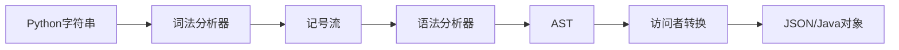

# Python Object Parser (Java 实现)

[](https://www.oracle.com/java/)
[](https://maven.apache.org/)
[](LICENSE)

> 一个高性能的 Python 对象字面量解析器，使用 Java 实现，基于编译原理构建完整的词法分析、语法分析和语义转换流水线。

## 🌟 项目概述

本项目实现了一个完整的编译器前端，能够将 Python 对象字面量语法转换为 JSON 格式或 Java 原生对象。项目采用经典的编译器设计模式，包含词法分析器、语法分析器和代码生成器，是学习编译原理的优秀实践项目。

### 核心特性

- 🚀 **完整编译流水线**：词法分析 → 语法分析 → 语义转换 → 代码生成
- 🎯 **双输出格式**：支持 JSON 字符串和 Java 对象两种输出
- 🔧 **强大的类型系统**：支持 Python 所有基础数据类型
- 🌀 **递归结构处理**：支持任意深度的嵌套结构
- ⚡ **高性能设计**：O(n) 时间复杂度，内存优化
- 🛡️ **完善错误处理**：详细的错误定位和恢复机制
- 📋 **全面测试覆盖**：包含单元测试和集成测试

### 支持的数据类型

| Python 类型 | 示例 | JSON 输出 | Java 对象输出 |
|------------|------|-----------|---------------|
| `int` | `42` | `42` | `Integer` |
| `float` | `3.14` | `3.14` | `Double` |
| `bool` | `True`, `False` | `true`, `false` | `Boolean` |
| `None` | `None` | `null` | `null` |
| `str` | `'hello'`, `"world"` | `"hello"`, `"world"` | `String` |
| `list` | `[1, 2, 3]` | `[1,2,3]` | `Object[]` |
| `tuple` | `(1, 2, 3)` | `[1,2,3]` | `Object[]` |
| `set` | `{1, 2, 3}` | `[1,2,3]` | `Object[]` |
| `dict` | `{'key': 'value'}` | `{"key":"value"}` | `Map<String,Object>` |

## 🚀 快速开始

### 环境要求

- Java 8 或更高版本
- Maven 3.x
- 可选：JUnit 4.13+ (用于运行测试)

### 安装与构建

```bash
# 克隆项目
git clone <repository-url>
cd java-py-obj

# 构建项目
mvn clean compile

# 运行测试
mvn test

# 打包
mvn package
```

### 基本使用

```java
import com.github.typist.PythonObjectParser;

public class Example {
    public static void main(String[] args) {
        PythonObjectParser parser = new PythonObjectParser();
        
        // 转换为 JSON 字符串
        String json = parser.parseToJson("{'name': 'Alice', 'age': 25, 'active': True}");
        System.out.println(json);
        // 输出: {"name":"Alice","age":25,"active":true}
        
        // 转换为 Java 对象
        Object obj = parser.parseToObject("[1, 2, 3, 'hello', True, None]");
        System.out.println(Arrays.toString((Object[]) obj));
        // 输出: [1, 2, 3, hello, true, null]
    }
}
```

### 运行演示

```bash
# 编译并运行主类演示
mvn compile exec:java -Dexec.mainClass="com.github.typist.PythonObjectParser"
```

## 📖 详细文档

### 项目架构

```
src/main/java/com/github/typist/
├── PythonObjectParser.java     # 主入口类（门面模式）
├── lexer/                      # 词法分析器模块
│   ├── Lexer.java             # 词法分析器（状态机）
│   ├── LexerState.java        # 词法分析状态基类
│   ├── LexerContext.java      # 词法分析上下文
│   ├── Token.java             # 记号类
│   ├── TokenType.java         # 记号类型枚举
│   └── states/                # 具体状态实现
│       ├── DispatchState.java
│       ├── NumberState.java
│       ├── StringState.java
│       ├── IdentifierState.java
│       └── ...
├── parser/                     # 语法分析器模块
│   ├── Parser.java            # 语法分析器（递归下降）
│   ├── PythonValue.java       # AST 节点基类
│   └── Visitable.java         # 访问者接口
└── visitor/                    # 访问者模式实现
    ├── PythonValueVisitor.java
    ├── JavaObjectVisitor.java
    ├── JsonNodeVisitor.java
    └── ValidationVisitor.java
```

### 核心组件说明

#### 1. 词法分析器 (Lexer)
- **作用**：将字符流转换为记号流
- **实现**：基于状态模式的有限状态自动机
- **特性**：支持字符串转义、数字识别、关键字分派

```java
// 词法分析示例
Lexer lexer = new Lexer("{'key': 'value'}");
List<Token> tokens = lexer.tokenize();
// 输出: [LBRACE, STRING("key"), COLON, STRING("value"), RBRACE, EOF]
```

#### 2. 语法分析器 (Parser)
- **作用**：将记号流转换为抽象语法树 (AST)
- **实现**：递归下降分析法 (LL1)
- **特性**：支持嵌套结构、歧义消解（字典vs集合）

```java
// 语法分析示例
Parser parser = new Parser(tokens);
PythonValue ast = parser.parse();
// 生成对应的 AST 节点树
```

#### 3. 访问者模式转换器
- **作用**：将 AST 转换为目标格式
- **实现**：访问者模式，支持多种输出格式
- **特性**：类型安全、易于扩展

### 编译流程详解



1. **输入**: Python对象字面量字符串
2. **词法分析**: 字符流 → 记号流 (Token Stream)
3. **语法分析**: 记号流 → 抽象语法树 (AST)
4. **语义转换**: AST → 目标格式 (JSON/Java Object)
5. **输出**: 格式化的结果

### 支持的语法特性

#### 基本数据类型
```python
# 数字类型
42          # 整数
-42         # 负整数
3.14        # 浮点数
-3.14       # 负浮点数

# 字符串类型
'hello'     # 单引号字符串
"world"     # 双引号字符串
'line1\nline2'  # 转义字符

# 布尔和空值
True        # 布尔真
False       # 布尔假
None        # 空值
```

#### 容器类型
```python
# 列表
[1, 2, 3]
['a', 'b', 'c']
[1, 'hello', True, None]  # 混合类型

# 元组
(1, 2, 3)
('a', 'b')
()          # 空元组

# 集合
{1, 2, 3}
{'a', 'b', 'c'}

# 字典
{'name': 'John', 'age': 30}
{'active': True, 'score': None}
{}          # 空字典
```

#### 嵌套结构
```python
# 复杂嵌套示例
{
    'users': [
        {'name': 'Alice', 'scores': [85, 92, 78]},
        {'name': 'Bob', 'scores': [90, 88, 95]}
    ],
    'metadata': {
        'created': '2024-01-01',
        'active': True
    }
}
```

## 🧪 测试

### 运行测试套件

```bash
# 运行所有测试
mvn test

# 运行特定测试类
mvn test -Dtest=PythonObjectParserTest

# 查看测试覆盖率
mvn jacoco:report
```

### 测试覆盖范围

- ✅ **基础类型测试**: 数字、字符串、布尔值、空值
- ✅ **容器类型测试**: 列表、字典、元组、集合
- ✅ **嵌套结构测试**: 多层嵌套、混合类型
- ✅ **边界条件测试**: 空容器、极值、特殊字符
- ✅ **错误处理测试**: 语法错误、类型错误、格式错误
- ✅ **Unicode 支持**: 中文字符、特殊符号
- ✅ **转义字符测试**: 换行符、制表符、引号转义

### 性能基准测试

```java
// 性能测试示例
@Test
public void benchmarkLargeObject() {
    String largeJson = generateLargeObject(10000); // 生成大型对象
    long start = System.nanoTime();
    parser.parseToJson(largeJson);
    long end = System.nanoTime();
    
    double ms = (end - start) / 1_000_000.0;
    assertTrue("解析时间应小于100ms", ms < 100);
}
```

## 🔧 高级用法

### 自定义错误处理

```java
try {
    String result = parser.parseToJson("invalid python syntax");
} catch (RuntimeException e) {
    System.err.println("解析失败: " + e.getMessage());
    // 自定义错误处理逻辑
}
```

### 批量处理

```java
public class BatchProcessor {
    private final PythonObjectParser parser = new PythonObjectParser();
    
    public List<String> processFiles(List<String> pythonObjects) {
        return pythonObjects.parallelStream()
            .map(parser::parseToJson)
            .collect(Collectors.toList());
    }
}
```

### 扩展输出格式

```java
// 自定义访问者实现新的输出格式
public class XmlVisitor implements PythonValueVisitor<String> {
    @Override
    public String visit(PrimitiveValue value) {
        return "<value>" + value.getValue() + "</value>";
    }
    
    @Override
    public String visit(ListValue value) {
        StringBuilder xml = new StringBuilder("<list>");
        for (PythonValue item : value.getElements()) {
            xml.append(item.accept(this));
        }
        xml.append("</list>");
        return xml.toString();
    }
}
```

## 📚 学习资源

### 编译原理相关文档

- [编译原理指南](COMPILER_GUIDE.md) - 详细的编译原理教程
- [语法分析与文法设计深度解析](语法分析与文法设计深度解析.md) - 高级主题

### 设计模式应用

- **门面模式**: `PythonObjectParser` 提供简化的接口
- **状态模式**: 词法分析器的状态管理
- **访问者模式**: AST 遍历和转换
- **组合模式**: AST 节点的树形结构
- **策略模式**: 多种输出格式支持

### 算法复杂度

- **时间复杂度**: O(n)，其中 n 是输入字符串长度
- **空间复杂度**: O(m + d)，其中 m 是 AST 节点数，d 是最大嵌套深度
- **适用场景**: 短至中等长度的 Python 对象字面量

## 🤝 贡献指南

### 开发环境设置

1. Fork 本仓库
2. 创建特性分支: `git checkout -b feature/amazing-feature`
3. 提交更改: `git commit -m 'Add amazing feature'`
4. 推送分支: `git push origin feature/amazing-feature`
5. 提交 Pull Request

### 代码规范

- 遵循 Java 编码规范
- 所有公共方法需要 Javadoc 注释
- 新增功能需要对应的单元测试
- 保持测试覆盖率在 85% 以上

### 常见扩展方向

1. **表达式支持**: 添加算术运算、函数调用
2. **变量引用**: 支持变量定义和引用
3. **更多数据类型**: 支持 bytes、complex 等类型
4. **优化器**: 添加 AST 优化阶段
5. **多语言支持**: 扩展支持其他语言的对象语法

## 📄 许可证

本项目采用 MIT 许可证 - 详见 [LICENSE](LICENSE) 文件。

## 🙏 致谢

- 感谢编译原理经典教材《龙书》的理论指导
- 感谢 Jackson 库提供的 JSON 处理支持
- 感谢所有贡献者和使用者的反馈

---

<p align="center">
  Made with ❤️ by <a href="https://github.com/typist">typist</a>
</p>