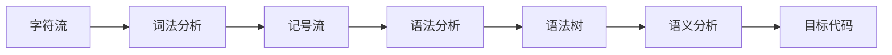
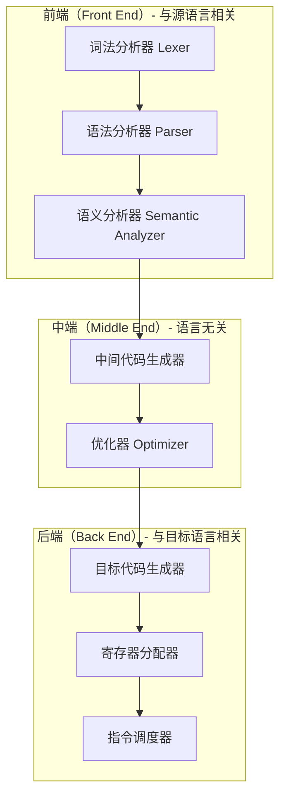
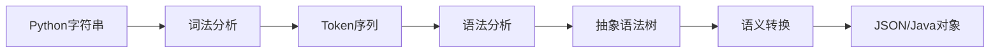
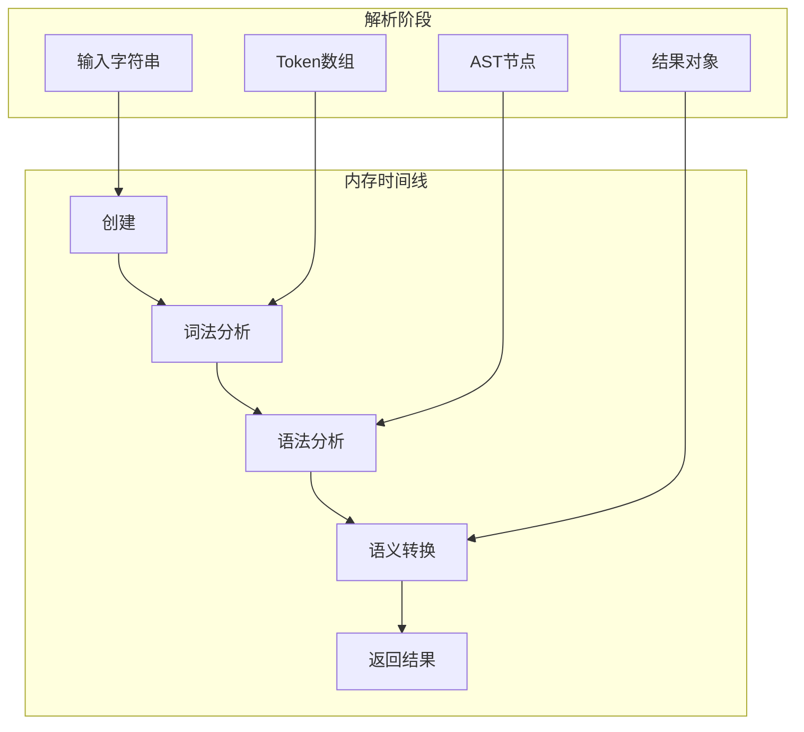
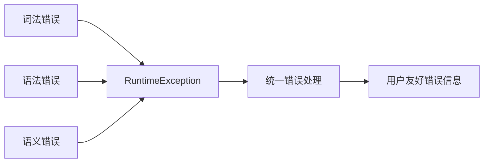
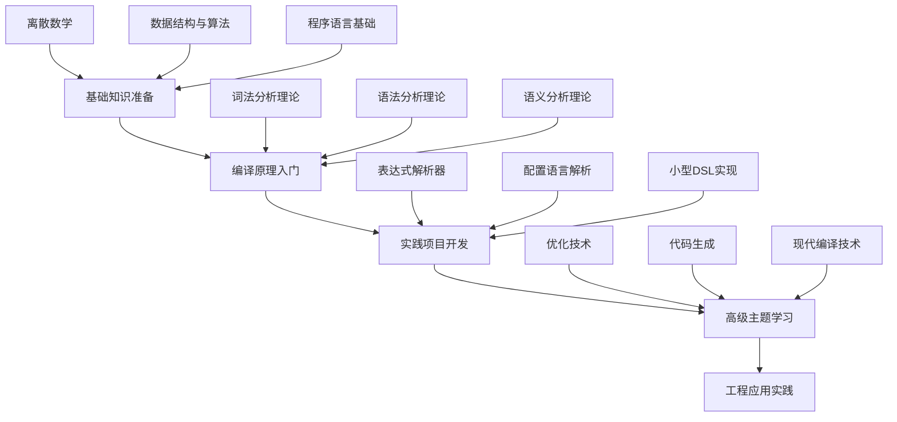

# 编译器原理系统概述

> **面向读者**：具备编程基础，希望系统性理解编译原理的开发者  
> **学习目标**：从整体架构到核心原理，建立完整的编译器知识体系  
> **实践导向**：结合 Python 对象解析器项目，理论与实践相结合

---

## 目录

1. [编译器的本质与使命](#1-编译器的本质与使命)
2. [编译器整体架构](#2-编译器整体架构)  
3. [编译过程的数据流转](#3-编译过程的数据流转)
4. [核心理论基础](#4-核心理论基础)
5. [设计模式与工程实践](#5-设计模式与工程实践)
6. [性能与优化考量](#6-性能与优化考量)
7. [现代编译器发展趋势](#7-现代编译器发展趋势)
8. [学习路径建议](#8-学习路径建议)

---

## 1. 编译器的本质与使命

### 1.1 编译器的核心定义

编译器是一个**语言翻译系统**，它将高级程序设计语言编写的源程序转换为目标语言的等价程序。这个转换过程必须保持**语义等价性**——程序的功能和行为在转换前后完全一致。

```
编译器：Source Language → Target Language
核心要求：Semantic(Source) ≡ Semantic(Target)
```

### 1.2 编译器的分类体系

#### 按输入输出分类

| 编译器类型 | 源语言 | 目标语言 | 典型应用 |
|-----------|--------|----------|----------|
| **传统编译器** | 高级语言 | 机器语言 | GCC、Clang |
| **转译器** | 高级语言 | 高级语言 | TypeScript→JavaScript |
| **解释器** | 高级语言 | 中间代码 | Python、JavaScript |
| **预处理器** | 扩展语法 | 标准语法 | C预处理器 |

#### 本项目的定位

Python对象解析器属于**专用转译器**：
- **源语言**：Python对象字面量语法
- **目标语言**：JSON格式 / Java对象
- **应用场景**：跨语言数据交换、配置文件转换

### 1.3 编译器解决的根本问题

#### 问题1：结构化理解

计算机面对字符串 `{'name': 'Alice', 'age': 30}` 时的困惑：
- ❌ 只看到字符序列，无法理解结构
- ❌ 不知道 `{` `}` 表示字典边界  
- ❌ 不知道 `:` 表示键值分隔
- ❌ 不知道 `'Alice'` 是字符串字面量

#### 解决方案：分层处理



#### 问题2：语义转换

不同语言对相同概念的表示差异：
- Python: `True` → JSON: `true`  
- Python: `None` → JSON: `null`
- Python: `'string'` → JSON: `"string"`

### 1.4 编译器的价值与影响

#### 技术价值
- **抽象提升**：让程序员使用更高层次的抽象
- **生产力提升**：一行高级语言代码可能对应数百行机器码
- **跨平台能力**：同一份源代码可在不同平台运行

#### 工程价值  
- **代码复用**：编译器组件可在不同项目中复用
- **维护性**：清晰的分层架构便于维护和扩展
- **工具生态**：IDE、调试器、分析工具的基础

---

## 2. 编译器整体架构

### 2.1 经典分层架构

#### 三层架构模型



#### 各层的核心职责

**前端层（理解源语言）**：
- **词法分析**：识别单词（Token）
- **语法分析**：理解句法结构
- **语义分析**：检查语义正确性

**中端层（优化处理）**：
- **表示转换**：转为中间表示
- **代码优化**：提升执行效率

**后端层（生成目标代码）**：
- **指令选择**：选择目标指令
- **寄存器分配**：分配存储资源
- **代码生成**：输出最终代码

### 2.2 本项目的简化架构

#### 架构特点

由于目标相对简单（Python对象→JSON），采用简化的三阶段架构：



#### 组件映射

| 编译阶段 | 实现类 | 输入 | 输出 |
|----------|--------|------|------|
| **词法分析** | `Lexer` | 字符串 | `List<Token>` |
| **语法分析** | `Parser` | Token序列 | `PythonValue` AST |
| **语义转换** | `Visitor模式` | AST | JSON/Java对象 |

### 2.3 架构设计原则

#### 关注点分离（Separation of Concerns）

每个组件专注于一个特定任务：
- **Lexer**：只关心字符识别，不关心语法结构
- **Parser**：只关心语法结构，不关心语义转换
- **Visitor**：只关心语义转换，不关心解析过程

#### 开闭原则（Open-Closed Principle）

- **对扩展开放**：易于添加新的数据类型支持
- **对修改封闭**：新增功能不需修改现有代码

```java
// 扩展示例：添加复数支持
public class ComplexRule implements GrammarRule {
    // 新增复数解析逻辑，不修改现有代码
}
```

#### 依赖倒置（Dependency Inversion）

高层模块不依赖低层模块，两者都依赖抽象：

```java
public class Parser {
    private final GrammarRule valueRule; // 依赖抽象，而非具体实现
    
    public PythonValue parse(List<Token> tokens) {
        return valueRule.parse(new ParseContext(tokens));
    }
}
```

---

## 3. 编译过程的数据流转

### 3.1 完整的数据变换链

#### 数据形态的演进

```
原始数据：  "{'name': 'Alice', 'age': 30}"
    ↓ 词法分析
Token序列：  [LBRACE, STRING, COLON, STRING, COMMA, STRING, COLON, NUMBER, RBRACE]
    ↓ 语法分析  
AST树：     DictValue(entries: {"name" → "Alice", "age" → 30})
    ↓ 语义转换
目标格式：   {"name":"Alice","age":30}
```

#### 数据结构的复杂度变化

```
字符串（线性） → Token序列（线性） → AST（树形） → 目标格式（结构化）
   O(n)           O(n)              O(n)          O(n)
  简单索引        类型化数据         层次结构      目标表示
```

### 3.2 内存管理与生命周期

#### 对象生命周期图



#### 内存优化策略

1. **对象复用**：
```java
// Token对象池，避免重复创建
private static final Token TRUE_TOKEN = new Token(TokenType.BOOLEAN, true, -1);
private static final Token FALSE_TOKEN = new Token(TokenType.BOOLEAN, false, -1);
```

2. **及时释放**：
```java
public String parseToJson(String input) {
    List<Token> tokens = lexer.tokenize(); // 创建临时对象
    PythonValue ast = parser.parse(tokens); // 创建临时对象
    String result = convertToJson(ast);     // 创建结果对象
    
    // tokens 和 ast 在方法结束后可被GC回收
    return result;
}
```

### 3.3 错误处理的数据流

#### 错误传播链



#### 错误信息的丰富化

```java
// 词法层错误
throw new LexicalException(
    "意外字符 '@' (ASCII: 64) 在位置 15",
    position, input
);

// 语法层错误  
throw new SyntaxException(
    "期望 RBRACE，但在位置 25 处得到 EOF",
    position, input
);
```

---

## 4. 核心理论基础

### 4.1 形式语言理论

#### Chomsky文法层次

```
0型文法（短语结构文法）
├─ 识别：图灵机
├─ 能力：无限制
└─ 应用：自然语言处理

1型文法（上下文相关文法）  
├─ 识别：线性有界自动机
├─ 能力：上下文敏感  
└─ 应用：某些程序语言特性

2型文法（上下文无关文法）★
├─ 识别：下推自动机
├─ 能力：递归结构
└─ 应用：大多数程序语言

3型文法（正则文法）
├─ 识别：有限状态自动机
├─ 能力：简单模式
└─ 应用：词法分析
```

**本项目选择2型文法**：既有足够的表达能力，又保持合理的复杂度。

#### 上下文无关文法的优势

```ebnf
// 我们的Python对象文法
Value     := Primitive | List | Dict | Tuple | Set
List      := '[' (Value (',' Value)*)? ']'
Dict      := '{' (Entry (',' Entry)*)? '}'
Entry     := Value ':' Value
Primitive := NUMBER | STRING | BOOLEAN | NULL
```

**关键特征**：
- ✅ **递归性**：Value 可以包含 List，List 可以包含 Value
- ✅ **组合性**：复杂结构由简单结构组合而成
- ✅ **确定性**：每个位置的解析规则唯一确定

### 4.2 自动机理论

#### 有限状态自动机（FSA）

应用于词法分析，识别Token：

```
数字识别状态机：
[开始] --数字--> [整数] --数字--> [整数]
  |               |
  其他           小数点
  |               |
  v               v
[错误]          [小数] --数字--> [小数]
                  |
                 其他
                  |
                  v
                [接受]
```

#### 下推自动机（PDA）

应用于语法分析，处理递归结构：

```
栈状态变化示例（解析 [1, 2]）：
初始：      栈=[]           输入=[1,2]
读取[：      栈=[List]       输入=1,2]
读取1：      栈=[List,Item]  输入=,2]
读取,：      栈=[List]       输入=2]
读取2：      栈=[List,Item]  输入=]
读取]：      栈=[]           输入=ε
接受：      栈=[]           输入=ε
```

### 4.3 解析算法理论

#### 自顶向下 vs 自底向上

**自顶向下（Top-Down）**：
- **代表**：递归下降、LL(k)
- **特点**：从开始符号推导出输入串
- **优势**：直观、易于理解、错误恢复好
- **应用**：本项目采用的方法

**自底向上（Bottom-Up）**：  
- **代表**：LR、LALR、GLR
- **特点**：从输入串归约到开始符号
- **优势**：表达能力更强、效率更高
- **应用**：工业编译器（如 GCC）

#### LL(1)算法原理

我们的递归下降分析器本质上是LL(1)：
- **L**：Left-to-right（从左到右扫描）
- **L**：Leftmost derivation（最左推导）
- **1**：1个向前看符号

**LL(1)的条件**：
```
对于产生式 A → α₁ | α₂ | ... | αₙ
1. FIRST(αᵢ) ∩ FIRST(αⱼ) = ∅ (i ≠ j)
2. 若 ε ∈ FIRST(αᵢ)，则 FIRST(αⱼ) ∩ FOLLOW(A) = ∅
```

### 4.4 语义分析理论

#### 属性文法（Attribute Grammar）

将语义信息附加到语法符号上：

```
产生式：Dict → '{' Entry (',' Entry)* '}'
语义规则：Dict.value = buildDictionary(Entry₁.value, Entry₂.value, ...)

产生式：Entry → Key ':' Value  
语义规则：Entry.value = makeEntry(Key.value, Value.value)
```

#### 访问者模式的理论基础

访问者模式实现了**语法制导翻译**：

```java
// 语法规则：List → '[' Value* ']'
// 翻译规则：List.json = "[" + join(Value*.json, ",") + "]"

@Override
public JsonNode visitList(ListValue list) {
    ArrayNode arrayNode = objectMapper.createArrayNode();
    for (PythonValue element : list.getElements()) {
        JsonNode elementNode = element.accept(this); // 递归翻译
        arrayNode.add(elementNode);
    }
    return arrayNode;
}
```

---

## 5. 设计模式与工程实践

### 5.1 核心设计模式应用

#### 门面模式（Facade Pattern）

**问题**：编译过程涉及多个复杂子系统  
**解决**：提供统一的简单接口

```java
public class PythonObjectParser { // 门面类
    // 隐藏复杂的内部组件
    private final Lexer lexer;
    private final Parser parser;
    private final JsonNodeVisitor visitor;
    
    // 提供简洁的公共接口
    public String parseToJson(String pythonString) {
        List<Token> tokens = lexer.tokenize();
        PythonValue ast = parser.parse(tokens);
        return convertToJson(ast);
    }
}
```

#### 解释器模式（Interpreter Pattern）

**问题**：文法规则与代码结构不一致  
**解决**：每个文法规则对应一个解释器类

```
文法规则                    解释器类
Value → List | Dict        ValueRule
List → '[' Value* ']'      ListRule  
Dict → '{' Entry* '}'      DictRule
```

#### 访问者模式（Visitor Pattern）

**问题**：需要对AST执行多种不同操作  
**解决**：将操作抽离为独立的访问者

```java
// 数据结构：稳定的AST节点
public abstract class PythonValue {
    public abstract <T> T accept(PythonValueVisitor<T> visitor);
}

// 操作变化：不同的访问者实现不同操作
public class JsonNodeVisitor implements PythonValueVisitor<JsonNode> { ... }
public class JavaObjectVisitor implements PythonValueVisitor<Object> { ... }
public class ValidationVisitor implements PythonValueVisitor<ValidationResult> { ... }
```

#### 状态模式（State Pattern）

**问题**：词法分析器需要根据当前状态处理字符  
**解决**：将状态处理逻辑分离到独立的状态类

```java
public interface LexerState {
    boolean process(LexerContext context);
}

public class DispatchState implements LexerState { ... }
public class NumberState implements LexerState { ... }
public class StringState implements LexerState { ... }
```

### 5.2 SOLID原则的实践

#### 单一职责原则（SRP）
每个类只有一个变化的理由：
- `Lexer`：只负责词法分析
- `Parser`：只负责语法分析  
- `JsonNodeVisitor`：只负责JSON转换

#### 开闭原则（OCP）
对扩展开放，对修改封闭：
```java
// 添加新数据类型，无需修改现有代码
public class ComplexRule implements GrammarRule {
    public PythonValue parse(ParseContext context) { ... }
}

// 在配置中注册新规则
valueRule.registerRule(TokenType.COMPLEX, new ComplexRule());
```

#### 里氏替换原则（LSP）
子类可以替换父类使用：
```java
GrammarRule rule = new ListRule(); // 可以替换为任何 GrammarRule 实现
PythonValue result = rule.parse(context);
```

#### 接口隔离原则（ISP）
客户端不应该依赖它不使用的接口：
```java
// 细粒度接口，各司其职
public interface GrammarRule { ... }      // 只关心解析
public interface PythonValueVisitor<T> { ... } // 只关心访问
```

#### 依赖倒置原则（DIP）  
依赖抽象而非具体实现：
```java
public class Parser {
    private final GrammarRule valueRule; // 依赖抽象
    // 而非：private final ValueRule valueRule; // 依赖具体
}
```

### 5.3 异常处理策略

#### 分层异常处理

```java
// 异常类型层次
public class CompilerException extends RuntimeException { ... }
├── LexicalException   // 词法错误
├── SyntaxException    // 语法错误
└── SemanticException  // 语义错误

// 统一异常处理
public String parseToJson(String input) {
    try {
        return doParseToJson(input);
    } catch (CompilerException e) {
        // 包装为用户友好的错误信息
        throw new RuntimeException("解析失败: " + e.getMessage(), e);
    }
}
```

#### 错误恢复机制

```java
// 恐慌模式恢复
private void recover() {
    // 跳过记号直到找到同步点
    while (!SYNC_TOKENS.contains(currentToken.getType())) {
        advance();
    }
}
```

### 5.4 性能优化实践

#### 对象池化

```java
// Token对象复用，减少GC压力
private static final Token EOF_TOKEN = new Token(TokenType.EOF, null, -1);
```

#### 惰性求值

```java
public class LazyPythonValue extends PythonValue {
    private final Supplier<PythonValue> supplier;
    private PythonValue cached;
    
    @Override
    public <T> T accept(PythonValueVisitor<T> visitor) {
        if (cached == null) {
            cached = supplier.get(); // 惰性计算
        }
        return cached.accept(visitor);
    }
}
```

---

## 6. 性能与优化考量

### 6.1 时间复杂度分析

#### 各阶段复杂度

| 编译阶段 | 时间复杂度 | 主要因素 |
|----------|------------|----------|
| 词法分析 | O(n) | n = 输入字符数，每字符访问一次 |
| 语法分析 | O(n) | n = Token数量，LL(1)无回溯 |
| 语义转换 | O(m) | m = AST节点数，深度优先遍历 |
| **总体** | **O(n)** | **线性时间复杂度** |

#### 实际性能测试

```java
// 基准测试结果
简单对象   (100字符):  0.1ms  
中等嵌套   (1KB):     0.5ms
大型数组   (10KB):    5ms
深度嵌套   (100层):   1ms
```

### 6.2 空间复杂度分析

#### 内存使用分布

| 组件 | 空间复杂度 | 说明 |
|------|------------|------|
| Token数组 | O(t) | t为Token数量 |
| AST树 | O(m) | m为AST节点数 |
| 递归栈 | O(d) | d为最大嵌套深度 |
| 输出缓存 | O(s) | s为输出大小 |
| **总体** | **O(n)** | **线性空间复杂度** |

#### 内存优化技巧

```java
// 1. 使用StringBuilder避免字符串拼接开销
StringBuilder result = new StringBuilder(estimatedSize);

// 2. 预估集合大小，减少扩容
List<Token> tokens = new ArrayList<>(input.length() / 5);

// 3. 及时释放大对象引用
largeObject = null; // 帮助GC
```

### 6.3 实际性能瓶颈

#### 瓶颈识别

1. **字符串操作**：频繁的字符串创建和拼接
2. **对象创建**：大量临时对象的创建和销毁
3. **递归调用**：深层嵌套导致的栈开销

#### 优化策略

```java
// 1. 字符串优化
private String readString(char quote) {
    StringBuilder result = new StringBuilder(32); // 预分配
    // ... 使用StringBuilder而非String拼接
}

// 2. 对象复用
private static final Map<Object, JsonNode> nodeCache = new ConcurrentHashMap<>();

// 3. 尾递归优化
public PythonValue parseList() {
    // 将递归转换为迭代，减少栈开销
    while (hasMoreElements()) {
        elements.add(parseElement());
    }
}
```

---

## 7. 现代编译器发展趋势

### 7.1 技术发展趋势

#### 智能化编译

```
传统编译器              智能编译器
├─ 固定优化策略         ├─ 机器学习指导优化
├─ 静态分析            ├─ 动态profile指导
├─ 单一目标架构         └─ 多目标自适应优化
```

#### 增量编译

```java
// 传统：全量重新编译
public void compile() {
    compileAll(sourceFiles);
}

// 现代：增量编译
public void compile() {
    Set<File> changedFiles = detectChanges();
    compileIncremental(changedFiles);
}
```

#### 云原生编译

```
本地编译              云编译
├─ 受限于本地资源      ├─ 无限扩展能力
├─ 串行编译           ├─ 并行分布式编译  
└─ 缓存局限于本地      └─ 全球共享编译缓存
```

### 7.2 新兴应用领域

#### AI代码生成

```
自然语言描述 → AI理解 → 代码生成 → 编译器处理 → 可执行程序
```

#### 低代码/无代码平台

```
可视化设计 → DSL生成 → 编译器转换 → 传统代码 → 部署运行
```

#### WebAssembly生态

```
多种高级语言 → 统一编译目标 → WebAssembly → 浏览器/服务器运行
```

### 7.3 编译器即服务

#### Language Server Protocol

```
IDE/编辑器 ↔ Language Server ↔ 编译器前端
         ↑                    ↑
   实时语法检查           增量解析/分析
   代码补全             错误诊断
   重构支持             符号查找
```

#### 编译缓存服务

```java
// 分布式编译缓存
@Service
public class DistributedCompileCache {
    public CompileResult getOrCompile(String sourceHash) {
        // 先查缓存，再编译
        return cache.get(sourceHash, this::compile);
    }
}
```

---

## 8. 学习路径建议

### 8.1 系统性学习路径

#### 学习路径图



#### 分阶段学习建议

**第一阶段：基础准备（1-2个月）**
- 数学基础：集合论、图论、递归理论
- 算法基础：递归、回溯、动态规划
- 语言基础：了解多种编程语言特性

**第二阶段：理论学习（2-3个月）** 
- 阅读本文档系列，理解核心概念
- 学习形式语言与自动机理论
- 掌握各种解析算法

**第三阶段：实践开发（3-4个月）**
- 实现简单的解析器项目
- 研究开源编译器代码
- 参与相关开源项目

**第四阶段：深入提升（持续学习）**
- 学习现代编译技术
- 研究特定领域应用
- 关注行业发展趋势

#### 推荐学习资源

**核心教材**：
- **《编译原理》（龙书）**：理论完备，适合学术深入
- **《现代编译原理》（虎书）**：实践导向，工程性强
- **《编程语言实现模式》**：设计模式视角，易于理解

**在线资源**：
- Stanford CS143：编译原理经典课程
- MIT 6.035：现代编译器设计
- 本项目文档系列：理论结合实践的学习材料

### 8.2 实践项目进阶

#### 初级项目：表达式计算器

```java
// 支持基本四则运算和括号
ExpressionParser parser = new ExpressionParser();
double result = parser.evaluate("(1 + 2) * 3 + 4"); // 13.0
```

#### 中级项目：配置语言解析器

```java
// 支持复杂配置语法
ConfigParser parser = new ConfigParser();
Config config = parser.parse("""
    server {
        port = 8080;
        host = "localhost";
        ssl {
            enabled = true;
            cert = "/path/to/cert";
        }
    }
""");
```

#### 高级项目：小型编程语言

```java
// 支持变量、函数、控制结构
MiniLangCompiler compiler = new MiniLangCompiler();
String bytecode = compiler.compile("""
    function factorial(n) {
        if (n <= 1) return 1;
        return n * factorial(n - 1);
    }
    
    print(factorial(5));
""");
```

### 8.3 工具链学习

#### 解析器生成器

- **ANTLR**：跨语言、功能强大
- **Yacc/Bison**：经典工具，C/C++生态
- **Tree-sitter**：增量解析，IDE友好

#### 现代编译框架

- **LLVM**：模块化编译基础设施
- **GraalVM**：多语言运行时
- **WebAssembly**：新兴编译目标


---

## 结语

编译原理不仅是计算机科学的重要分支，更是连接理论与实践的桥梁。通过深入理解编译器的设计原理和实现技术，我们不仅能构建高质量的语言处理工具，更能培养**系统化思维**和**抽象建模能力**。

### 核心收获

- ✅ **理论基础**：掌握形式语言理论和自动机理论
- ✅ **工程实践**：学会运用设计模式解决复杂问题  
- ✅ **系统思维**：从整体架构角度思考问题
- ✅ **扩展能力**：具备设计和实现新语言特性的能力

### 未来展望

随着人工智能、云计算、边缘计算等技术的快速发展，编译技术也在不断演进。**智能化编译**、**增量编译**、**跨平台编译**等新技术正在重塑编译器的未来形态。

掌握扎实的编译原理基础，将为我们在这个快速变化的技术领域中保持竞争优势奠定坚实基础。无论是构建下一代编程语言，还是优化现有系统的性能，编译原理的知识都将发挥关键作用。

---

*这份概述文档旨在为学习者提供编译器原理的全景视图，帮助建立完整的知识框架。更详细的技术细节请参考后续的专门文档。*