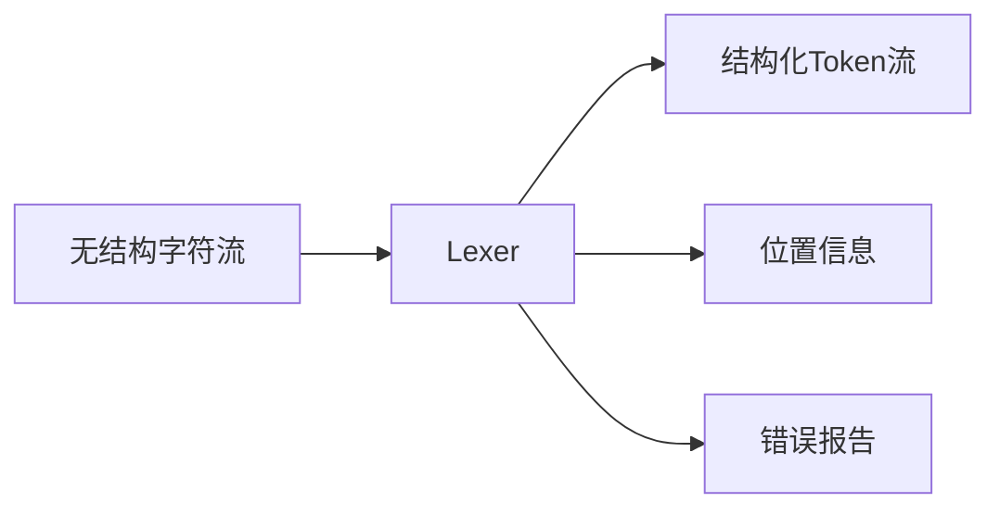
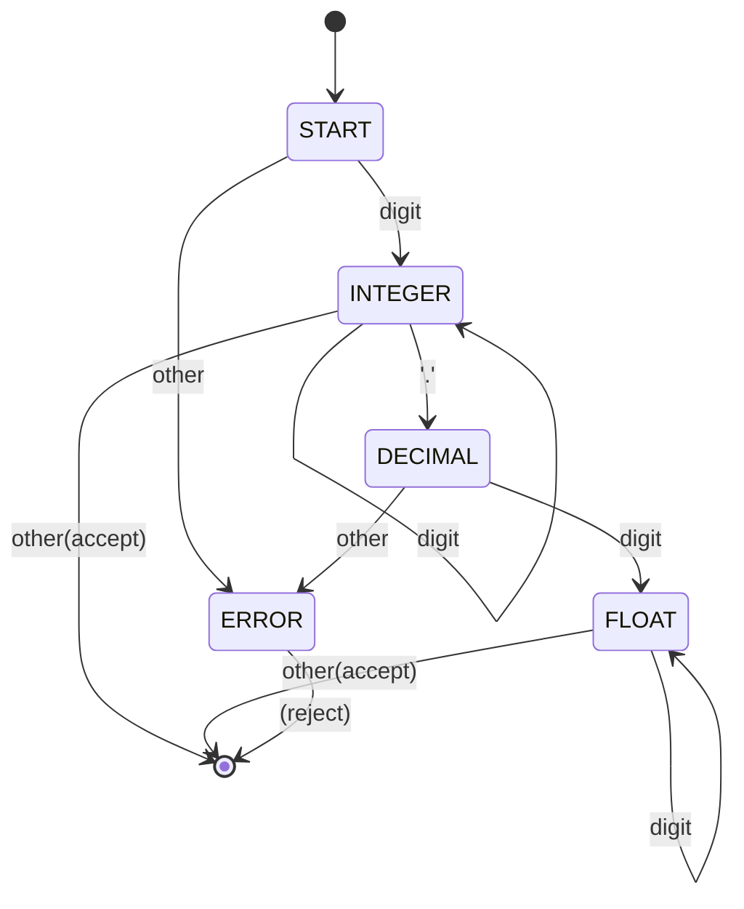
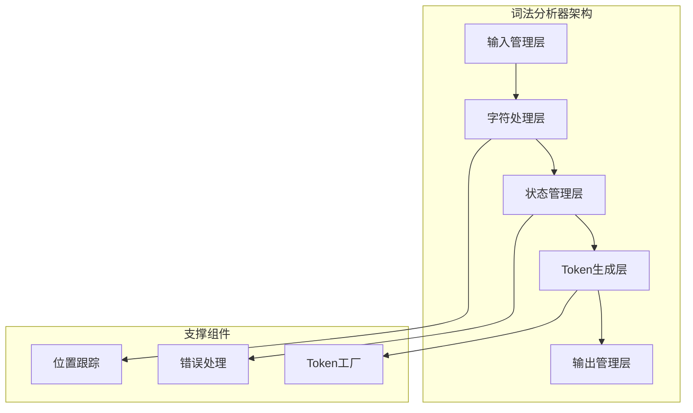

# 词法分析深度解析

> **核心主题**：编译器前端的第一道关卡——如何将字符流转换为有意义的记号序列  
> **技术重点**：状态机理论、自动机实现、Token设计、错误处理  
> **实践导向**：基于 Python 对象解析器的词法分析器实现与优化

---

## 目录

1. [词法分析的本质与使命](#1-词法分析的本质与使命)
2. [理论基础：有限状态自动机](#2-理论基础有限状态自动机)
3. [Token设计与分类](#3-token设计与分类)
4. [词法分析器架构设计](#4-词法分析器架构设计)
5. [核心算法：状态驱动识别](#5-核心算法状态驱动识别)
6. [特殊情况处理](#6-特殊情况处理)
7. [错误处理与诊断](#7-错误处理与诊断)
8. [性能优化策略](#8-性能优化策略)
9. [扩展与维护](#9-扩展与维护)
10. [实际应用案例](#10-实际应用案例)

---

## 1. 词法分析的本质与使命

### 1.1 词法分析的核心定义

词法分析（Lexical Analysis）是编译过程的第一个阶段，其核心任务是将输入的**字符序列**转换为**记号（Token）序列**。

```
输入：  "{'name': 'Alice', 'age': 30}"
      ↓ 词法分析
输出：  [LBRACE, STRING, COLON, STRING, COMMA, STRING, COLON, NUMBER, RBRACE]
```

#### 词法分析器（Lexer）的作用



**核心职责**：
- **单词识别**：识别出语言中的各种词汇单元
- **分类标记**：为每个词汇单元分配正确的类型
- **位置跟踪**：记录每个Token在源码中的位置
- **空白过滤**：处理空格、制表符、换行等无意义字符
- **错误检测**：识别和报告词法层面的错误

### 1.2 词法分析在编译过程中的地位

#### 编译管道中的位置

```
源代码  → [词法分析] → Token流 → [语法分析] → AST → [语义分析] → 目标代码
        ↑ Lexer    ↑           ↑ Parser   ↑       ↑ Analyzer  ↑
        首要阶段    中间产物     核心阶段    结构化    语义理解    最终产物
```

#### 与后续阶段的接口关系

**输入接口**：
- 接收原始字符流
- 处理不同编码格式（UTF-8, UTF-16等）
- 支持不同行结束符（\n, \r\n, \r）

**输出接口**：  
- 提供标准化的Token序列
- 附带位置和类型信息
- 支持回退和前瞻操作

### 1.3 词法分析的设计挑战

#### 挑战1：歧义识别问题

考虑字符序列 `"123.456"`：
- 可能是浮点数：`123.456`
- 可能是三个Token：`123` + `.` + `456`

**解决策略**：最长匹配原则（Maximal Munch Rule）
- 词法分析器总是尝试匹配最长的可能序列
- 这确保了`123.456`被正确识别为浮点数而非分离的Token

#### 挑战2：关键字与标识符区分

考虑字符序列 `"True"`：
- 在Python中是布尔值关键字
- 在某些上下文中可能是普通标识符

**解决策略**：关键字优先原则
- 首先按标识符规则读取完整词汇
- 然后检查是否匹配预定义关键字表
- 关键字匹配时优先返回关键字Token

#### 挑战3：嵌套和转义处理

考虑字符串 `"She said \"Hello\""`：
- 需要正确处理引号嵌套
- 需要识别转义序列

**解决策略**：状态机管理
- 使用专门的字符串状态跟踪引号层次
- 转义状态处理反斜杠后的字符
- 确保字符串边界的正确识别

---

## 2. 理论基础：有限状态自动机

### 2.1 有限状态自动机（FSA）基础

#### 数学定义

有限状态自动机 M = (Q, Σ, δ, q₀, F)，其中：
- **Q**：状态集合
- **Σ**：输入字母表  
- **δ**：转移函数 δ: Q × Σ → Q
- **q₀**：初始状态
- **F**：接受状态集合

#### 在词法分析中的应用

```
数字识别自动机：
状态集合 Q = {START, INTEGER, DECIMAL, FLOAT, ERROR}
字母表 Σ = {0-9, '.', other}
```

### 2.2 确定性有限状态自动机（DFA）

#### DFA的优势

- **高效执行**：每个状态对每个输入符号只有唯一转移
- **线性时间**：O(n)时间复杂度，n为输入长度
- **易于实现**：直接转换为程序代码

#### 数字识别DFA设计



#### DFA的代码实现

```java
public class NumberRecognizer {
    
    enum State { START, INTEGER, DECIMAL, FLOAT, ERROR }
    
    public TokenType recognizeNumber(String input) {
        State currentState = State.START;
        
        for (char ch : input.toCharArray()) {
            currentState = transition(currentState, ch);
            if (currentState == State.ERROR) {
                return null; // 识别失败
            }
        }
        
        return switch (currentState) {
            case INTEGER -> TokenType.INTEGER;
            case FLOAT -> TokenType.FLOAT;
            default -> null;
        };
    }
    
    private State transition(State state, char ch) {
        return switch (state) {
            case START -> Character.isDigit(ch) ? State.INTEGER : State.ERROR;
            case INTEGER -> Character.isDigit(ch) ? State.INTEGER :
                           ch == '.' ? State.DECIMAL : State.ERROR;
            case DECIMAL -> Character.isDigit(ch) ? State.FLOAT : State.ERROR;
            case FLOAT -> Character.isDigit(ch) ? State.FLOAT : State.ERROR;
            default -> State.ERROR;
        };
    }
}
```

### 2.3 非确定性有限状态自动机（NFA）

#### NFA的特点

- **多重转移**：一个状态对同一输入可能有多个转移
- **ε-转移**：可以不消耗输入字符进行状态转移
- **表达能力**：与DFA等价，但表示可能更简洁

#### NFA到DFA的转换（子集构造法）

```java
// NFA状态：可能同时处于多个状态
Set<State> nfaStates = Set.of(State.START, State.IN_STRING);

// DFA状态：确定的单一状态  
State dfaState = combineStates(nfaStates);
```

### 2.4 正则表达式与自动机的关系

#### 正则表达式到NFA

每个正则表达式都可以构造对应的NFA：

```
正则式：  [0-9]+\.[0-9]+
NFA：   (数字)+.(数字)+
```

#### Thompson构造法

```java
// 为正则表达式 "a|b" 构造NFA
public NFA constructAlternation(NFA nfaA, NFA nfaB) {
    NFA result = new NFA();
    
    // 创建新的开始状态
    State newStart = result.createState();
    result.setStartState(newStart);
    
    // 添加ε-转移到两个分支
    result.addEpsilonTransition(newStart, nfaA.getStartState());
    result.addEpsilonTransition(newStart, nfaB.getStartState());
    
    return result;
}
```

---

## 3. Token设计与分类

### 3.1 Token的构成要素

#### Token结构定义

```java
public class Token {
    private final TokenType type;      // 记号类型
    private final Object value;        // 记号值
    private final int position;        // 源码位置
    private final int line;           // 行号
    private final int column;         // 列号
    
    // 构造器和访问方法...
}
```

#### Token属性详解

**类型（Type）**：
- 定义Token的语法类别
- 用于语法分析时的模式匹配
- 例：`TokenType.NUMBER`, `TokenType.STRING`

**值（Value）**：
- 存储Token的实际内容
- 用于语义分析和代码生成
- 例：字符串 "Hello" 的值为 Hello

**位置（Position）**：
- 记录Token在源码中的字符偏移
- 用于错误报告和调试信息
- 支持源码映射和IDE跳转

### 3.2 Python对象语法的Token分类

#### 基础Token类型

```java
public enum TokenType {
    // 字面量类型
    NUMBER,          // 123, 3.14
    STRING,          // 'hello', "world"  
    BOOLEAN,         // True, False
    NULL,            // None
    
    // 结构分隔符
    LEFT_BRACKET,    // [
    RIGHT_BRACKET,   // ]
    LEFT_BRACE,      // {
    RIGHT_BRACE,     // }
    LEFT_PAREN,      // (
    RIGHT_PAREN,     // )
    
    // 语法符号
    COMMA,           // ,
    COLON,           // :
    
    // 特殊Token
    EOF,             // 文件结束
    WHITESPACE,      // 空白字符（通常跳过）
    COMMENT          // 注释（通常跳过）
}
```

#### 复杂Token的识别规则

**数字Token**：
```
整数：   [+-]?[0-9]+
浮点：   [+-]?[0-9]+\.[0-9]+
科学：   [+-]?[0-9]+(\.[0-9]+)?[eE][+-]?[0-9]+
```

**字符串Token**：
```
单引号： '([^'\\]|\\.)*'
双引号： "([^"\\]|\\.)*"
三引号： '''(.*?)''' 或 """(.*?)"""
```

**布尔Token**：
```
真值：   True
假值：   False
```

### 3.3 Token工厂模式

#### 设计意图

避免重复创建相同的Token对象，提高性能并减少内存占用。

```java
public class TokenFactory {
    // 预创建常用Token
    private static final Token TRUE_TOKEN = new Token(TokenType.BOOLEAN, true, -1);
    private static final Token FALSE_TOKEN = new Token(TokenType.BOOLEAN, false, -1);
    private static final Token NULL_TOKEN = new Token(TokenType.NULL, null, -1);
    private static final Token EOF_TOKEN = new Token(TokenType.EOF, null, -1);
    
    // Token缓存
    private final Map<String, Token> stringTokenCache = new ConcurrentHashMap<>();
    private final Map<Number, Token> numberTokenCache = new ConcurrentHashMap<>();
    
    public Token createBooleanToken(boolean value, int position) {
        Token template = value ? TRUE_TOKEN : FALSE_TOKEN;
        return new Token(template.getType(), template.getValue(), position);
    }
    
    public Token createStringToken(String value, int position) {
        // 小字符串缓存，大字符串直接创建
        if (value.length() <= 32) {
            return stringTokenCache.computeIfAbsent(value, 
                v -> new Token(TokenType.STRING, v, position));
        }
        return new Token(TokenType.STRING, value, position);
    }
}
```

---

## 4. 词法分析器架构设计

### 4.1 总体架构设计

#### 分层架构



#### 分层设计的优势

这种分层架构将词法分析的复杂性分解为独立的功能模块，每层都有明确的职责边界：

**输入管理层**：
- 处理不同输入源（String, Reader, InputStream）
- 管理输入缓冲区，优化I/O性能
- 支持字符编码转换，确保Unicode兼容性

**字符处理层**：
- 提供字符读取接口，抽象底层输入细节
- 实现前瞻（lookahead）功能，支持复杂Token识别
- 处理行列位置计算，为错误报告提供精确信息

**状态管理层**：
- 维护当前解析状态，实现状态机核心逻辑
- 执行状态转移逻辑，处理不同Token类型的识别
- 处理状态回退，支持试探性解析

**Token生成层**：
- 根据识别结果创建Token对象
- 管理Token缓存，提升内存使用效率
- 附加位置信息，支持调试和错误定位

### 4.2 状态模式实现

#### 状态接口定义

```java
public interface LexerState {
    /**
     * 处理当前字符
     * @param context 词法分析上下文
     * @return 是否继续处理
     */
    boolean process(LexerContext context);
    
    /**
     * 获取状态名称（用于调试）
     */
    String getName();
}
```

#### 具体状态实现

```java
public class DispatchState implements LexerState {
    
    @Override
    public boolean process(LexerContext context) {
        char ch = context.currentChar();
        
        // 分派到具体的处理状态
        LexerState nextState = switch (ch) {
            case '0', '1', '2', '3', '4', '5', '6', '7', '8', '9' 
                -> new NumberState();
            case '"', '\'' 
                -> new StringState(ch);
            case 'T' 
                -> new KeywordState("True");
            case 'F' 
                -> new KeywordState("False");
            case 'N' 
                -> new KeywordState("None");
            case '[' 
                -> new SingleCharState(TokenType.LEFT_BRACKET);
            case ']' 
                -> new SingleCharState(TokenType.RIGHT_BRACKET);
            // ... 其他字符分派
            default 
                -> new ErrorState("意外字符: " + ch);
        };
        
        context.setState(nextState);
        return true;
    }
}
```

#### 复杂状态实现：字符串识别

```java
public class StringState implements LexerState {
    private final char quote;
    private final StringBuilder buffer;
    private boolean escapeNext;
    
    public StringState(char quote) {
        this.quote = quote;
        this.buffer = new StringBuilder();
        this.escapeNext = false;
    }
    
    @Override
    public boolean process(LexerContext context) {
        char ch = context.currentChar();
        
        if (escapeNext) {
            // 处理转义字符
            char escaped = processEscape(ch);
            buffer.append(escaped);
            escapeNext = false;
        } else if (ch == '\\') {
            // 遇到转义符
            escapeNext = true;
        } else if (ch == quote) {
            // 字符串结束
            Token token = new Token(TokenType.STRING, buffer.toString(), 
                                  context.getStartPosition());
            context.addToken(token);
            context.setState(new DispatchState());
            return true;
        } else {
            // 普通字符
            buffer.append(ch);
        }
        
        context.advance();
        return true;
    }
    
    private char processEscape(char ch) {
        return switch (ch) {
            case 'n' -> '\n';
            case 't' -> '\t';
            case 'r' -> '\r';
            case '\\' -> '\\';
            case '\'' -> '\'';
            case '"' -> '"';
            default -> ch; // 未知转义，保持原样
        };
    }
}
```

### 4.3 上下文对象设计

#### LexerContext接口

```java
public class LexerContext {
    private final String input;
    private int position;
    private int line;
    private int column;
    private int startPosition;
    private LexerState currentState;
    private final List<Token> tokens;
    
    // 字符导航方法
    public char currentChar() { ... }
    public char peek() { ... }
    public char peek(int offset) { ... }
    public void advance() { ... }
    public boolean hasMore() { ... }
    
    // 位置管理方法  
    public int getPosition() { ... }
    public int getLine() { ... }
    public int getColumn() { ... }
    public void markStart() { ... }
    
    // 状态管理方法
    public LexerState getState() { ... }
    public void setState(LexerState state) { ... }
    
    // Token管理方法
    public void addToken(Token token) { ... }
    public List<Token> getTokens() { ... }
}
```

#### 上下文的核心功能

**字符导航**：
```java
public char peek(int offset) {
    int pos = position + offset;
    return (pos >= 0 && pos < input.length()) ? input.charAt(pos) : '\0';
}

public void advance() {
    if (position < input.length()) {
        char ch = input.charAt(position);
        position++;
        if (ch == '\n') {
            line++;
            column = 1;
        } else {
            column++;
        }
    }
}
```

**错误恢复**：
```java
public void skipToNextToken() {
    // 跳过当前错误token，寻找下一个可识别的字符
    while (hasMore() && !isTokenStart(currentChar())) {
        advance();
    }
}

private boolean isTokenStart(char ch) {
    return Character.isLetterOrDigit(ch) || "\"'[]{}():,".indexOf(ch) != -1;
}
```

---

## 5. 核心算法：状态驱动识别

### 5.1 主控制循环

#### 基本控制结构

```java
public class Lexer {
    
    public List<Token> tokenize(String input) {
        LexerContext context = new LexerContext(input);
        context.setState(new DispatchState());
        
        while (context.hasMore()) {
            try {
                // 状态驱动的处理
                boolean shouldContinue = context.getState().process(context);
                if (!shouldContinue) {
                    break;
                }
            } catch (LexicalException e) {
                // 错误处理和恢复
                handleError(context, e);
            }
        }
        
        // 添加EOF token
        context.addToken(createEofToken(context.getPosition()));
        return context.getTokens();
    }
    
    private void handleError(LexerContext context, LexicalException e) {
        // 记录错误
        reportError(e);
        
        // 尝试恢复
        context.skipToNextToken();
        context.setState(new DispatchState());
    }
}
```

### 5.2 前瞻技术

前瞻（Lookahead）是词法分析中解决歧义性的重要技术。通过预先查看后续字符，词法分析器可以做出正确的识别决策。

#### k-前瞻实现

```java
public class LookaheadContext extends LexerContext {
    
    /**
     * 检查前瞻序列是否匹配
     * @param sequence 要匹配的字符序列
     * @return 是否匹配
     */
    public boolean matchLookahead(String sequence) {
        for (int i = 0; i < sequence.length(); i++) {
            if (peek(i) != sequence.charAt(i)) {
                return false;
            }
        }
        return true;
    }
    
    /**
     * 贪婪匹配：选择最长的匹配
     */
    public String greedyMatch(String... candidates) {
        String longestMatch = "";
        
        for (String candidate : candidates) {
            if (matchLookahead(candidate) && candidate.length() > longestMatch.length()) {
                longestMatch = candidate;
            }
        }
        
        return longestMatch;
    }
}
```

#### 前瞻应用实例：关键字vs标识符

这是前瞻技术的典型应用场景。当遇到以字母开头的序列时，需要读取完整的词汇才能确定其类型：

```java
public class KeywordOrIdentifierState implements LexerState {
    
    @Override
    public boolean process(LexerContext context) {
        StringBuilder buffer = new StringBuilder();
        
        // 读取字母数字序列
        while (context.hasMore() && isIdentifierChar(context.currentChar())) {
            buffer.append(context.currentChar());
            context.advance();
        }
        
        String word = buffer.toString();
        
        // 检查是否为关键字
        TokenType type = getKeywordType(word);
        if (type == null) {
            type = TokenType.IDENTIFIER;
        }
        
        Object value = getTokenValue(type, word);
        Token token = new Token(type, value, context.getStartPosition());
        context.addToken(token);
        
        context.setState(new DispatchState());
        return true;
    }
    
    private TokenType getKeywordType(String word) {
        return switch (word) {
            case "True" -> TokenType.BOOLEAN;
            case "False" -> TokenType.BOOLEAN;
            case "None" -> TokenType.NULL;
            default -> null;
        };
    }
    
    private Object getTokenValue(TokenType type, String word) {
        return switch (type) {
            case BOOLEAN -> Boolean.parseBoolean(word);
            case NULL -> null;
            default -> word;
        };
    }
}
```

### 5.3 回溯与状态保存

#### 状态快照机制

```java
public class LexerSnapshot {
    private final int position;
    private final int line;
    private final int column;
    private final LexerState state;
    private final int tokenCount;
    
    // 构造器和访问方法...
}

public class BacktrackableLexer extends Lexer {
    private final Stack<LexerSnapshot> snapshots = new Stack<>();
    
    public void saveState(LexerContext context) {
        snapshots.push(new LexerSnapshot(
            context.getPosition(),
            context.getLine(), 
            context.getColumn(),
            context.getState(),
            context.getTokens().size()
        ));
    }
    
    public void restoreState(LexerContext context) {
        if (!snapshots.isEmpty()) {
            LexerSnapshot snapshot = snapshots.pop();
            
            context.setPosition(snapshot.getPosition());
            context.setLine(snapshot.getLine());
            context.setColumn(snapshot.getColumn());
            context.setState(snapshot.getState());
            
            // 回退token序列
            List<Token> tokens = context.getTokens();
            while (tokens.size() > snapshot.getTokenCount()) {
                tokens.remove(tokens.size() - 1);
            }
        }
    }
}
```

#### 试探性解析

```java
public boolean tryParseComplexNumber(LexerContext context) {
    // 保存当前状态
    saveState(context);
    
    try {
        // 尝试解析复数格式: 1+2j
        if (parseNumber(context) && 
            matchChar(context, '+') && 
            parseNumber(context) && 
            matchChar(context, 'j')) {
            
            // 解析成功，清除快照
            snapshots.pop();
            return true;
        }
    } catch (LexicalException e) {
        // 解析失败，恢复状态
        restoreState(context);
    }
    
    return false;
}
```

---

## 6. 特殊情况处理

### 6.1 字符串处理的复杂性

#### 多种引号格式支持

```java
public class StringState implements LexerState {
    
    enum StringType {
        SINGLE_QUOTE("'"),
        DOUBLE_QUOTE("\""),
        TRIPLE_SINGLE("'''"),
        TRIPLE_DOUBLE("\"\"\"");
        
        private final String delimiter;
        
        StringType(String delimiter) {
            this.delimiter = delimiter;
        }
    }
    
    private StringType detectStringType(LexerContext context) {
        // 检查三引号字符串
        if (context.matchLookahead("'''")) {
            return StringType.TRIPLE_SINGLE;
        }
        if (context.matchLookahead("\"\"\"")) {
            return StringType.TRIPLE_DOUBLE;
        }
        
        // 检查单引号字符串
        char ch = context.currentChar();
        return (ch == '\'') ? StringType.SINGLE_QUOTE : StringType.DOUBLE_QUOTE;
    }
}
```

#### 转义序列处理

```java
public class EscapeProcessor {
    
    private static final Map<Character, Character> ESCAPE_MAP = Map.of(
        'n', '\n',
        't', '\t',
        'r', '\r',
        'b', '\b',
        'f', '\f',
        '\\', '\\',
        '\'', '\'',
        '"', '"',
        '0', '\0'
    );
    
    public String processEscapes(String rawString) {
        StringBuilder result = new StringBuilder(rawString.length());
        
        for (int i = 0; i < rawString.length(); i++) {
            char ch = rawString.charAt(i);
            
            if (ch == '\\' && i + 1 < rawString.length()) {
                char next = rawString.charAt(i + 1);
                
                if (ESCAPE_MAP.containsKey(next)) {
                    // 标准转义序列
                    result.append(ESCAPE_MAP.get(next));
                    i++; // 跳过转义字符
                } else if (next == 'u' && i + 5 < rawString.length()) {
                    // Unicode转义: \uXXXX
                    String hexCode = rawString.substring(i + 2, i + 6);
                    try {
                        int codePoint = Integer.parseInt(hexCode, 16);
                        result.append((char) codePoint);
                        i += 5; // 跳过整个Unicode序列
                    } catch (NumberFormatException e) {
                        // 无效的Unicode序列，保持原样
                        result.append(ch);
                    }
                } else {
                    // 未知转义序列，保持原样
                    result.append(ch);
                }
            } else {
                result.append(ch);
            }
        }
        
        return result.toString();
    }
}
```

### 6.2 数字格式的多样性

#### 复杂数字格式识别

```java
public class NumberState implements LexerState {
    
    enum NumberType {
        INTEGER,        // 123
        FLOAT,          // 123.456
        SCIENTIFIC,     // 1.23e-4
        HEXADECIMAL,    // 0xFF
        OCTAL,          // 0o77
        BINARY          // 0b1010
    }
    
    @Override
    public boolean process(LexerContext context) {
        StringBuilder buffer = new StringBuilder();
        NumberType type = NumberType.INTEGER;
        
        // 处理符号
        if (context.currentChar() == '+' || context.currentChar() == '-') {
            buffer.append(context.currentChar());
            context.advance();
        }
        
        // 检查特殊进制前缀
        if (context.currentChar() == '0' && context.hasMore()) {
            char next = context.peek(1);
            switch (Character.toLowerCase(next)) {
                case 'x' -> {
                    type = NumberType.HEXADECIMAL;
                    buffer.append("0x");
                    context.advance(2);
                    parseHexadecimal(context, buffer);
                }
                case 'o' -> {
                    type = NumberType.OCTAL;
                    buffer.append("0o");
                    context.advance(2);
                    parseOctal(context, buffer);
                }
                case 'b' -> {
                    type = NumberType.BINARY;
                    buffer.append("0b");
                    context.advance(2);
                    parseBinary(context, buffer);
                }
                default -> type = parseDecimal(context, buffer);
            }
        } else {
            type = parseDecimal(context, buffer);
        }
        
        // 创建相应的Token
        Token token = createNumberToken(type, buffer.toString(), context.getStartPosition());
        context.addToken(token);
        context.setState(new DispatchState());
        
        return true;
    }
    
    private NumberType parseDecimal(LexerContext context, StringBuilder buffer) {
        // 解析整数部分
        while (context.hasMore() && Character.isDigit(context.currentChar())) {
            buffer.append(context.currentChar());
            context.advance();
        }
        
        // 检查小数点
        if (context.currentChar() == '.') {
            buffer.append('.');
            context.advance();
            
            // 解析小数部分
            while (context.hasMore() && Character.isDigit(context.currentChar())) {
                buffer.append(context.currentChar());
                context.advance();
            }
            
            // 检查科学记数法
            if (Character.toLowerCase(context.currentChar()) == 'e') {
                return parseScientific(context, buffer);
            }
            
            return NumberType.FLOAT;
        }
        
        // 检查科学记数法
        if (Character.toLowerCase(context.currentChar()) == 'e') {
            return parseScientific(context, buffer);
        }
        
        return NumberType.INTEGER;
    }
}
```

### 6.3 空白字符和注释处理

#### 智能空白处理

```java
public class WhitespaceState implements LexerState {
    
    @Override
    public boolean process(LexerContext context) {
        // 跳过所有空白字符
        while (context.hasMore() && Character.isWhitespace(context.currentChar())) {
            context.advance();
        }
        
        // 返回到分派状态
        context.setState(new DispatchState());
        return true;
    }
}
```

#### 注释处理

```java
public class CommentState implements LexerState {
    
    @Override
    public boolean process(LexerContext context) {
        if (context.currentChar() == '#') {
            // Python单行注释：跳过到行尾
            while (context.hasMore() && context.currentChar() != '\n') {
                context.advance();
            }
        }
        
        context.setState(new DispatchState());
        return true;
    }
}
```

---

## 7. 错误处理与诊断

### 7.1 错误分类与层次

#### 词法错误类型

```java
public abstract class LexicalException extends RuntimeException {
    protected final int position;
    protected final int line;
    protected final int column;
    protected final String input;
    
    // 构造器和基础方法...
}

// 具体错误类型
public class UnexpectedCharacterException extends LexicalException {
    private final char unexpectedChar;
    
    public UnexpectedCharacterException(char ch, int position, String input) {
        super(String.format("意外字符 '%c' (ASCII: %d) 在位置 %d", 
                           ch, (int)ch, position));
        this.unexpectedChar = ch;
        this.position = position;
        this.input = input;
    }
}

public class UnterminatedStringException extends LexicalException {
    public UnterminatedStringException(int startPosition, String input) {
        super(String.format("未闭合的字符串，开始于位置 %d", startPosition));
        this.position = startPosition;
        this.input = input;
    }
}

public class InvalidNumberFormatException extends LexicalException {
    private final String invalidNumber;
    
    public InvalidNumberFormatException(String number, int position, String input) {
        super(String.format("无效的数字格式 '%s' 在位置 %d", number, position));
        this.invalidNumber = number;
        this.position = position;
        this.input = input;
    }
}
```

### 7.2 错误恢复策略

#### 恐慌模式恢复

```java
public class PanicModeRecovery {
    
    private static final Set<Character> SYNC_CHARACTERS = Set.of(
        ',', ':', ']', '}', ')', '\n'
    );
    
    public void recover(LexerContext context, LexicalException error) {
        // 1. 记录错误
        reportError(error);
        
        // 2. 跳过错误字符
        context.advance();
        
        // 3. 寻找同步点
        while (context.hasMore() && !isSyncPoint(context.currentChar())) {
            context.advance();
        }
        
        // 4. 重置状态
        context.setState(new DispatchState());
    }
    
    private boolean isSyncPoint(char ch) {
        return SYNC_CHARACTERS.contains(ch) || Character.isLetterOrDigit(ch);
    }
    
    private void reportError(LexicalException error) {
        System.err.printf("词法错误 [%d行,%d列]: %s%n", 
                         error.getLine(), 
                         error.getColumn(), 
                         error.getMessage());
    }
}
```

#### 局部错误修正

```java
public class ErrorCorrection {
    
    /**
     * 尝试修正常见的输入错误
     */
    public boolean tryCorrectError(LexerContext context, LexicalException error) {
        
        if (error instanceof UnexpectedCharacterException uce) {
            char unexpected = uce.getUnexpectedChar();
            
            // 尝试修正常见的拼写错误
            if (tryCorrectKeyword(context, unexpected)) {
                return true;
            }
            
            // 尝试修正引号错误
            if (tryCorrectQuote(context, unexpected)) {
                return true;
            }
        }
        
        return false; // 无法修正
    }
    
    private boolean tryCorrectKeyword(LexerContext context, char unexpected) {
        // 例如：Treu -> True, Fals -> False
        String ahead = context.peek(5);
        
        if (ahead.startsWith("reu") && unexpected == 'T') {
            // 可能是想输入 "True"，但拼错了
            suggestCorrection("True", context.getPosition());
            return false; // 仍然报错，但给出建议
        }
        
        return false;
    }
    
    private void suggestCorrection(String suggestion, int position) {
        System.out.printf("建议修正 [位置 %d]: 您是否想要输入 '%s'?%n", 
                         position, suggestion);
    }
}
```

### 7.3 友好的错误报告

#### 上下文敏感的错误消息

```java
public class ErrorReporter {
    
    public void reportError(LexicalException error) {
        // 基本错误信息
        System.err.printf("错误: %s%n", error.getMessage());
        
        // 显示源码上下文
        showSourceContext(error);
        
        // 提供修复建议
        provideSuggestions(error);
    }
    
    private void showSourceContext(LexicalException error) {
        String[] lines = error.getInput().split("\n");
        int errorLine = error.getLine() - 1; // 转为0基础索引
        
        // 显示错误行的前后文
        int start = Math.max(0, errorLine - 2);
        int end = Math.min(lines.length - 1, errorLine + 2);
        
        for (int i = start; i <= end; i++) {
            String prefix = (i == errorLine) ? " >>> " : "     ";
            System.err.printf("%s%d: %s%n", prefix, i + 1, lines[i]);
            
            // 在错误行下方显示指针
            if (i == errorLine) {
                String pointer = " ".repeat(error.getColumn() + 4) + "^";
                System.err.println(pointer);
            }
        }
    }
    
    private void provideSuggestions(LexicalException error) {
        if (error instanceof UnterminatedStringException) {
            System.err.println("建议: 检查字符串是否缺少闭合引号");
        } else if (error instanceof InvalidNumberFormatException) {
            System.err.println("建议: 检查数字格式是否正确，如 123, 3.14, 1.23e-4");
        } else if (error instanceof UnexpectedCharacterException uce) {
            char ch = uce.getUnexpectedChar();
            if (!Character.isWhitespace(ch) && Character.isLetter(ch)) {
                System.err.println("建议: 检查关键字拼写，如 True, False, None");
            }
        }
    }
}
```

---

## 8. 性能优化策略

### 8.1 内存管理优化

#### 对象池化技术

```java
public class TokenPool {
    
    // 预分配常用Token
    private final Token[] booleanTokens = new Token[2];
    private final Token nullToken = new Token(TokenType.NULL, null, -1);
    private final Token eofToken = new Token(TokenType.EOF, null, -1);
    
    // 小字符串缓存
    private final Map<String, Token> stringCache = new LRUCache<>(1000);
    
    // 小整数缓存（-128 到 127）
    private final Token[] integerCache = new Token[256];
    
    public TokenPool() {
        initializePools();
    }
    
    private void initializePools() {
        booleanTokens[0] = new Token(TokenType.BOOLEAN, false, -1);
        booleanTokens[1] = new Token(TokenType.BOOLEAN, true, -1);
        
        for (int i = 0; i < integerCache.length; i++) {
            int value = i - 128;
            integerCache[i] = new Token(TokenType.NUMBER, value, -1);
        }
    }
    
    public Token getBooleanToken(boolean value, int position) {
        Token template = booleanTokens[value ? 1 : 0];
        return new Token(template.getType(), template.getValue(), position);
    }
    
    public Token getIntegerToken(int value, int position) {
        if (value >= -128 && value <= 127) {
            Token template = integerCache[value + 128];
            return new Token(template.getType(), template.getValue(), position);
        }
        return new Token(TokenType.NUMBER, value, position);
    }
}
```

#### 字符串优化

```java
public class OptimizedStringProcessor {
    
    // 使用StringBuilder避免字符串拼接开销
    private final StringBuilder buffer = new StringBuilder(256);
    
    public String processString(LexerContext context, char quote) {
        buffer.setLength(0); // 重用StringBuilder
        
        while (context.hasMore()) {
            char ch = context.currentChar();
            
            if (ch == quote) {
                break;
            } else if (ch == '\\') {
                // 高效处理转义序列
                processEscapeSequence(context);
            } else {
                buffer.append(ch);
            }
            
            context.advance();
        }
        
        return buffer.toString();
    }
    
    private void processEscapeSequence(LexerContext context) {
        context.advance(); // 跳过反斜杠
        
        if (!context.hasMore()) {
            throw new UnterminatedStringException(context.getPosition(), context.getInput());
        }
        
        char escaped = context.currentChar();
        char result = switch (escaped) {
            case 'n' -> '\n';
            case 't' -> '\t';
            case 'r' -> '\r';
            case '\\' -> '\\';
            case '\'' -> '\'';
            case '"' -> '"';
            default -> escaped;
        };
        
        buffer.append(result);
    }
}
```

### 8.2 算法优化

#### 状态转移表优化

```java
public class OptimizedDispatcher {
    
    // 使用数组而不是switch语句，提高分派效率
    private static final LexerState[] DISPATCH_TABLE = new LexerState[256];
    
    static {
        initializeDispatchTable();
    }
    
    private static void initializeDispatchTable() {
        // 默认状态：错误状态
        Arrays.fill(DISPATCH_TABLE, new ErrorState("意外字符"));
        
        // 数字字符
        for (int i = '0'; i <= '9'; i++) {
            DISPATCH_TABLE[i] = new NumberState();
        }
        
        // 引号字符
        DISPATCH_TABLE['\''] = new StringState('\'');
        DISPATCH_TABLE['"'] = new StringState('"');
        
        // 结构符号
        DISPATCH_TABLE['['] = new SingleCharState(TokenType.LEFT_BRACKET);
        DISPATCH_TABLE[']'] = new SingleCharState(TokenType.RIGHT_BRACKET);
        DISPATCH_TABLE['{'] = new SingleCharState(TokenType.LEFT_BRACE);
        DISPATCH_TABLE['}'] = new SingleCharState(TokenType.RIGHT_BRACE);
        DISPATCH_TABLE['('] = new SingleCharState(TokenType.LEFT_PAREN);
        DISPATCH_TABLE[')'] = new SingleCharState(TokenType.RIGHT_PAREN);
        DISPATCH_TABLE[','] = new SingleCharState(TokenType.COMMA);
        DISPATCH_TABLE[':'] = new SingleCharState(TokenType.COLON);
        
        // 空白字符
        DISPATCH_TABLE[' '] = new WhitespaceState();
        DISPATCH_TABLE['\t'] = new WhitespaceState();
        DISPATCH_TABLE['\n'] = new WhitespaceState();
        DISPATCH_TABLE['\r'] = new WhitespaceState();
        
        // 字母字符（关键字或标识符）
        for (int i = 'A'; i <= 'Z'; i++) {
            DISPATCH_TABLE[i] = new KeywordOrIdentifierState();
        }
        for (int i = 'a'; i <= 'z'; i++) {
            DISPATCH_TABLE[i] = new KeywordOrIdentifierState();
        }
    }
    
    public LexerState dispatch(char ch) {
        int index = (ch >= 0 && ch < 256) ? ch : 255; // 处理非ASCII字符
        return DISPATCH_TABLE[index];
    }
}
```

#### 批量处理优化

```java
public class BatchProcessor {
    
    /**
     * 批量跳过空白字符
     */
    public int skipWhitespace(String input, int start) {
        int pos = start;
        while (pos < input.length() && Character.isWhitespace(input.charAt(pos))) {
            pos++;
        }
        return pos;
    }
    
    /**
     * 批量读取数字字符
     */
    public String readDigits(String input, int start, int end) {
        StringBuilder buffer = new StringBuilder(end - start);
        for (int i = start; i < end && i < input.length(); i++) {
            char ch = input.charAt(i);
            if (Character.isDigit(ch)) {
                buffer.append(ch);
            } else {
                break;
            }
        }
        return buffer.toString();
    }
    
    /**
     * 批量验证标识符字符
     */
    public boolean isValidIdentifier(String input, int start, int end) {
        if (start >= end || !Character.isLetter(input.charAt(start))) {
            return false;
        }
        
        for (int i = start + 1; i < end && i < input.length(); i++) {
            char ch = input.charAt(i);
            if (!Character.isLetterOrDigit(ch) && ch != '_') {
                return false;
            }
        }
        
        return true;
    }
}
```

### 8.3 缓存策略

#### 多级缓存系统

```java
public class MultiLevelCache {
    
    // L1缓存：最近使用的Token
    private final LRUCache<String, Token> l1Cache = new LRUCache<>(100);
    
    // L2缓存：频繁使用的Token
    private final Map<String, Token> l2Cache = new ConcurrentHashMap<>();
    
    // L3缓存：统计驱动的缓存
    private final FrequencyCache<String, Token> l3Cache = new FrequencyCache<>(1000);
    
    public Token getCachedToken(String key, Supplier<Token> creator) {
        // L1缓存查找
        Token token = l1Cache.get(key);
        if (token != null) {
            return copyWithNewPosition(token);
        }
        
        // L2缓存查找
        token = l2Cache.get(key);
        if (token != null) {
            l1Cache.put(key, token); // 提升到L1
            return copyWithNewPosition(token);
        }
        
        // L3缓存查找
        token = l3Cache.get(key);
        if (token != null) {
            l1Cache.put(key, token); // 提升到L1
            return copyWithNewPosition(token);
        }
        
        // 创建新Token
        token = creator.get();
        
        // 根据使用频率决定缓存级别
        if (shouldCacheInL2(key)) {
            l2Cache.put(key, token);
        } else {
            l3Cache.put(key, token);
        }
        
        l1Cache.put(key, token);
        return token;
    }
    
    private boolean shouldCacheInL2(String key) {
        // 关键字和常用符号放入L2缓存
        return key.length() <= 10 && 
               ("True".equals(key) || "False".equals(key) || "None".equals(key) ||
                key.matches("[0-9]+"));
    }
}
```

---

## 9. 扩展与维护

### 9.1 简洁的设计架构

#### 当前实现特点

本项目采用了简洁而实用的设计方法，避免了过度工程化：

```java
/**
 * 词法分析器状态接口
 * 
 * 包内接口，不对外暴露具体的状态实现细节。
 */
interface LexerState {
    /**
     * 处理当前字符
     * @param context 词法分析器上下文，提供字符操作和状态管理功能
     * @return true表示处理完成可以继续，false表示需要特殊处理
     */
    boolean process(LexerContext context);
}
```

#### 状态管理的简化设计

```java
class LexerContext {
    // 状态实例 - 单例模式避免重复创建
    private final LexerState dispatchState;
    private final LexerState numberState;
    private final LexerState stringState;
    private final LexerState identifierState;
    private final LexerState delimiterState;
    private final LexerState errorState;
    
    // 简洁的状态转换接口
    void transitionToDispatch() { this.currentState = dispatchState; }
    void transitionToNumber() { this.currentState = numberState; }
    void transitionToString() { this.currentState = stringState; }
    void transitionToIdentifier() { this.currentState = identifierState; }
    void transitionToDelimiter() { this.currentState = delimiterState; }
    void transitionToError() { this.currentState = errorState; }
}
```

### 9.2 添加新Token类型的实践方法

#### 步骤1：扩展TokenType枚举

```java
public enum TokenType {
    // 现有类型...
    
    // 新增类型示例
    REGEX_LITERAL,     // 正则表达式字面量
    COMPLEX_NUMBER,    // 复数类型
    RAW_STRING;        // 原始字符串
}
```

#### 步骤2：创建新的状态处理器

```java
class RegexLiteralState implements LexerState {
    @Override
    public boolean process(LexerContext context) {
        // 简单的正则表达式识别逻辑
        StringBuilder buffer = new StringBuilder();
        
        // 跳过开始的 '/'
        context.advance();
        
        while (context.getCurrentChar() != '/' && context.getCurrentChar() != '\0') {
            if (context.getCurrentChar() == '\\') {
                // 处理转义字符
                buffer.append(context.getCurrentChar());
                context.advance();
                if (context.getCurrentChar() != '\0') {
                    buffer.append(context.getCurrentChar());
                    context.advance();
                }
            } else {
                buffer.append(context.getCurrentChar());
                context.advance();
            }
        }
        
        if (context.getCurrentChar() == '/') {
            context.advance(); // 跳过结束的 '/'
            context.addToken(TokenType.REGEX_LITERAL, buffer.toString(), context.getPosition());
            context.transitionToDispatch();
            return true;
        } else {
            context.transitionToError();
            return false;
        }
    }
}
```

#### 步骤3：在LexerContext中集成新状态

```java
class LexerContext {
    // 添加新的状态实例
    private final LexerState regexLiteralState;
    
    LexerContext(String input) {
        // 初始化新状态
        this.regexLiteralState = new RegexLiteralState();
    }
    
    // 添加新的转换方法
    void transitionToRegexLiteral() { 
        this.currentState = regexLiteralState; 
    }
}
```

#### 步骤4：在DispatchState中添加分发逻辑

```java
// 在DispatchState的process方法中添加新的分发条件
if (currentChar == '/') {
    context.transitionToRegexLiteral();
    return true;
}
```

### 9.3 维护性设计原则

#### 包级封装的优势

```java
// 所有实现类都是包级的，对外只暴露必要接口
public class Lexer {
    // 简洁的公共接口
    public List<Token> tokenize() {
        return new LexerContext(input).tokenize();
    }
}
```

#### 单一职责原则

每个状态类只负责一种特定的词法元素：

- `NumberState` - 专门处理数字
- `StringState` - 专门处理字符串  
- `IdentifierState` - 专门处理标识符
- `DelimiterState` - 专门处理分隔符
- `DispatchState` - 负责分发到合适的状态

#### 易于测试的设计

```java
// 可以独立测试各个状态的处理逻辑
@Test
void testNumberStateHandling() {
    LexerContext context = new LexerContext("123.45");
    NumberState numberState = new NumberState();
    
    boolean result = numberState.process(context);
    
    assertTrue(result);
    assertEquals(1, context.getTokens().size());
    assertEquals(TokenType.NUMBER, context.getTokens().get(0).getType());
    assertEquals(123.45, context.getTokens().get(0).getValue());
}
```

### 9.4 实际的扩展建议

#### 渐进式改进

1. **先满足基本需求**：当前实现已经能够处理基本的Python对象语法
2. **按需添加功能**：只在真正需要时才添加新的Token类型
3. **保持接口稳定**：避免频繁修改公共接口
4. **优先考虑性能**：简单的实现通常性能更好

#### 代码质量保证

```java
// 使用工厂方法模式简化Token创建
class TokenFactory {
    static Token createNumberToken(Object value, int position) {
        return new Token(TokenType.NUMBER, value, position);
    }
    
    static Token createStringToken(String value, int position) {
        return new Token(TokenType.STRING, value, position);
    }
}
```

#### 文档和注释

```java
/**
 * 词法分析器（Lexical Analyzer / Scanner）- 状态模式版本
 * 
 * 设计原则：
 * 1. 单一职责：每个状态类只处理特定类型的词素
 * 2. 易于扩展：添加新词素类型无需修改现有代码
 * 3. 状态清晰：词法分析的状态转换逻辑明确
 * 4. 易于测试：可以独立测试各个状态的处理逻辑
 * 5. 封装完善：实现细节完全隐藏，对外接口简洁
 */
public class Lexer {
    // 实现代码...
}
```

---

## 10. 实际应用案例

### 10.1 IDE集成应用

#### 语法高亮支持

```java
public class SyntaxHighlighter {
    
    public List<HighlightToken> highlightSyntax(String code) {
        List<Token> tokens = lexer.tokenize(code);
        List<HighlightToken> highlighted = new ArrayList<>();
        
        for (Token token : tokens) {
            HighlightStyle style = getHighlightStyle(token.getType());
            highlighted.add(new HighlightToken(
                token.getPosition(),
                token.getValue().toString().length(),
                style
            ));
        }
        
        return highlighted;
    }
    
    private HighlightStyle getHighlightStyle(TokenType type) {
        return switch (type) {
            case STRING -> HighlightStyle.STRING_LITERAL;
            case NUMBER -> HighlightStyle.NUMBER_LITERAL;
            case BOOLEAN, NULL -> HighlightStyle.KEYWORD;
            case LEFT_BRACE, RIGHT_BRACE -> HighlightStyle.BRACE;
            case LEFT_BRACKET, RIGHT_BRACKET -> HighlightStyle.BRACKET;
            default -> HighlightStyle.DEFAULT;
        };
    }
}
```

#### 实时错误检测

```java
public class RealTimeErrorChecker {
    
    public List<ErrorMarker> checkErrors(String code) {
        List<ErrorMarker> errors = new ArrayList<>();
        
        try {
            List<Token> tokens = lexer.tokenize(code);
            validateTokenSequence(tokens, errors);
        } catch (LexicalException e) {
            errors.add(new ErrorMarker(
                e.getPosition(),
                1,
                ErrorSeverity.ERROR,
                e.getMessage()
            ));
        }
        
        return errors;
    }
    
    private void validateTokenSequence(List<Token> tokens, List<ErrorMarker> errors) {
        // 检查括号匹配
        checkBracketBalance(tokens, errors);
        
        // 检查语法结构
        checkSyntaxPatterns(tokens, errors);
    }
}
```

### 10.2 输入验证工具

#### 基于Token的格式验证

词法分析器的一个重要应用是快速验证输入格式的正确性，无需进行完整的语法分析：

```java
public class InputValidator {
    
    public ValidationResult validatePythonObject(String input) {
        ValidationResult result = new ValidationResult();
        
        try {
            List<Token> tokens = lexer.tokenize(input);
            
            // 基于Token序列进行快速验证
            validateTokenSequence(tokens, result);
            
            // 检查结构完整性
            validateStructuralIntegrity(tokens, result);
            
        } catch (LexicalException e) {
            result.addError(new ValidationError(
                e.getPosition(), 
                "词法错误: " + e.getMessage()
            ));
        }
        
        return result;
    }
    
    private void validateTokenSequence(List<Token> tokens, ValidationResult result) {
        // 检查基本的Token组合规则
        for (int i = 0; i < tokens.size() - 1; i++) {
            Token current = tokens.get(i);
            Token next = tokens.get(i + 1);
            
            if (!isValidTokenPair(current, next)) {
                result.addWarning(new ValidationWarning(
                    current.getPosition(),
                    String.format("可能的语法错误: %s 后面跟着 %s", 
                                 current.getType(), next.getType())
                ));
            }
        }
    }
    
    private void validateStructuralIntegrity(List<Token> tokens, ValidationResult result) {
        Stack<TokenType> bracketStack = new Stack<>();
        
        for (Token token : tokens) {
            switch (token.getType()) {
                case LEFT_BRACE, LEFT_BRACKET, LEFT_PAREN -> 
                    bracketStack.push(token.getType());
                    
                case RIGHT_BRACE -> {
                    if (bracketStack.isEmpty() || bracketStack.pop() != TokenType.LEFT_BRACE) {
                        result.addError(new ValidationError(
                            token.getPosition(), "不匹配的右花括号"
                        ));
                    }
                }
                
                case RIGHT_BRACKET -> {
                    if (bracketStack.isEmpty() || bracketStack.pop() != TokenType.LEFT_BRACKET) {
                        result.addError(new ValidationError(
                            token.getPosition(), "不匹配的右方括号"
                        ));
                    }
                }
                
                case RIGHT_PAREN -> {
                    if (bracketStack.isEmpty() || bracketStack.pop() != TokenType.LEFT_PAREN) {
                        result.addError(new ValidationError(
                            token.getPosition(), "不匹配的右圆括号"
                        ));
                    }
                }
            }
        }
        
        if (!bracketStack.isEmpty()) {
            result.addError(new ValidationError(
                -1, "存在未闭合的括号"
            ));
        }
    }
    
    private boolean isValidTokenPair(Token current, Token next) {
        // 简单的Token序列验证规则
        return switch (current.getType()) {
            case COMMA -> next.getType() != TokenType.COMMA && 
                         next.getType() != TokenType.RIGHT_BRACE &&
                         next.getType() != TokenType.RIGHT_BRACKET;
            
            case COLON -> next.getType() != TokenType.COLON &&
                         next.getType() != TokenType.COMMA;
            
            default -> true;
        };
    }
}
```

### 10.3 代码格式化工具

#### 基于Token流的智能格式化

词法分析器的另一个实用价值是支持代码格式化。通过分析Token序列，可以在保持语义不变的前提下美化代码格式：

```java
public class CodeFormatter {
    
    public String formatPythonObject(String input) {
        List<Token> tokens = lexer.tokenize(input);
        return formatTokenSequence(tokens);
    }
    
    private String formatTokenSequence(List<Token> tokens) {
        StringBuilder formatted = new StringBuilder();
        int indentLevel = 0;
        boolean needsNewLine = false;
        
        for (int i = 0; i < tokens.size(); i++) {
            Token token = tokens.get(i);
            
            // 处理缩进和换行
            if (needsNewLine) {
                formatted.append('\n');
                appendIndent(formatted, indentLevel);
                needsNewLine = false;
            }
            
            switch (token.getType()) {
                case LEFT_BRACE -> {
                    formatted.append("{");
                    indentLevel++;
                    needsNewLine = true;
                }
                
                case RIGHT_BRACE -> {
                    if (formatted.length() > 0 && formatted.charAt(formatted.length() - 1) != '\n') {
                        formatted.append('\n');
                    }
                    indentLevel--;
                    appendIndent(formatted, indentLevel);
                    formatted.append("}");
                    
                    // 检查是否需要在右括号后换行
                    if (i < tokens.size() - 1 && tokens.get(i + 1).getType() != TokenType.EOF) {
                        needsNewLine = true;
                    }
                }
                
                case LEFT_BRACKET -> {
                    formatted.append("[");
                    // 如果数组内容较多，考虑换行
                    if (shouldBreakArray(tokens, i)) {
                        indentLevel++;
                        needsNewLine = true;
                    }
                }
                
                case RIGHT_BRACKET -> {
                    if (isMultiLineArray(tokens, i)) {
                        formatted.append('\n');
                        indentLevel--;
                        appendIndent(formatted, indentLevel);
                    }
                    formatted.append("]");
                }
                
                case COMMA -> {
                    formatted.append(",");
                    if (indentLevel > 0) {
                        needsNewLine = true;
                    } else {
                        formatted.append(" ");
                    }
                }
                
                case COLON -> {
                    formatted.append(": ");
                }
                
                case STRING -> {
                    formatted.append(formatStringValue((String) token.getValue()));
                }
                
                case NUMBER -> {
                    formatted.append(token.getValue().toString());
                }
                
                case BOOLEAN, NULL -> {
                    formatted.append(token.getValue() != null ? 
                                   token.getValue().toString() : "None");
                }
                
                default -> {
                    // 处理其他Token类型
                }
            }
        }
        
        return formatted.toString();
    }
    
    private void appendIndent(StringBuilder sb, int level) {
        for (int i = 0; i < level; i++) {
            sb.append("    "); // 4个空格缩进
        }
    }
    
    private boolean shouldBreakArray(List<Token> tokens, int startIndex) {
        // 简单的启发式规则：如果数组包含超过3个元素，则换行
        int elementCount = 0;
        int depth = 0;
        
        for (int i = startIndex + 1; i < tokens.size(); i++) {
            Token token = tokens.get(i);
            
            if (token.getType() == TokenType.LEFT_BRACKET) {
                depth++;
            } else if (token.getType() == TokenType.RIGHT_BRACKET) {
                if (depth == 0) break;
                depth--;
            } else if (token.getType() == TokenType.COMMA && depth == 0) {
                elementCount++;
            }
        }
        
        return elementCount >= 3;
    }
    
    private boolean isMultiLineArray(List<Token> tokens, int endIndex) {
        // 检查对应的左括号是否开启了多行模式
        // 这里简化实现，实际应该跟踪括号匹配
        return true; // 简化逻辑
    }
    
    private String formatStringValue(String value) {
        // 统一使用双引号，并处理转义
        return "\"" + value.replace("\\", "\\\\").replace("\"", "\\\"") + "\"";
    }
}
```

---

## 结语

词法分析作为编译过程的第一个阶段，承担着将无结构的字符流转换为结构化Token序列的重要使命。通过深入理解有限状态自动机理论、精心设计Token类型系统、合理规划状态转移逻辑，我们可以构建出高效、可靠、可扩展的词法分析器。

### 核心要点回顾

- ✅ **理论基础**：有限状态自动机为词法分析提供了坚实的数学基础
- ✅ **工程实践**：状态模式、工厂模式等设计模式的合理运用  
- ✅ **性能优化**：对象池化、缓存策略、批量处理等优化技术
- ✅ **错误处理**：完善的错误分类、恢复机制和用户友好的错误报告
- ✅ **扩展性**：模块化设计支持新Token类型的灵活添加

### 实践价值

词法分析器的设计和实现不仅是编译原理学习的重要实践，更是现代软件开发中广泛应用的技术。从IDE的语法高亮到配置文件解析，从数据转换工具到领域特定语言，词法分析技术无处不在。

掌握词法分析的核心原理和实现技巧，将为我们在构建各种语言处理工具时提供强有力的技术支撑，同时也为深入学习语法分析和编译优化奠定坚实的基础。

---

*本文档详细阐述了词法分析的理论基础、设计方法、实现技巧和优化策略，旨在为学习者和实践者提供全面而深入的技术指导。*