# 编程语言设计指南：从理论到实践的系统化方法

> **面向读者**：有编程基础，希望设计自己编程语言的开发者和计算机科学学习者  
> **核心目标**：从语言学理论到工程实践，系统掌握编程语言设计的完整方法论  
> **实践导向**：结合真实案例和最佳实践，理论与工程并重

---

## 目录

1. [语言设计的哲学思考](#1-语言设计的哲学思考)
2. [语言设计的理论基础](#2-语言设计的理论基础)  
3. [语言特性的系统化设计](#3-语言特性的系统化设计)
4. [语法设计与文法理论](#4-语法设计与文法理论)
5. [语义系统与类型理论](#5-语义系统与类型理论)
6. [编译器架构设计](#6-编译器架构设计)
7. [语言生态系统建设](#7-语言生态系统建设)
8. [现代语言设计趋势](#8-现代语言设计趋势)
9. [实践案例分析](#9-实践案例分析)
10. [语言演进与维护](#10-语言演进与维护)

---

## 1. 语言设计的哲学思考

### 1.1 编程语言的本质

编程语言是人类思维与计算机执行之间的**符号系统桥梁**。它不仅仅是语法规则的集合，更是一种**思维工具**和**表达媒介**。

#### 语言设计的三个层次

```
哲学层次：为什么需要这门语言？解决什么根本问题？
设计层次：如何组织语法、语义、类型系统？  
工程层次：如何实现编译器、运行时、工具链？
```

#### 语言设计的核心问题

1. **表达力与简洁性的平衡**
   - 足够强大：能表达复杂的计算和抽象
   - 足够简洁：语法清晰，学习成本低

2. **安全性与灵活性的权衡**
   - 类型安全：编译时捕获错误
   - 运行时灵活：支持动态特性

3. **性能与可读性的协调**
   - 执行效率：接近底层语言的性能
   - 代码可读：接近自然语言的表达

### 1.2 设计原则体系

#### 核心设计原则

| 原则 | 含义 | 示例应用 |
|------|------|----------|
| **正交性** | 语言特性独立，组合无冲突 | Go的接口与结构体正交设计 |
| **一致性** | 相似概念使用相似语法 | Python的切片语法统一应用 |
| **最小惊讶** | 语法行为符合直觉预期 | JavaScript的`this`违反此原则 |
| **渐进公开** | 复杂特性可选，简单任务简单 | C++的复杂性 vs Python的简洁性 |

#### 设计权衡的经典案例

```python
# Python：表达力优先
numbers = [x**2 for x in range(10) if x % 2 == 0]

# Java：类型安全优先  
List<Integer> numbers = Arrays.stream(IntStream.range(0, 10))
    .filter(x -> x % 2 == 0)
    .map(x -> x * x)
    .boxed()
    .collect(Collectors.toList());

# C：性能优先
int numbers[5];
int count = 0;
for(int x = 0; x < 10; x++) {
    if(x % 2 == 0) {
        numbers[count++] = x * x;
    }
}
```

### 1.3 目标受众分析

#### 语言用户画像

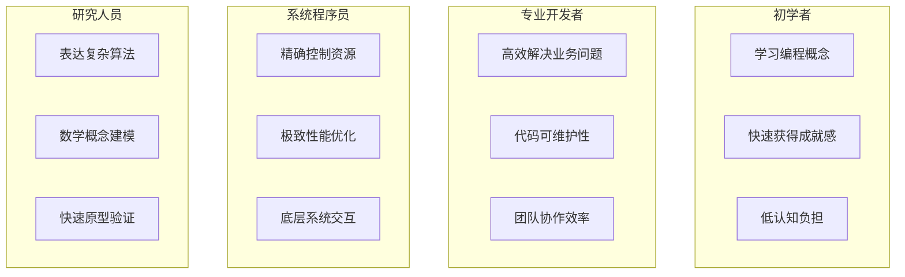

#### 应用领域定位

| 领域 | 核心需求 | 语言特性偏好 | 典型语言 |
|------|----------|--------------|----------|
| **Web开发** | 快速迭代、社区生态 | 动态类型、元编程 | JavaScript、PHP |
| **系统编程** | 性能、内存控制 | 静态类型、零成本抽象 | C、Rust |
| **数据科学** | 表达力、库生态 | 数值计算、可视化 | Python、R |
| **移动开发** | 跨平台、用户体验 | 响应式、异步 | Dart、Swift |

---

## 2. 语言设计的理论基础

### 2.1 形式语言理论

#### Chomsky文法层次体系

编程语言的语法设计必须基于形式语言理论，理解不同文法类型的能力和限制。

```
Type 0: 无限制文法 (Unrestricted Grammar)
├── 识别器：图灵机
├── 能力：任意递归可枚举语言
└── 应用：理论研究

Type 1: 上下文敏感文法 (Context-Sensitive Grammar)  
├── 识别器：线性有界自动机
├── 能力：上下文敏感语言
└── 应用：自然语言处理

Type 2: 上下文无关文法 (Context-Free Grammar)
├── 识别器：下推自动机  
├── 能力：嵌套结构、递归
└── 应用：绝大多数编程语言

Type 3: 正则文法 (Regular Grammar)
├── 识别器：有限状态自动机
├── 能力：序列模式、词法分析
└── 应用：词法分析器、正则表达式
```

#### 上下文无关文法设计

大多数编程语言的语法采用上下文无关文法（CFG），因为它在表达力和分析复杂度间达到了最佳平衡。

**CFG的标准形式（BNF）**：
```ebnf
Expression ::= Term (('+' | '-') Term)*
Term       ::= Factor (('*' | '/') Factor)*  
Factor     ::= NUMBER | '(' Expression ')'
```

**扩展巴科斯范式（EBNF）**：
```ebnf
Statement  ::= Assignment | IfStatement | WhileStatement
Assignment ::= Identifier '=' Expression ';'
IfStatement::= 'if' '(' Expression ')' Block ('else' Block)?
Block      ::= '{' Statement* '}'
```

### 2.2 语义学理论

#### 语义描述的三种方法

1. **操作语义 (Operational Semantics)**
   - 描述程序执行的逐步过程
   - 适合解释器实现
   ```
   ⟨x := e, σ⟩ → ⟨skip, σ[x ↦ eσ]⟩
   ```

2. **指称语义 (Denotational Semantics)**
   - 将程序映射到数学对象
   - 适合编译器优化
   ```
   x := e = λσ. σ[x ↦ eσ]
   ```

3. **公理语义 (Axiomatic Semantics)**
   - 使用逻辑断言描述程序性质
   - 适合程序验证
   ```
   {P} S {Q}  // 如果P成立，执行S后Q成立
   ```

### 2.3 类型理论基础

#### 类型系统的分类维度

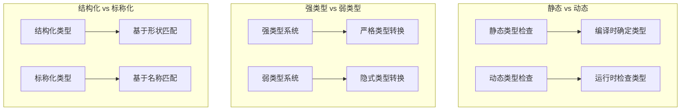

#### 高级类型系统特性

| 特性 | 作用 | 实现复杂度 | 典型语言 |
|------|------|------------|----------|
| **泛型/参数化类型** | 代码复用、类型安全 | 中等 | Java、C#、Go |
| **类型推断** | 减少冗余标注 | 较高 | Haskell、ML、Rust |
| **代数数据类型** | 建模复杂数据结构 | 中等 | Haskell、Rust、Swift |
| **依赖类型** | 编译时约束验证 | 很高 | Agda、Idris |

---

## 3. 语言特性的系统化设计

### 3.1 核心特性矩阵

#### 基础数据类型设计

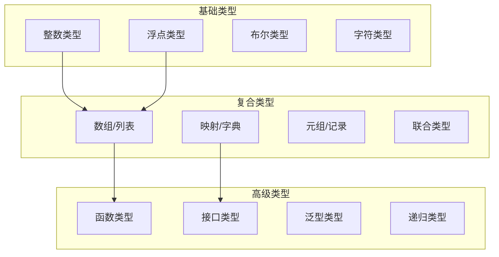

#### 数据类型设计决策

| 设计维度 | 选项 | 优势 | 劣势 | 适用场景 |
|----------|------|------|------|----------|
| **数值类型精度** | 固定精度 | 性能优秀 | 溢出风险 | 系统编程 |
|  | 任意精度 | 避免溢出 | 性能开销 | 科学计算 |
| **内存管理** | 手动管理 | 精确控制 | 容易出错 | 系统编程 |
|  | 垃圾回收 | 安全便利 | 性能不可控 | 应用开发 |
| **字符串实现** | 不可变 | 线程安全 | 拷贝开销 | 函数式编程 |
|  | 可变 | 高效修改 | 并发复杂 | 性能敏感场景 |

### 3.2 控制流设计

#### 结构化控制流

```python
# 条件分支设计模式
if condition:
    # Python风格：简洁的缩进语法
    action1()
elif other_condition:
    action2()
else:
    default_action()

# 模式匹配（现代趋势）
match value:
    case Pattern1(x, y): handle_pattern1(x, y)
    case Pattern2(z): handle_pattern2(z)
    case _: handle_default()
```

#### 错误处理机制设计

| 机制 | 语法形式 | 优势 | 劣势 | 典型语言 |
|------|----------|------|------|----------|
| **异常机制** | `try/catch/finally` | 自动传播、清晰分离 | 隐式控制流 | Java、Python |
| **错误值** | `Result<T, E>` | 显式错误处理 | 冗长代码 | Rust、Go |
| **Maybe类型** | `Option<T>` | 空值安全 | 学习曲线 | Haskell、Scala |
| **错误码** | `int error_code` | 简单直接 | 容易忽略 | C |

### 3.3 函数与模块系统

#### 函数设计维度

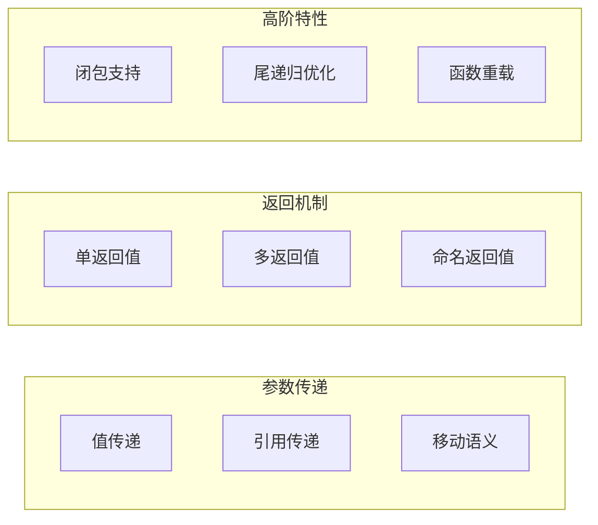

#### 模块系统设计

```rust
// Rust模块系统：清晰的可见性控制
pub mod network {
    pub struct Connection {
        addr: String,        // 私有字段
    }
    
    impl Connection {
        pub fn new(addr: &str) -> Self {  // 公有构造函数
            Self { addr: addr.to_string() }
        }
        
        fn internal_method(&self) {}      // 私有方法
    }
}

// Python模块系统：基于文件的简单模型
# math_utils.py
def add(a, b):
    return a + b

def _internal_helper():  # 约定的私有函数
    pass

# main.py  
from math_utils import add  # 显式导入
```

---

## 4. 语法设计与文法理论

### 4.1 词法设计原则

#### 词法单元的分类体系

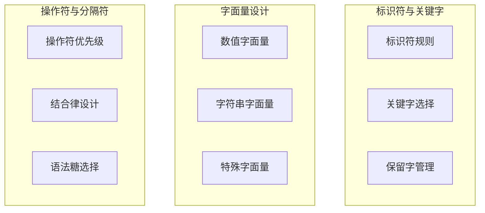

#### 标识符设计策略

| 策略 | 规则 | 示例 | 优势 | 劣势 |
|------|------|------|------|------|
| **驼峰命名** | 单词首字母大写 | `getUserName` | 可读性好 | 输入成本高 |
| **下划线分割** | 单词用下划线连接 | `get_user_name` | 易于输入 | 较长的标识符 |
| **混合策略** | 不同场景不同规则 | 类型用驼峰，函数用下划线 | 灵活性高 | 学习成本高 |

#### 字符串字面量设计

```python
# Python的多样化字符串支持
regular_string = "Hello World"
raw_string = r"C:\Users\Name"  # 原始字符串
multiline_string = """
This is a
multiline string
"""
f_string = f"Hello {name}"  # 格式化字符串
```

### 4.2 语法设计模式

#### 表达式优先级设计

经典的操作符优先级层次：
```
1. 后缀操作符    a[] a() a.field a++
2. 一元操作符    ++a --a +a -a !a ~a  
3. 乘除取模      * / %
4. 加减          + -
5. 位移          << >>
6. 关系比较      < <= > >=
7. 相等比较      == !=
8. 位与          &
9. 位异或        ^
10. 位或         |
11. 逻辑与       &&
12. 逻辑或       ||
13. 条件操作符   ? :
14. 赋值操作符   = += -= *= /=
15. 逗号操作符   ,
```

#### 语法糖设计原则

```javascript
// 良好的语法糖：简化常见操作
let user = users.find(u => u.id === targetId) ?? defaultUser;

// 过度的语法糖：增加认知负担
let result = input |> transform |> validate |> process;
```

### 4.3 二义性消解

#### 经典的语法二义性问题

1. **悬挂else问题**
```c
if (condition1)
    if (condition2)
        statement1;
else
    statement2;  // 这个else属于哪个if？
```

2. **操作符结合性**
```c
a = b = c;  // 右结合：a = (b = c)
a - b - c;  // 左结合：(a - b) - c
```

3. **表达式与语句区分**
```javascript
// 表达式还是语句？
{ foo: 1 }  // 对象字面量 vs 标签语句
```

#### 消解策略

| 策略 | 方法 | 示例 | 适用场景 |
|------|------|------|----------|
| **优先级规则** | 定义操作符优先级 | `*` 高于 `+` | 表达式解析 |
| **结合律规则** | 定义左/右结合 | 赋值右结合 | 连续操作符 |
| **上下文敏感** | 基于上下文决策 | 泛型 `<` vs 比较 `<` | 复杂语法 |
| **关键字消歧** | 引入区分关键字 | `function` 关键字 | 语句区分 |

---

## 5. 语义系统与类型理论

### 5.1 类型系统设计

#### 类型系统的设计空间

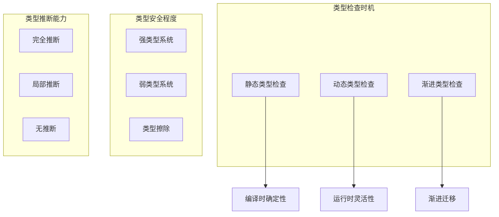

#### 类型系统设计决策

| 维度 | 静态类型 | 动态类型 | 渐进类型 |
|------|----------|----------|----------|
| **错误检测** | 编译时 | 运行时 | 混合 |
| **开发速度** | 慢（初期） | 快（初期） | 中等 |
| **重构安全** | 高 | 低 | 中等 |
| **运行性能** | 高 | 低 | 中等 |
| **学习曲线** | 陡峭 | 平缓 | 中等 |

### 5.2 高级类型特性

#### 泛型系统设计

```typescript
// TypeScript的泛型设计：平衡表达力与复杂度
interface Container<T> {
    value: T;
    map<U>(f: (value: T) => U): Container<U>;
}

// 约束泛型
interface Comparable<T> {
    compareTo(other: T): number;
}

function sort<T extends Comparable<T>>(items: T[]): T[] {
    return items.sort((a, b) => a.compareTo(b));
}

// 条件类型（高级特性）
type NonNullable<T> = T extends null | undefined ? never : T;
```

#### 代数数据类型

```rust
// Rust的枚举：强大的代数数据类型
enum Result<T, E> {
    Ok(T),
    Err(E),
}

enum Expression {
    Number(f64),
    Add(Box<Expression>, Box<Expression>),
    Multiply(Box<Expression>, Box<Expression>),
}

// 模式匹配：安全的数据解构
match result {
    Ok(value) => println!("Success: {}", value),
    Err(error) => println!("Error: {:?}", error),
}
```

### 5.3 内存管理模型

#### 内存管理策略比较

| 策略 | 机制 | 优势 | 劣势 | 典型语言 |
|------|------|------|------|----------|
| **手动管理** | malloc/free | 精确控制、高性能 | 容易出错 | C, C++ |
| **引用计数** | 自动计数引用 | 确定性回收 | 循环引用问题 | Python, Swift |
| **标记清除GC** | 跟踪可达对象 | 处理循环引用 | STW暂停 | Java, C# |
| **所有权系统** | 编译时检查 | 零成本安全 | 学习曲线陡峭 | Rust |

#### Rust所有权系统深度解析

```rust
// 所有权规则：编译时保证内存安全
fn main() {
    let s1 = String::from("hello");
    let s2 = s1;  // s1的所有权转移给s2
    // println!("{}", s1);  // 编译错误：use after move
    
    let s3 = &s2;  // 借用：不转移所有权
    println!("{}", s3);  // 正确
    
    // 生命周期注解：明确引用的有效范围
    fn longest<'a>(x: &'a str, y: &'a str) -> &'a str {
        if x.len() > y.len() { x } else { y }
    }
}
```

---

## 6. 编译器架构设计

### 6.1 编译器前端设计

#### 词法分析器架构

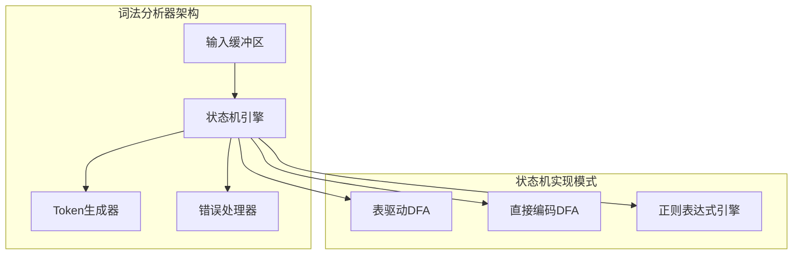

#### 语法分析器选择

| 分析方法 | 算法复杂度 | 适用文法 | 实现难度 | 错误恢复 |
|----------|------------|----------|----------|----------|
| **递归下降** | O(n) | LL(k) | 简单 | 容易 |
| **LR分析** | O(n) | LR(k) | 复杂 | 困难 |
| **LALR分析** | O(n) | LALR(k) | 中等 | 中等 |
| **GLR分析** | O(n³) | 任意CFG | 复杂 | 良好 |

### 6.2 中间表示设计

#### IR设计的层次结构

```
高级IR (HIR)：接近源语言，保留高级语义
├── 类型信息丰富
├── 控制流结构清晰  
├── 适合类型检查和高级优化
└── 示例：LLVM IR的高级形式

中级IR (MIR)：平衡抽象与具体
├── 部分lowering完成
├── 适合大部分优化
├── 跨平台抽象
└── 示例：大多数编译器的核心IR

低级IR (LIR)：接近目标机器
├── 寄存器分配前的形式
├── 指令选择基本完成
├── 适合底层优化
└── 示例：汇编前的中间形式
```

#### SSA形式的设计

```llvm
; LLVM IR示例：Static Single Assignment形式
define i32 @fibonacci(i32 %n) {
entry:
  %cmp = icmp slt i32 %n, 2
  br i1 %cmp, label %base_case, label %recursive_case

base_case:
  ret i32 %n

recursive_case:
  %n_minus_1 = sub i32 %n, 1
  %fib_n_minus_1 = call i32 @fibonacci(i32 %n_minus_1)
  %n_minus_2 = sub i32 %n, 2
  %fib_n_minus_2 = call i32 @fibonacci(i32 %n_minus_2)
  %result = add i32 %fib_n_minus_1, %fib_n_minus_2
  ret i32 %result
}
```

### 6.3 优化器设计

#### 优化Pass的组织结构

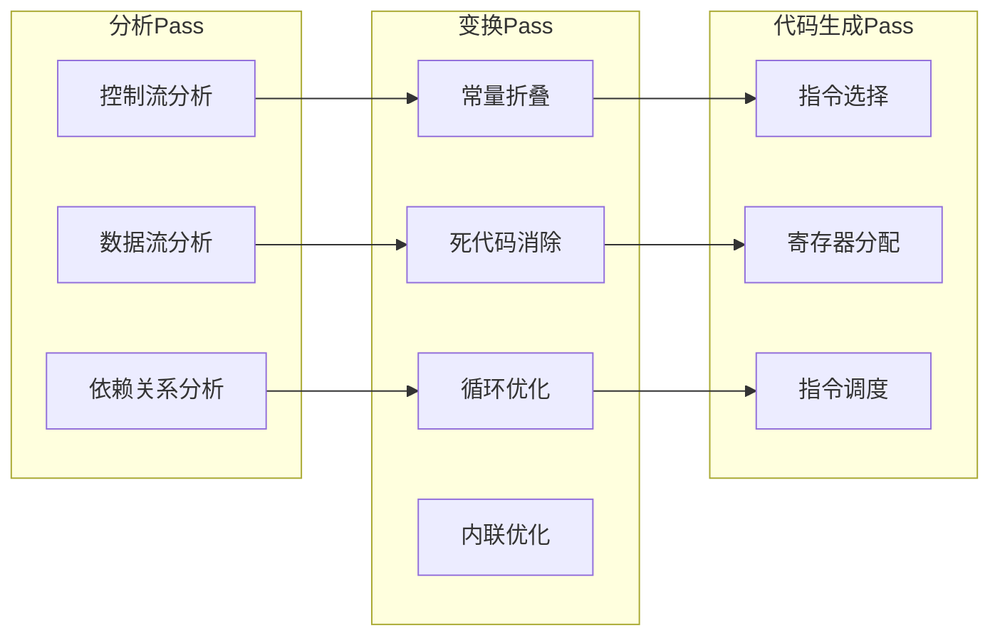

#### 经典优化技术

| 优化类型 | 作用范围 | 复杂度 | 效果 | 实现难度 |
|----------|----------|--------|------|----------|
| **窥孔优化** | 局部 | O(n) | 中等 | 简单 |
| **公共子表达式消除** | 基本块/全局 | O(n²) | 高 | 中等 |
| **循环不变量外提** | 循环 | O(n) | 高 | 中等 |
| **内联优化** | 过程间 | 指数级 | 很高 | 复杂 |

---

## 7. 语言生态系统建设

### 7.1 工具链设计

#### 完整工具链架构

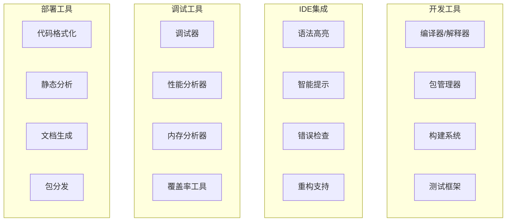

#### 工具链集成策略

```toml
# Rust的Cargo：统一的工具链管理
[package]
name = "my-project"
version = "0.1.0"
edition = "2021"

[dependencies]
serde = { version = "1.0", features = ["derive"] }

[dev-dependencies]
criterion = "0.4"

# 内置命令支持
# cargo build    # 构建
# cargo test     # 测试  
# cargo doc      # 文档生成
# cargo fmt      # 代码格式化
# cargo clippy   # 静态检查
```

### 7.2 标准库设计

#### 标准库的分层架构

```
核心层 (Core)：最基础的类型和操作
├── 基础数据类型 (int, float, bool)
├── 基础操作 (算术、比较、逻辑)
├── 内存管理原语
└── 异常处理机制

标准层 (Std)：常用功能和数据结构
├── 容器类型 (数组、映射、集合)
├── 字符串处理
├── I/O操作
├── 数学函数
└── 时间日期处理

扩展层 (Extended)：高级功能和工具
├── 网络编程
├── 并发原语
├── 正则表达式
├── JSON/XML处理
└── 加密算法
```

#### API设计原则

```python
# 好的API设计：一致性和可预测性
list.append(item)      # 修改原对象
list.extend(items)     # 修改原对象  
list + other_list      # 返回新对象
list.copy()            # 明确的拷贝语义

# 坏的API设计：不一致的行为
list.sort()            # 修改原对象，返回None
sorted(list)           # 返回新对象
```

### 7.3 社区生态培育

#### 包管理系统设计

| 特性 | 重要性 | 设计考量 | 典型实现 |
|------|--------|----------|----------|
| **依赖解析** | 关键 | 版本兼容性算法 | npm, cargo |
| **安全验证** | 关键 | 包签名、漏洞扫描 | cargo audit |
| **镜像分发** | 重要 | 全球CDN、缓存策略 | npm registry |
| **语义版本** | 重要 | SemVer兼容性 | 主流包管理器 |

#### 文档生态建设

```rust
// Rust的文档注释：工具友好的文档系统
/// 计算两个数的最大公约数
/// 
/// # 示例
/// 
/// ```
/// let result = gcd(48, 18);
/// assert_eq!(result, 6);
/// ```
/// 
/// # 复杂度
/// 
/// 时间复杂度：O(log(min(a,b)))
pub fn gcd(a: u32, b: u32) -> u32 {
    if b == 0 { a } else { gcd(b, a % b) }
}
```

---

## 8. 现代语言设计趋势

### 8.1 新兴语言特性

#### 模式匹配的演进

```swift
// Swift的模式匹配：从简单到复杂
enum Result<T, E> {
    case success(T)
    case failure(E)
}

// 基础模式匹配
switch result {
case .success(let value):
    print("成功: \(value)")
case .failure(let error):
    print("失败: \(error)")
}

// 高级模式匹配：守卫条件
switch (x, y) {
case (let a, let b) where a + b == 10:
    print("和为10")
case (0...5, 0...5):
    print("都在0-5范围内")
default:
    print("其他情况")
}
```

#### 异步编程模型

```javascript
// JavaScript的异步演进历程
// 1. 回调地狱
getData(function(a) {
    getMoreData(a, function(b) {
        getEvenMoreData(b, function(c) {
            // 嵌套地狱
        });
    });
});

// 2. Promise链
getData()
    .then(a => getMoreData(a))
    .then(b => getEvenMoreData(b))
    .then(c => processData(c));

// 3. async/await
async function processAll() {
    const a = await getData();
    const b = await getMoreData(a);
    const c = await getEvenMoreData(b);
    return processData(c);
}
```

### 8.2 性能与安全的平衡

#### 零成本抽象原则

```cpp
// C++的零成本抽象：编译时优化
template<typename T>
class Vector {
public:
    T& operator[](size_t index) {
        return data_[index];  // 内联优化，零运行时成本
    }
    
private:
    T* data_;
    size_t size_;
};

// 使用时与原始指针性能相同
Vector<int> vec;
int x = vec[0];  // 编译为直接内存访问
```

#### 编译时计算趋势

```zig
// Zig的编译时计算：强大的元编程
comptime {
    var sum: u32 = 0;
    var i: u32 = 0;
    while (i <= 100) : (i += 1) {
        sum += i;
    }
    // sum = 5050，编译时计算完成
}

// 编译时类型生成
fn JsonParser(comptime T: type) type {
    return struct {
        pub fn parse(json: []const u8) T {
            // 根据T的类型信息生成解析代码
        }
    };
}
```

### 8.3 领域特定语言(DSL)

#### DSL设计模式

| DSL类型 | 实现方式 | 示例 | 适用场景 |
|---------|----------|------|----------|
| **内嵌DSL** | 宿主语言语法 | SQL in LINQ | 快速开发 |
| **外部DSL** | 独立语法解析 | SQL, HTML | 专业领域 |
| **流畅接口** | 方法链式调用 | jQuery | API设计 |
| **模板语言** | 文本插值语法 | Jinja2 | 代码生成 |

```python
# 内嵌DSL示例：用Python构建查询
class Query:
    def __init__(self, table):
        self.table = table
        self.conditions = []
    
    def where(self, condition):
        self.conditions.append(condition)
        return self
    
    def limit(self, count):
        self.limit_count = count
        return self

# 流畅的查询语法
result = Query("users") \
    .where("age > 18") \
    .where("active = true") \
    .limit(100) \
    .execute()
```

---

## 9. 实践案例分析

### 9.1 成功案例研究

#### Go语言：简洁性的胜利

**设计哲学**：少即是多（Less is more）

```go
// Go的设计特点：极简但实用
package main

import "fmt"

// 简单的并发模型
func worker(jobs <-chan int, results chan<- int) {
    for job := range jobs {
        results <- job * 2
    }
}

func main() {
    jobs := make(chan int, 100)
    results := make(chan int, 100)
    
    // 启动工作goroutine
    for w := 1; w <= 3; w++ {
        go worker(jobs, results)
    }
    
    // 发送任务
    for j := 1; j <= 5; j++ {
        jobs <- j
    }
    close(jobs)
    
    // 收集结果
    for a := 1; a <= 5; a++ {
        <-results
    }
}
```

**成功因素分析**：
- 🎯 **明确目标**：系统编程的现代化
- 🧹 **大胆取舍**：移除复杂特性（泛型延后、继承省略）
- 🏗️ **工具集成**：gofmt、go mod统一生态
- 📈 **时机选择**：云计算兴起的时代需求

#### Rust语言：安全性的突破

**设计哲学**：零成本安全（Zero-cost safety）

```rust
// Rust的核心创新：所有权系统
use std::collections::HashMap;
use std::thread;

fn main() {
    let mut data = HashMap::new();
    data.insert("key1", "value1");
    
    // 所有权转移：编译时保证内存安全
    let handle = thread::spawn(move || {
        println!("{:?}", data);  // data的所有权已转移
    });
    
    handle.join().unwrap();
    // println!("{:?}", data);  // 编译错误：use after move
}

// 生命周期：明确引用的有效范围
fn longest<'a>(x: &'a str, y: &'a str) -> &'a str {
    if x.len() > y.len() { x } else { y }
}
```

**成功因素分析**：
- 🔬 **理论突破**：线性类型系统的工程化应用
- 🎯 **问题聚焦**：系统编程的内存安全痛点
- 🏭 **渐进演进**：从研究语言到生产语言的迭代
- 🤝 **社区建设**：友好的新手体验和强大的工具链

### 9.2 失败案例分析

#### Google Dart：定位模糊的教训

**原始设计目标**：替代JavaScript的Web语言

```dart
// Dart的设计：功能丰富但定位不清
class User {
  String name;
  int age;
  
  User(this.name, this.age);
  
  // 可选类型：试图平衡静态和动态
  dynamic process(var input) {
    return input.toString();
  }
}

void main() {
  var user = User("Alice", 25);  // 类型推断
  print(user.process(42));
}
```

**失败原因分析**：
- 🎯 **目标不明确**：JavaScript替代者 vs 移动开发语言
- ⏰ **时机问题**：ECMAScript 6的快速发展
- 🏗️ **生态缺失**：缺乏杀手级应用场景
- 🔄 **频繁调整**：语法和定位的多次重大变更

**转机与重生**：
- 📱 **重新定位**：专注Flutter移动开发
- 🎯 **明确价值**：跨平台UI开发的最佳选择

### 9.3 设计决策的权衡分析

#### 性能 vs 安全性权衡

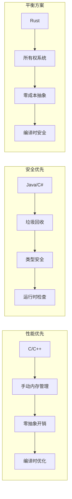

#### 学习曲线 vs 表达力权衡

| 语言特性 | 学习难度 | 表达力提升 | 适用人群 | 设计建议 |
|----------|----------|------------|----------|----------|
| **基础语法** | 低 | 中 | 所有用户 | 必须简洁直观 |
| **类型系统** | 中 | 高 | 专业开发者 | 渐进公开 |
| **元编程** | 高 | 很高 | 库开发者 | 慎重引入 |
| **并发模型** | 高 | 高 | 系统程序员 | 提供多种抽象层次 |

---

## 10. 语言演进与维护

### 10.1 版本演进策略

#### 语义化版本控制

```
MAJOR.MINOR.PATCH (例如：2.1.3)

MAJOR：不兼容的API修改
├── 语法变更
├── 类型系统重大改变  
├── 标准库API删除
└── 运行时行为变更

MINOR：向后兼容的功能增加
├── 新语法特性
├── 标准库扩展
├── 性能改进
└── 新工具支持

PATCH：向后兼容的问题修正
├── Bug修复
├── 文档更新
├── 小的性能优化
└── 安全补丁
```

#### 渐进式特性引入

```python
# Python的演进示例：渐进式类型系统
# Python 3.5: 基础类型标注
def greet(name: str) -> str:
    return f"Hello {name}"

# Python 3.6: 变量类型标注
count: int = 0
names: List[str] = []

# Python 3.8: 更精确的类型表达
from typing import Literal, TypedDict

class UserDict(TypedDict):
    name: str
    age: int

def process_status(status: Literal['pending', 'approved', 'rejected']):
    pass
```

### 10.2 向后兼容性管理

#### 兼容性策略矩阵

| 策略 | 优势 | 劣势 | 适用场景 | 典型语言 |
|------|------|------|----------|----------|
| **严格兼容** | 稳定性极高 | 技术债务积累 | 企业环境 | Java |
| **定期破坏性更新** | 技术现代化 | 迁移成本高 | 快速迭代项目 | Python 2→3 |
| **可选新特性** | 渐进迁移 | 复杂度增加 | 大型生态系统 | JavaScript |
| **版本分支** | 并行维护 | 资源分散 | 特殊需求 | Python 2.x/3.x |

#### 迁移工具设计

```python
# 自动化迁移工具示例
class MigrationTool:
    def __init__(self, source_version, target_version):
        self.rules = self.load_migration_rules(source_version, target_version)
    
    def migrate_file(self, filepath):
        content = self.read_file(filepath)
        
        # 应用语法转换规则
        for rule in self.rules:
            content = rule.apply(content)
        
        # 生成迁移报告
        report = self.generate_report(filepath, content)
        return content, report
    
    def load_migration_rules(self, src_ver, tgt_ver):
        # 加载版本特定的迁移规则
        return [
            RenameFunction("old_name", "new_name"),
            UpdateSyntax(r"old_pattern", "new_pattern"),
            AddImport("new_module"),
        ]
```

### 10.3 社区治理模型

#### 语言治理结构

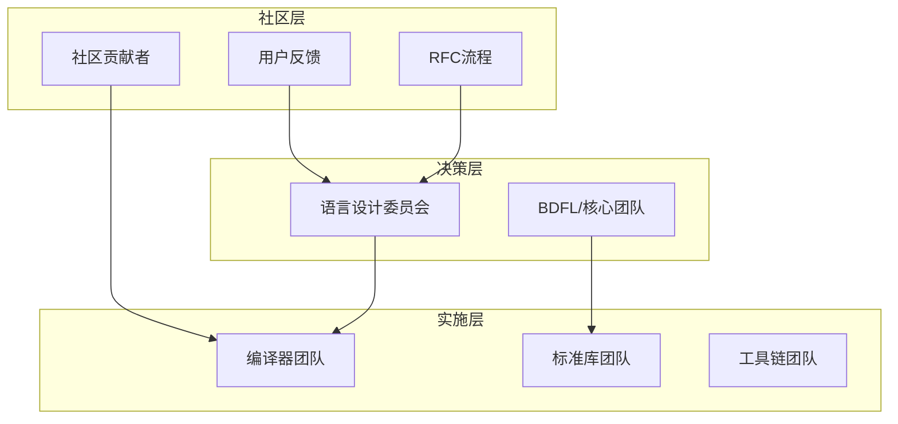

#### RFC（请求意见稿）流程

```markdown
# RFC模板示例

## 摘要
[一段话描述此RFC的内容]

## 动机
[为什么需要这个改变？解决什么问题？]

## 详细设计
[具体的设计方案，包括语法、语义、实现等]

## 缺点
[这个设计有什么缺点或风险？]

## 备选方案
[考虑过哪些其他方案？为什么不采用？]

## 未解决的问题
[实现过程中可能遇到的问题]
```

#### 特性生命周期管理

```
实验性 (Experimental)
├── 编译器标志启用
├── 语法可能变更
├── 用于收集反馈
└── 随时可能移除

不稳定 (Unstable)  
├── 基本设计确定
├── API可能调整
├── 生产环境慎用
└── 文档逐步完善

稳定 (Stable)
├── 向后兼容承诺
├── 完整文档支持
├── 生产环境就绪
└── 长期维护保证

废弃 (Deprecated)
├── 标记为过时
├── 建议迁移方案
├── 保持有限支持
└── 最终版本移除
```

---

## 结语：设计语言的艺术与科学

### 核心要点回顾

编程语言设计是一门平衡的艺术，需要在多个维度间做出明智的权衡：

1. **理论与实践的结合**：深厚的理论基础 + 丰富的工程经验
2. **简洁与强大的平衡**：既要易学易用，又要功能完备
3. **创新与兼容的协调**：引入新特性的同时保持生态稳定
4. **当前与未来的考量**：解决今天的问题，为明天的发展留空间

### 设计检查清单

在设计语言时，请考虑以下关键问题：

**哲学层面**：
- [ ] 这门语言要解决什么根本问题？
- [ ] 目标用户群体是谁？他们的真实需求是什么？
- [ ] 这门语言的核心价值主张是什么？

**技术层面**：
- [ ] 类型系统设计是否一致和安全？
- [ ] 语法设计是否直观和可扩展？
- [ ] 错误处理机制是否完善？
- [ ] 性能特征是否符合应用场景？

**生态层面**：
- [ ] 工具链是否完整和易用？
- [ ] 标准库设计是否合理和充分？
- [ ] 包管理和依赖系统是否健壮？
- [ ] 社区治理模式是否可持续？

### 持续学习的建议

1. **深入研究现有语言**：理解经典语言的设计决策和权衡
2. **关注前沿研究**：跟踪编程语言理论的最新发展
3. **实践小型DSL**：从领域特定语言开始练手
4. **参与开源项目**：贡献现有语言的编译器和工具
5. **建立用户思维**：始终从用户角度思考语言设计

编程语言设计是一个充满挑战和创造性的领域。每一门成功的语言都承载着设计者的深刻洞察和无数开发者的智慧结晶。希望这份指南能够为你的语言设计之旅提供有价值的参考和启发。

---

**参考文献与延伸阅读**：

- 《编译原理》（龙书）- Alfred V. Aho, Monica S. Lam, Ravi Sethi, Jeffrey D. Ullman
- 《程序设计语言：实践之路》 - Michael L. Scott  
- 《类型和程序设计语言》 - Benjamin C. Pierce
- 《编程语言的设计与实现》 - Terrence W. Pratt, Marvin V. Zelkowitz
- RFC流程文档 - Rust, Python, JavaScript等语言的官方RFC
- LLVM项目文档 - 现代编译器基础设施的最佳实践

**在线资源**：
- Programming Language Theory (plt.dev)
- Language Implementation Patterns
- Crafting Interpreters (craftinginterpreters.com)
- LLVM Documentation (llvm.org/docs)

---

<p align="center">
  <em>语言是思想的工具，设计语言就是在塑造思维的边界</em><br>
  Made with ❤️ for programming language enthusiasts
</p>