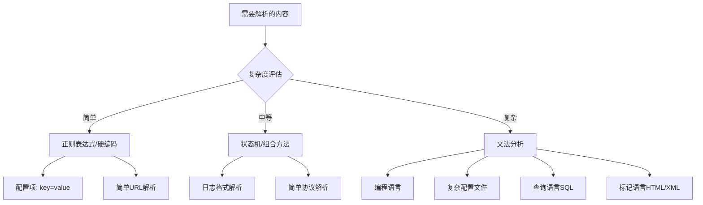

# 语法分析与文法设计深度解析

> **学习主题**：编译原理中的语法分析与上下文无关文法  
> **学习方法**：从概念困惑到深度理解的完整过程  
> **核心价值**：理解复杂结构化信息的系统处理方法

---

## 目录

1. [核心问题：为什么需要语法分析？](#1-核心问题为什么需要语法分析)
2. [语法分析的本质理解](#2-语法分析的本质理解)
3. [上下文无关文法深度剖析](#3-上下文无关文法深度剖析)
4. [文法规则工作机制详解](#4-文法规则工作机制详解)
5. [文法分析 vs 其他解析方法](#5-文法分析-vs-其他解析方法)
6. [实际应用与工程选择](#6-实际应用与工程选择)
7. [学习方法总结](#7-学习方法总结)
8. [扩展思考](#8-扩展思考)

---

## 1. 核心问题：为什么需要语法分析？

### 1.1 计算机面临的挑战

当计算机看到字符串 `"1 + 2 * 3"` 时，它面临的问题：

**问题清单**：
- ✅ 这只是一串字符，没有任何结构信息
- ✅ 不知道 `+`、`*` 是运算符
- ✅ 不知道 `1`、`2`、`3` 是数字
- ✅ 不知道应该先算 `2*3` 还是先算 `1+2`

**解决思路**：需要将**线性的字符序列**转换为**有层次的结构**

### 1.2 从混乱到秩序的转换

```
输入（混乱）: "1 + 2 * 3"
输出（有序）:
    +
   / \
  1   *
     / \
    2   3
```

**关键洞察**：结构决定了计算顺序！

---

## 2. 语法分析的本质理解

### 2.1 类比：搭积木的游戏

#### 积木游戏规则设计

假设我们有三种积木：
- 🔴 红色积木（屋顶）
- 🔵 蓝色积木（墙体）  
- 🟢 绿色积木（装饰）

制定搭建规则：
```
房子 → 屋顶 + 墙体
屋顶 → 红色积木
墙体 → 蓝色积木 + 蓝色积木
```

#### 验证合法性

- ✅ 红+蓝+蓝 = 合法的房子
- ❌ 绿+红+蓝 = 不合法（违反规则）

**核心理解**：**文法就是这样的"搭建规则"**！

### 2.2 语法分析 = 结构化理解

**本质定义**：
- **输入**：无结构的符号序列
- **过程**：应用规则进行结构化
- **输出**：有层次的语法树
- **目标**：让计算机理解人类的表达意图

---

## 3. 上下文无关文法深度剖析

### 3.1 "上下文"概念理解

#### 上下文相关的例子

**中文歧义**：
- "河边的**银行**" → 河岸
- "去**银行**取钱" → 金融机构

同一个词在不同**上下文**中含义完全不同！

#### 上下文无关的特征

**英文语法示例**：
```
句子 → 主语 + 谓语 + 宾语
主语 → 名词
谓语 → 动词
宾语 → 名词
```

**关键特征**：
- 规则**固定不变**
- **不依赖**周围环境  
- **任何地方**都适用相同规则

### 3.2 为什么选择"上下文无关"？

#### 优势分析

| 特征 | 上下文相关 | 上下文无关 |
|------|------------|------------|
| **复杂度** | 😰 极高 | 😊 可控 |
| **实现难度** | 😰 很难 | 😊 相对简单 |
| **性能** | 😰 慢 | 😊 快 |
| **可预测性** | 😰 不确定 | 😊 确定 |

#### 实际考虑

对于**大多数编程语言的语法结构**，上下文无关文法**已经足够**！

---

## 4. 文法规则工作机制详解

### 4.1 规则设计：表达式文法

为了正确处理 `1 + 2 * 3`，我们设计如下规则：

```
规则1: 表达式 → 表达式 + 项
规则2: 表达式 → 项  
规则3: 项 → 项 * 因子
规则4: 项 → 因子
规则5: 因子 → 数字
规则6: 数字 → 1 | 2 | 3 | 4 | 5 | ...
```

**设计思想**：通过**层次结构**隐含地定义**运算优先级**

### 4.2 替换游戏：推导过程

#### 完整推导演示

输入：`1 + 2 * 3`

```
步骤 1: 表达式
步骤 2: 表达式 + 项                    (应用规则1)
步骤 3: 项 + 项                        (应用规则2)
步骤 4: 因子 + 项                      (应用规则4)
步骤 5: 数字 + 项                      (应用规则5)
步骤 6: 1 + 项                         (应用规则6)
步骤 7: 1 + 项 * 因子                  (应用规则3)
步骤 8: 1 + 因子 * 因子                (应用规则4)
步骤 9: 1 + 数字 * 因子                (应用规则5)
步骤10: 1 + 2 * 因子                   (应用规则6)
步骤11: 1 + 2 * 数字                   (应用规则5)
步骤12: 1 + 2 * 3                      (应用规则6)
```

#### 生成语法树

```
        表达式
       /   |   \
    表达式  +    项
      |        /  |  \
      项      项   *  因子
      |       |       |
     因子    因子     数字
      |       |       |
     数字    数字      3
      |       |
      1       2
```

### 4.3 优先级的巧妙实现

#### 层次决定优先级

观察语法树结构：
- `2 * 3` 在**同一个子树**中（内层）
- `1 +` 在**更高层级**（外层）

**计算顺序**：内层先算，外层后算
- 先计算：`2 * 3 = 6`
- 再计算：`1 + 6 = 7`

#### 积木盒子类比

```
大盒子(表达式) 
└─ 中盒子(项) + 中盒子(项)
   ├─ 小盒子(1)
   └─ 小盒子(2) * 小盒子(3)
```

**规律**：**内盒子的内容先处理**！

---

## 5. 文法分析 vs 其他解析方法

### 5.1 解析方法大对比

#### 方法1：硬编码（暴力但直接）

```java
// 针对每种情况写代码
if (input.contains("*") && input.contains("+")) {
    // 先处理乘法，再处理加法
    handleMultiplicationFirst(input);
} else if (input.contains("+")) {
    handleAddition(input);
}
```

**问题**：
- ❌ 每种情况都要写代码
- ❌ 复杂表达式代码爆炸
- ❌ `1+2*3+4*5-6` 怎么办？

#### 方法2：正则表达式（简单场景好用）

```java
Pattern.matches("\\d+\\s*[+*]\\s*\\d+", input)
```

**适用场景**：简单模式匹配
**局限性**：
- ❌ 无法处理嵌套：`(1+2)*3`
- ❌ 无法表达复杂结构：`{a: [1, {b: 2}]}`

#### 方法3：状态机（适合线性处理）

```
状态1 --数字--> 状态2 --运算符--> 状态3 --数字--> 状态4
```

**适用场景**：简单的状态转换
**局限性**：❌ 无法处理递归嵌套结构

#### 方法4：文法分析（处理复杂结构的王者）

**优势**：
- ✅ 天然处理递归结构
- ✅ 理论基础扎实
- ✅ 可扩展性强
- ✅ 工具链成熟

### 5.2 文法分析的核心优势

#### 优势1：递归结构的天然处理能力

```python
# 复杂嵌套的Python字典
{
  'user': {
    'profile': {
      'settings': [1, 2, {'nested': True}]
    }
  }
}
```

对应的文法规则**非常简洁**：
```
Dict → '{' Entry (',' Entry)* '}'
Entry → Value ':' Value
Value → Dict | List | Primitive  # 递归定义！
```

#### 优势2：出色的可扩展性

```
// 原始规则：只支持加法和乘法
Expression → Expression + Term | Term
Term → Term * Factor | Factor

// 要支持减法？只需添加一行！
Expression → Expression + Term | Expression - Term | Term

// 要支持除法？再添加一行！
Term → Term * Factor | Term / Factor | Factor
```

#### 优势3：理论基础扎实

- ✅ 完整的**数学理论**支撑
- ✅ **算法复杂度**可分析  
- ✅ **行为可预测**，没有意外
- ✅ 有**大量工具**自动生成代码

---

## 6. 实际应用与工程选择

### 6.1 选择决策树



### 6.2 文法分析的最佳适用场景

#### 强烈推荐 ⭐⭐⭐

- **编程语言解析器**：Java、Python、JavaScript等
- **查询语言**：SQL、GraphQL、MongoDB查询
- **配置文件**：复杂的JSON、YAML、TOML
- **标记语言**：HTML、XML、Markdown
- **DSL设计**：领域特定语言

#### 不建议使用 ❌

- **简单key-value解析**：`name=John`
- **固定格式日志**：Apache访问日志
- **简单字符串操作**：替换、分割
- **极度性能敏感**：高频交易系统

### 6.3 现代混合策略

```java
/**
 * 现代解析器的智能选择策略
 */
public class SmartParser {
    
    public Object parse(String input) {
        // 策略1：简单情况用正则
        if (isSimpleKeyValue(input)) {
            return parseWithRegex(input);
        }
        
        // 策略2：中等复杂用状态机
        if (isStructuredButSimple(input)) {
            return parseWithStateMachine(input);
        }
        
        // 策略3：复杂结构用文法分析
        return parseWithGrammar(input);
    }
    
    // 性能监控
    private void logPerformance(String method, long duration) {
        System.out.printf("%s parsing took %d ms%n", method, duration);
    }
}
```

---

## 7. 学习方法总结

### 7.1 有效学习策略

#### 策略1：类比学习法 🎯

将抽象概念映射到具体事物：
- **文法规则** ↔ 搭积木规则
- **推导过程** ↔ 替换游戏
- **语法树层次** ↔ 盒子嵌套
- **优先级** ↔ 内外层关系

#### 策略2：问题驱动法 🚀

从具体问题出发：
1. **遇到困惑**：`1 + 2 * 3` 怎么解析？
2. **寻找方法**：有哪些可能的解决方案？
3. **深入理解**：为什么选择文法分析？
4. **对比分析**：其他方法的优劣如何？

#### 策略3：渐进理解法 📚

```
基础概念 → 具体实例 → 抽象规则 → 应用场景 → 优劣对比 → 工程实践
```

### 7.2 理解关键点

#### 上下文无关文法的本质

1. **规则固定性**：`A → B C` 这个规则**任何地方**都成立
2. **机械应用性**：可以像**玩游戏**一样机械地应用
3. **结构语义性**：**树的层次**直接决定运算优先级
4. **递归自然性**：**递归规则**天然处理递归结构

#### 学习中的常见误区

❌ **误区1**：认为文法分析很复杂，避而远之
✅ **正解**：从简单例子开始，逐步理解

❌ **误区2**：死记硬背规则和算法
✅ **正解**：理解背后的设计思想

❌ **误区3**：只学理论，不写代码
✅ **正解**：理论与实践并重

❌ **误区4**：认为只有编译器才用得上
✅ **正解**：广泛应用于各种结构化数据处理

---

## 8. 扩展思考

### 8.1 深入学习路径

#### 理论深化 📖

- **形式语言理论**：正则语言、上下文无关语言、上下文相关语言
- **自动机理论**：有限自动机、下推自动机、图灵机
- **解析算法**：递归下降、LR、LALR、GLR

#### 实践强化 💻

```java
// 项目1：表达式计算器
ExpressionParser parser = new ExpressionParser();
double result = parser.evaluate("(1 + 2) * 3 + 4");

// 项目2：简单配置语言
ConfigParser config = new ConfigParser();
Map<String, Object> settings = config.parse("server { port = 8080; host = 'localhost' }");

// 项目3：小型查询语言
QueryParser query = new QueryParser();
QueryAST ast = query.parse("SELECT name FROM users WHERE age > 18");
```

#### 工具学习 🛠️

- **ANTLR**：跨语言的强大解析工具
- **YACC/Bison**：经典的解析器生成器
- **Tree-sitter**：增量解析，IDE常用
- **PEG**：解析表达式文法，更现代的方法

### 8.2 现实应用场景

#### 软件开发领域

```
IDE功能 ────┐
            ├─ 语法高亮
            ├─ 代码补全  
            ├─ 错误检查
            └─ 重构工具

静态分析 ────┐  
            ├─ 代码质量检查
            ├─ 安全漏洞检测
            └─ 性能分析

配置处理 ────┐
            ├─ JSON/YAML解析
            ├─ 构建脚本处理
            └─ 模板引擎
```

#### 新兴技术领域

- **人工智能**：代码生成、程序合成、自动重构
- **低代码平台**：可视化编程转换为代码
- **区块链**：智能合约编译、虚拟机设计
- **边缘计算**：轻量级编译器、JIT优化

### 8.3 思维启发

#### 系统化思维

文法分析教会我们：
- **分而治之**：复杂问题分解为简单规则
- **层次思维**：通过层次结构表达复杂关系  
- **规则驱动**：用规则而非硬编码解决问题
- **抽象建模**：将现实问题抽象为数学模型

#### 工程实践智慧

- **选择合适的工具**：不同问题需要不同方案
- **平衡复杂度与效果**：过度工程 vs 功能不足
- **理论指导实践**：扎实的理论基础很重要
- **持续学习优化**：技术在不断发展

### 8.4 未来发展方向

#### 编译技术趋势

```
传统编译 → 智能编译
           ├─ ML指导的优化
           ├─ 自适应编译策略  
           └─ 基于数据的性能预测

单机编译 → 分布式编译
           ├─ 云原生构建
           ├─ 并行编译
           └─ 增量编译

通用编译 → 领域优化
           ├─ 硬件特定优化
           ├─ 应用场景定制
           └─ 跨语言优化
```

#### 个人发展建议

1. **建立扎实基础**：数据结构、算法、离散数学
2. **保持实践敏感**：关注工业界需求和技术发展
3. **培养系统思维**：从整体角度思考问题
4. **持续学习更新**：技术发展很快，要跟上节奏

---

## 结语

通过深入理解**语法分析**和**上下文无关文法**，我们不仅掌握了处理复杂结构化信息的强大工具，更重要的是培养了**系统化思维**和**抽象建模能力**。

这些思维方式和技术手段将在软件开发的各个领域发挥重要作用——从IDE工具开发到人工智能，从配置文件处理到领域特定语言设计。

**核心收获**：
- ✅ 理解了语法分析的本质：结构化理解
- ✅ 掌握了文法设计的思路：规则驱动
- ✅ 学会了技术选择的智慧：合适的工具解决合适的问题
- ✅ 培养了系统化思维：分层抽象，递归处理

在人工智能、低代码开发等新兴领域，这些编译原理的核心思想将发挥越来越重要的作用。**掌握这些基础理论，就是为未来的技术创新打下坚实的根基**。

---

*本文档基于实际学习对话整理，展现了从概念困惑到深度理解的完整过程，希望能为其他学习者提供有价值的参考。*

**关键标签**: #编译原理 #语法分析 #上下文无关文法 #学习方法 #系统化思维